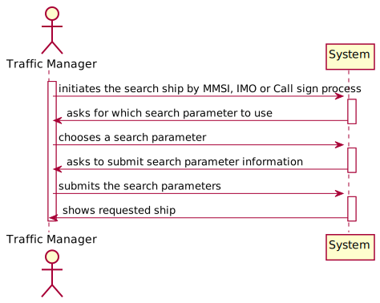

# US 102 - Search a Ship

## 1. Requirements Engineering

## 1.1. User Story Description

As a traffic manager I wish to search the details of a ship using any of its codes:
MMSI, IMO or Call Sign

## 1.2. Acceptance Criteria

* **AC1:** correct use of OOP concepts

## 1.3. System Sequence Diagram (SSD)

## 2. OO Analysis

### Relevant Domain Model Excerpt

## 3. Design - User Story Realization

### 3.1. Sequence Diagram (SD)

### 3.2. Class Diagram (CD)

#4. Tests

**Test 1: Gets a ship by its MMSI**
    
    @Test
    void getShipByMMSI() {

        //Arrange
        shipstore.addShip(shipgeral);
        String expected = "Ship{cargo='null', MMSI=111111111, name='name', IMO='IMO1111111', numGen=0, genPowerOutput=0, callSign='A', vesselType='A', length=1.0, width=1.0, capacity=0.0, draft=1.0}";
        //Act
        String actual = shipstore.getShipByMmsi(111111111).toString();
        //Assert
        assertEquals(expected, actual);
    }

# 5. Construction (Implementation)

##SearchShipController

    public class SearchShipController {

    private final Company cmpn;
    private final ShipStore ss;

    public SearchShipController(){
        this.cmpn = App.getInstance().getCompany();
        ss = cmpn.getShipStore();
    }

    public Ship searchShipByMMSI(int p) {
        return ss.getShipByMmsi(p);
    }

    public Ship searchShipByIMO(String p) {
        return ss.getShipByIMO(p);
    }

    public Ship searchShipByCallSign(String p) {
        return ss.getShipByCallSign(p);
    }

    public ShipStore getShipStore(){
        return ss;
    }
    }

##ShipStore

    public class ShipStore {

    public ShipStore() {
    this.shipByMmsiAVL = new AVL<>();
    this.shipByIMOAVL = new AVL<>();
    this.shipByCallSignAVL = new AVL<>();
    }

        public Ship getShipByMmsi(int mmsi) {
        ShipByMmsi ship = new ShipByMmsi(mmsi);
        return shipByMmsiAVL.find(ship);
    }

    public Ship getShipByIMO(String imo) {
        ShipByIMO ship = new ShipByIMO(imo);
        return shipByIMOAVL.find(ship);
    }

    public Ship getShipByCallSign(String callSign) {
        ShipByCallSign ship = new ShipByCallSign(callSign);
        return shipByCallSignAVL.find(ship);
    }
    }