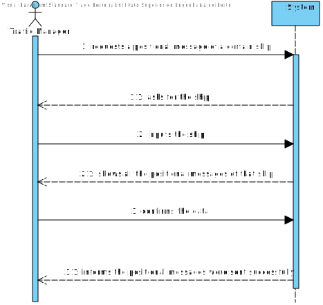
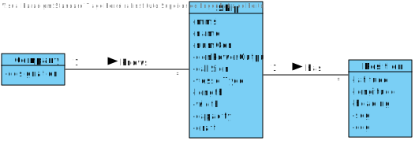
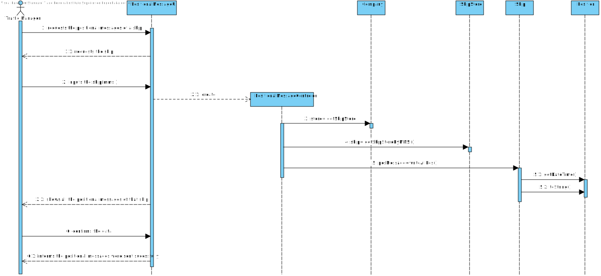
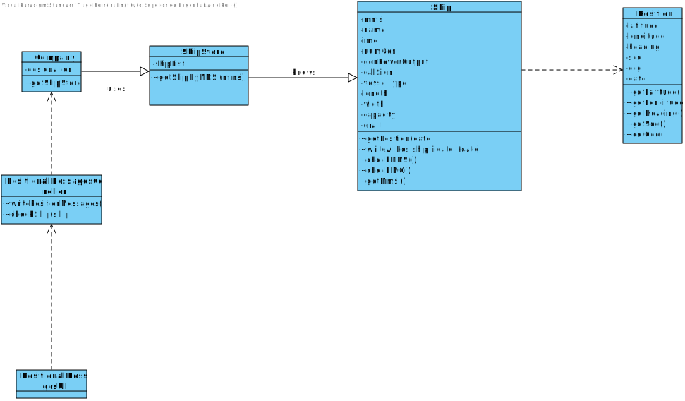

# US 103 - Have the Positional Messages of a Ship
## 1. Requirements Engineering

## 1.1. User Story Description

As a traffic manager I wish to have the positional messages temporally
organized and associated with each of the ships

## 1.2. Acceptance Criteria

* **AC1:** efficient access of any position value(s) of a ship on a period or date.

## 1.3. System Sequence Diagram (SSD)

## 2. OO Analysis

### Relevant Domain Model Excerpt

## 3. Design - User Story Realization

### 3.1. Sequence Diagram (SD)

### 3.2. Class Diagram (CD)

#4. Tests

**Test 1: Writes all the Positions**

    @Test
    void writeAllPosTest() {

        //Arrange
        shipgeral.getPosDate().addPosition(posgeral);
        LocalDateTime li = LocalDateTime.of(2020, 12, 01, 01, 01, 01);
        LocalDateTime lf = LocalDateTime.of(2020, 12, 31, 23, 59, 50);

        String expected = "Positional Message:";
        String expected2 = "Positional Message:\n" +
                "Position{latitude=0.0, longitude=0.0, heading=0.0, SOG=0.0, COG=1.0}";

        //Act + Assert
        assertEquals(expected, shipgeral.writeAllPos(li, null));
        assertEquals(expected, shipgeral.writeAllPos(null, lf));
        assertEquals(expected, shipgeral.writeAllPos(null, null));
        assertEquals(expected2, shipgeral.writeAllPos(li, lf));

    }

*Test 2: Compares the dates between positions*

    @Test
    void compareToMutation(){

        int actual = posgeral.compareTo(posgeral2);

        if(actual==0) fail();

    }

# 5. Construction (Implementation)

##Ship 

    public class Ship {

    private char transceiverClass;
    private PositionTreeStore posDate;
    private String cargo;
    private int mmsi;
    private String name;
    private String imo;
    private int numGen;
    private long genPowerOutput;
    private String callSign;
    private String vesselType;
    private double length;
    private double width;
    private double capacity;
    private double draft;
    private double travelledDistance;
    private Position biggestPosition;
    private Position smallPosition;
    private double posDateSize;

    public Ship(int mmsi, String name, String imo, String callSign, String vesselType, double length, double width, double draft, String cargo, char transceiverClass) {
        checkIMO(imo);
        checkMMSI(mmsi);

        this.mmsi = mmsi;
        this.name = name;
        this.imo = imo;
        this.callSign = callSign;
        this.vesselType = vesselType;
        this.length = length;
        this.width = width;
        this.draft = draft;
        this.cargo = cargo;
        this.transceiverClass = transceiverClass;

        this.posDate = new PositionTreeStore();
        this.travelledDistance = 0;
        this.biggestPosition = null;
        this.smallPosition = null;
        this.posDateSize = 0;
    }
    public String writeAllPos(LocalDateTime di, LocalDateTime df) {

        StringBuilder positionalMessage = new StringBuilder("Positional Message:");

        if (di == null || df == null) return positionalMessage.toString();

        Date initiald = java.sql.Timestamp.valueOf(di);
        Date finald = java.sql.Timestamp.valueOf(df);

        Calendar calendar = Calendar.getInstance();
        calendar.setTime(initiald);

        calendar.add(Calendar.SECOND, -1);
        initiald = calendar.getTime();

        List<Position> positionList = new ArrayList<>();

        PositionTreeStore binaryTest = this.getPosDate();
        Iterable<Position> posIterable = binaryTest.getInOrderList();
        Iterator<Position> posIterator = posIterable.iterator();

        while (!initiald.after(finald)) {
            while (posIterator.hasNext()) {
                Position pos = posIterator.next();
                Date posDate = java.sql.Timestamp.valueOf(pos.getDate());

                if (!posDate.before(initiald) && !posDate.after(initiald)) {
                    positionList.add(pos);
                }
            }
            posIterator = posIterable.iterator();

            calendar.add(Calendar.SECOND, 1);
            initiald = calendar.getTime();
        }

        if (positionList.isEmpty()) {
            return positionalMessage.toString();
        }

        for (Position pos : positionList) {
            positionalMessage.append("\n").append(pos.toString());
        }
        return positionalMessage.toString();
    }   
    }

##PositionalMessageController:

    public class PositionalMessageController {
    private final Company company;
    private final ShipStore shipStore;

    /**
     * Constructor.
     */
    public PositionalMessageController() {
        this.company = App.getInstance().getCompany();
        this.shipStore = company.getShipStore();
    }

    /**
     * Gets the positional messages of a ship by its MMSI on a certain period of time.
     */
    public String getPositionalMessages(int mmsi, LocalDateTime di, LocalDateTime df) {
        try {
            Ship ship = shipStore.getShipByMmsi(mmsi);

            if (ship == null) throw new NullPointerException("Ship doesn't exist!");
            String posMessage = ship.writeAllPos(di, df);

            if (!posMessage.equals("Positional Message:")) {
                return posMessage;
            }
        } catch (NullPointerException e) {
            return null;
        }
        return null;
    }

    /**
     * Gets the Ship Store.
     *
     * @return the Ship Store
     */
    public ShipStore getShipStore() {
        return shipStore;
    }
    }

##Class Position
    
    public class Position implements Comparable<Position> {
    Double latitude;
    Double longitude;
    Double heading;
    Double sog;
    Double cog;
    LocalDateTime date;

    public Position(double latitude, double longitude, double heading, double sog, double cog, LocalDateTime date) {
        setLatitude(latitude);
        setLongitude(longitude);
        setHeading(heading);
        setSog(sog);
        setCog(cog);
        setDate(date);
    }
 
    public Double getLatitude() {
        return latitude;
    }

 
    public Double getLongitude() {
        return longitude;
    }

    public Double getHeading() {
        return heading;
    }

    public Double getSog() {
        return sog;
    }

    public Double getCog() {
        return cog;
    }

    public LocalDateTime getDate() {
        return date;
    }

    public void setLatitude(double latitude) {
        if (latitude == 91) {
            this.latitude = null;
            return;
        }
        if (!(latitude < -MAX_LATITUDE || latitude > MAX_LATITUDE)) {
            this.latitude = latitude;
            return;
        }

        throw new IllegalArgumentException("");
    }

    public void setLongitude(double longitude) {
        if (longitude == 181) {
            this.longitude = null;
            return;
        }
        if (!(longitude < -MAX_LONGITUDE || longitude > MAX_LONGITUDE)) {
            this.longitude = longitude;
            return;
        }

        throw new IllegalArgumentException("");
    }

    public void setHeading(double heading) {
        if (heading == 511) {
            this.heading = null;
            return;
        }
        if (!(heading < -MIN_HEADING || heading > MAX_HEADING)) {
            this.heading = heading;
            return;
        }
        throw new IllegalArgumentException("");
    }

    public void setSog(double sog) {
        this.sog = sog;
    }

 
    public void setCog(double cog) {
        this.cog = cog;
    }

    public void setDate(LocalDateTime date) {
        this.date = date;
    }

    @Override
    public String toString() {
        return "Position{" +
                "latitude=" + latitude +
                ", longitude=" + longitude +
                ", heading=" + heading +
                ", SOG=" + sog +
                ", COG=" + cog +
                '}';
    }

    @Override
    public int compareTo(Position o) {
        if (this.getDate().isBefore(o.getDate())) {
            return -1;
        } else if (this.getDate().isAfter(o.getDate())) {
            return 1;
        } else {
            return 0;
        }
    }
    }
