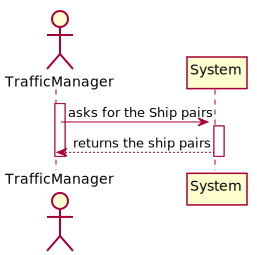
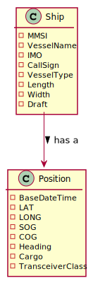
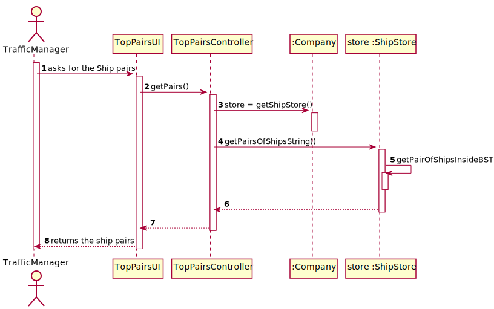
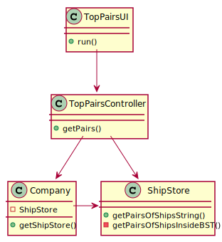

# US 107 - Returns pairs of ships with close routes 
## 1. Requirements Engineering

## 1.1. User Story Description

Return pairs of ships with routes with close departure/arrival coordinates (no
more than 5 Kms away) and with different Travelled Distance.

## 1.2. Acceptance Criteria

* **AC1:** Sorted by the MMSI code of the 1st ship and in descending order of the
  Travelled Distance difference.
  
* **AC2:** Do not consider ships with the number of movements greater than 1000
  and Travelled Distance less than 10 kms.

## 1.3. System Sequence Diagram (SSD)

## 2. OO Analysis

### Relevant Domain Model Excerpt

## 3. Design - User Story Realization

### 3.1. Sequence Diagram (SD)

### 3.2. Class Diagram (CD)

#4. Tests

**Test 1: Returns a pair of ship**

    @Test
    void getPairsOfShipsString() {
        ShipStore shipStore = new ShipStore();

        DateTimeFormatter formatter = DateTimeFormatter.ofPattern("dd-MM-yyyy HH:mm");

        Ship ship1 = new Ship(210950000, "VARAMO", "IMO9395044", "C4SQ2", "70", 166, 25, 9.5, "NA", 'B');
        Ship ship2 = new Ship(228339600, "CMA CGM ALMAVIVA", "IMO9450648", "FLSU", "70", 334, 42, 15, "79", 'B');
        shipstore.addShip(ship1);
        shipstore.addShip(ship2);
        ship1.insertPosition(ship1.createPosition(LocalDateTime.parse("31-12-2020 23:16", formatter), 0, 0, 0, 0, 1));
        ship1.insertPosition(ship1.createPosition(LocalDateTime.parse("01-01-2021 00:16", formatter), 25, 0, 0, 0, 1));

        ship2.insertPosition(ship2.createPosition(LocalDateTime.parse("02-01-2021 00:16", formatter), 0, 0, 0, 0, 1));
        ship2.insertPosition(ship2.createPosition(LocalDateTime.parse("02-01-2021 01:16", formatter), 15, 0, 0, 0, 1));
        ship2.insertPosition(ship2.createPosition(LocalDateTime.parse("02-01-2021 01:16", formatter), 25.0001, 0, 0, 0, 1));

        Ship ship3 = new Ship(256888000, "CMA CGM MELISANDE", "IMO9473028", "9HA2954", "70", 334, 42, 14.7, "70", 'B');
        Ship ship4 = new Ship(257881000, "SPAR ARIES", "IMO9701920", "LATO7", "70", 199, 32, 13.3, "NA", 'B');

        ship3.insertPosition(ship3.createPosition(LocalDateTime.parse("03-01-2021 01:16", formatter), 50, 0, 0, 0, 1));
        ship3.insertPosition(ship3.createPosition(LocalDateTime.parse("04-01-2021 01:16", formatter), 15.645, 0, 0, 0, 1));

        ship4.insertPosition(ship4.createPosition(LocalDateTime.parse("02-01-2021 01:16", formatter), 50, 0, 0, 0, 1));
        ship4.insertPosition(ship4.createPosition(LocalDateTime.parse("02-01-2021 01:26", formatter), 15.6456, 0, 0, 0, 1));

        shipstore.calculateTravelledDistanceOfAllShips();

        String expected = "|   Ship 1 MMSI   \t | \t     Ship 2 MMSI  \t  | \t   DistOrig     \t  |    \t  DistDest     \t  |      \t  Movs  \t       |         \t   TravelDist    \t        |  \t       Movs  \t       |           \t TravelDist           \t |\n" +
                "     228339600\t\t\t     210950000         \t\t\t 2779890.79     \t\t\t\t2779890.79          \t\t\t2                     \t\t2779890.79            \t\t2                    \t\t2779879.67\n";
        assertEquals(expected, shipstore.getPairsOfShipsString());

    }

# 5. Construction (Implementation)

##Class ShipStore

    public class ShipStore {

    public AVL<ShipByMmsi> shipByMmsiAVL;
    public AVL<ShipByIMO> shipByIMOAVL;
    public AVL<ShipByCallSign> shipByCallSignAVL;
    public AVL<PairOfShips> pairsOfShipsSearchTree = new AVL<>();

    /**
     * Constructor.
     */
    public ShipStore() {
        this.shipByMmsiAVL = new AVL<>();
        this.shipByIMOAVL = new AVL<>();
        this.shipByCallSignAVL = new AVL<>();
    }

    public void getPairOfShipsInsideBST() {
        List<Ship> lShip = transformAVLintoListMMSI();

        for (int i = 0; i < lShip.size(); i++) {
            Ship s1 = lShip.get(i);
            for (int j = 1; j < lShip.size(); j++) {
                Ship s2 = lShip.get(j);
                if (!s1.equals(s2)) {
                    if (DistanceCalculation.distanceTo(s1.getSmallPosition(), s2.getSmallPosition()) < 5000) {
                        if (DistanceCalculation.distanceTo(s1.getBiggestPosition(), s2.getBiggestPosition()) < 5000) {
                            if (s1.getShipsTravelledDistance() != s2.getShipsTravelledDistance()) {
                                if (s1.getShipsTravelledDistance() >= 10000 && s2.getShipsTravelledDistance() >= 10000) {
                                    PairOfShips pairOfShips = new PairOfShips(s1, s2);
                                    pairsOfShipsSearchTree.insert(pairOfShips);
                                }
                            }
                        }
                    }
                }
            }
        }
    }

    public String getPairsOfShipsString() {
        getPairOfShipsInsideBST();
        StringBuilder sb = new StringBuilder();

        sb.append("|   Ship 1 MMSI   \t | \t     Ship 2 MMSI  \t  | \t   DistOrig     \t  |    \t  DistDest     \t  |      \t  Movs  \t       |         \t   TravelDist    \t        |  \t       Movs  \t       |           \t TravelDist           \t |\n");

        for (PairOfShips pairOfShips : getPairsOfShipsSearchTree()) {
            sb.append("     " + pairOfShips.getLeft().getMmsi() + "\t\t\t     " + pairOfShips.getRight().getMmsi() + "         \t\t\t " + DistanceCalculation.distanceTo(pairOfShips.getLeft().getPosDate().getSmallestPosition(), pairOfShips.getLeft().getPosDate().getBiggestPosition()) + "     \t\t\t\t" + DistanceCalculation.distanceTo(pairOfShips.getLeft().getPosDate().getSmallestPosition(), pairOfShips.getLeft().getPosDate().getBiggestPosition()) + "          \t\t\t" + pairOfShips.getLeft().getTotalNumberOfMovements() + "                     \t\t" + pairOfShips.getLeft().getTravelledDistance() + "            \t\t" + pairOfShips.getRight().getTotalNumberOfMovements() + "                    \t\t" + pairOfShips.getRight().getTravelledDistance() + "\n");
        }
        return sb.toString();
    }
    }

##Class PairOfShipsController
    public class PairsOfShipsController {

    private final Company company;
    private final ShipStore shipStore;

    public PairsOfShipsController() {
        this.company = App.getInstance().getCompany();
        this.shipStore = company.getShipStore();
    }

    public String getPairs() {
        return shipStore.getPairsOfShipsString();
    }

    public ShipStore getShipStore() {
        return shipStore;
    }

    public int getSize() {
        return shipStore.getShipByMMSIBinarySearchTree().size();
    }

    }