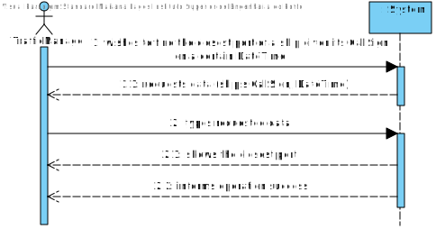
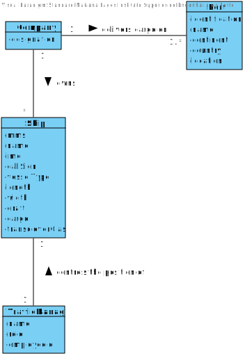
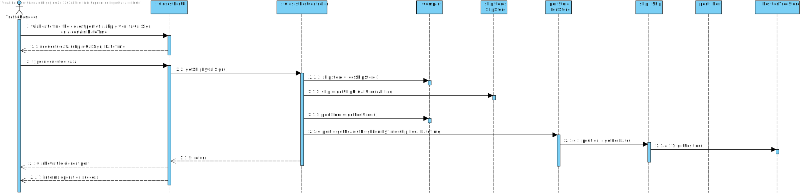
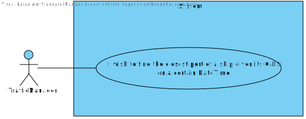

# US 101 - To import ports from a text file and create a 2D-tree with port locations

## 1. Requirements Engineering

## 1.1. User Story Description

As a Port manager, I which to import ports from a text file and create a 2D-tree
with port locations.

## 1.2. Acceptance Criteria

* **AC1:** 2D-tree balanced.

## 1.3. System Sequence Diagram (SSD)

## 2. OO Analysis

### Relevant Domain Model Excerpt

## 3. Design - User Story Realization

### 3.1. Sequence Diagram (SD)

### 3.2. Class Diagram (CD)

## 3.3 Use Case Diagram (UCD)

# 4. Tests

**Test 1:** Finds the nearest Port of a given ship

    @Test
    void nearestNeighbor() {
        //Arrange
        List<Port> portList = new ArrayList<>();
        Port port = new Port("11111", "a1", "a1", "a1", new FacilityLocation(10, 13));
        Port port2 = new Port("22222", "a2", "a2", "a2", new FacilityLocation(11, 12));
        Port port3 = new Port("33333", "a3", "a3", "a3", new FacilityLocation(3, 20));
        Port port4 = new Port("33333", "a4", "a4", "a4", new FacilityLocation(2, 22));
        Port port5 = new Port("33333", "a5", "a5", "a5", new FacilityLocation(20, 20));

        Position posgeral = new Position(19, 19, 0, 1, 1, date);
        portList.add(port3);
        portList.add(port2);
        portList.add(port);
        portList.add(port5);

        tdt.insert(portList.toArray(new Port[0]));

        //Act
        Port actual = tdt.nearestNeighborPort(posgeral);

        //Assert
        assertEquals(port5, actual);
    }

# 5. Construction (Implementation)

## Class ClosestPortController

    package lapr.project.controller;

    import lapr.project.model.Company;
    import lapr.project.model.Port;
    import lapr.project.model.Ship;
    import lapr.project.model.stores.PortStore;
    import lapr.project.utils.mappers.PortMapper;
    import lapr.project.utils.mappers.dto.PortDTO;
    import java.time.LocalDateTime;
    import java.util.ArrayList;
    import java.util.List;

    public class ClosestPortController {

    private final Company company = App.getInstance().getCompany();
    private final PortStore portStore;
    private final PortMapper portMapper;

    /**
     * Constructor.
     */
    public ClosestPortController() {
        portStore = company.getPortStore();
        portMapper = new PortMapper();
    }

    /**
     * Gets the nearest port by call sign (in DTO)
     *
     * @param callSign      the ship's call sign
     * @param localDateTime the time
     * @return the nearest port by call sign (in DTO)
     */
    public PortDTO getNearestPortByCallSign(String callSign, LocalDateTime localDateTime) throws IllegalArgumentException {
        Ship ship = company.getShipStore().getShipByCallSign(callSign);
        Port port = portStore.getNearestNeighbourByTime(ship, localDateTime);

        List<Port> portList = new ArrayList<>();
        portList.add(port);

        List<PortDTO> listOfPortsDTO = portMapper.toDTO(portList);
        return (listOfPortsDTO.get(0));
    }
    
}
##Class TwoDTree

    public class TwoDTree {
    private final Comparator<Facility> cmpX = Comparator.comparingDouble(o -> o.getLocation().getLongitude());

    private final Comparator<Facility> cmpY = Comparator.comparingDouble(o -> o.getLocation().getLatitude());

    double closesDist;
    Node closestNode;

    Node root = null;

    public TwoDTree() {
        root = null;
    }

    private static double dist(Node n0, Port port) {
        double total;

        total = Math.sqrt(distSquared(n0, port));

        return total;
    }

    private static double distSquared(Node n0, Port port) {

        double total = Math.abs(Math.pow(n0.getX() - port.getLocation().getLatitude(), 2) + Math.pow(n0.getY() - port.getLocation().getLongitude(), 2));

        return total;
    }

    public void insert(Port[] port) {

        if (port == null) return;
        if (port.length == 0) return;

        root = insert(port, true);
    }

    public Node insert(Port[] point, boolean divX) {
        if (point.length == 0) {
            return null;
        }
        int n = point.length / 2;

        if (divX) {
            Arrays.sort(point, cmpX);
        } else {
            Arrays.sort(point, cmpY);
        }
        Node nodeToInsert = new Node<>(point[n], null, null);
        nodeToInsert.setLeft(insert(Arrays.copyOfRange(point, 0, n), !divX));
        nodeToInsert.setRight(insert(Arrays.copyOfRange(point, n + 1, point.length), !divX));
        return nodeToInsert;
    }

    public Port nearestNeighborPort(Position target) {

        closesDist = Double.MAX_VALUE;
        closestNode = null;
        return nearestNeighborNode(root, target, true).getElement();
    }

    private Node nearestNeighborNode(Node root, Position target, boolean divX) {

        if (root == null) {
            return closestNode;
        }

        double d = Point2D.distanceSq(root.getX(), root.getY(), target.getLongitude(), target.getLatitude());

        if (closesDist > d) {
            closesDist = d;
            closestNode = root;
        }

        double delta = divX ? target.getLongitude() - root.getX() : target.getLatitude() - root.getY();
        double delta2 = delta * delta;

        Node node1 = delta < 0 ? root.left : root.right;
        Node node2 = delta2 < 0 ? root.right : root.left;

        nearestNeighborNode(node1, target, !divX);

        if (delta2 < closesDist) {
            closestNode = nearestNeighborNode(node2, target, !divX);
        }

        return closestNode;
    }

    @Override
    public String toString() {
        StringBuilder sb = new StringBuilder();
        Queue<Node> q = new LinkedList<>();

        q.add(this.root);

        while (!q.isEmpty()) {
            int size = q.size();
            for (int i = 0; i < size; i++) {
                Node n = q.poll();
                if (n != null) {
                    sb.append(" --").append(n.getElement().getName()).append("-- ");
                    q.add(n.left);
                    q.add(n.right);
                } else {
                    sb.append(" --null-- ");
                }
            }
            sb.append('\n');
        }

        return sb.toString();
    }

    protected static class Node<Port> {

        private lapr.project.model.Port port;

        private Node left;
        private Node right;

        public Node(lapr.project.model.Port port, Node leftChild, Node rightChild) {
            this.port = port;
            left = leftChild;
            right = rightChild;

        }

        public lapr.project.model.Port getElement() {
            return port;
        }

        // Update methods

        public void setElement(lapr.project.model.Port e) {
            port = e;
        }

        public Node getLeft() {
            return left;
        }

        public void setLeft(Node leftChild) {
            left = leftChild;
        }

        public Node getRight() {
            return right;
        }

        public void setRight(Node rightChild) {
            right = rightChild;
        }

        public double getX() {
            return port.getLocation().getLongitude();
        }

        public double getY() {
            return port.getLocation().getLatitude();
        }
    }
    }

