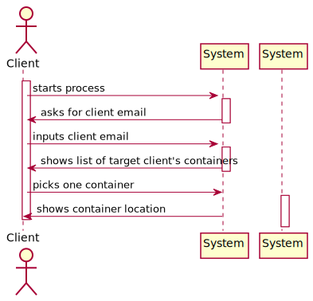
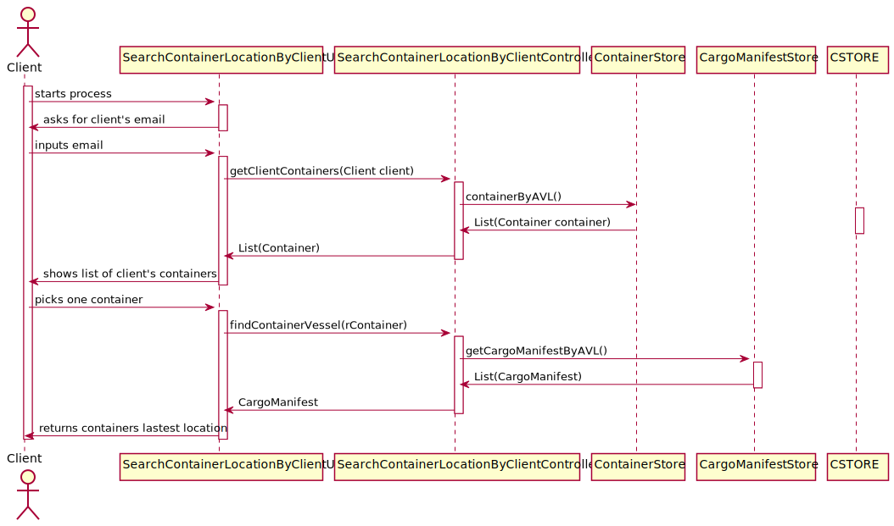
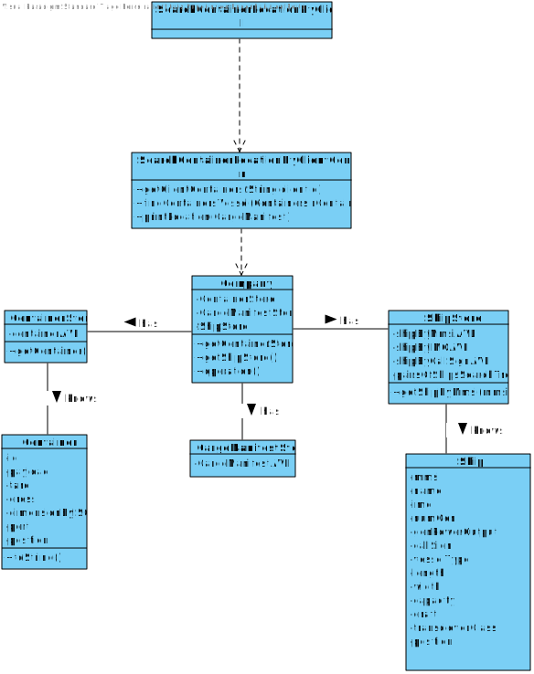

# US 101 -  to know the current situation of a specific container being used to transport my goods.

## 1. Requirements Engineering

## 1.1. User Story Description

As Client, I want to know the current situation of a specific container being used
to transport my goods.

## 1.2. Acceptance Criteria

* **AC1:** Clients provide the container identifier and get the type and the concrete
  instance of its current location, e.g., PORT, Leixões or SHIP, WeFly.

## 1.3. System Sequence Diagram (SSD)

## 2. OO Analysis

### Relevant Domain Model Excerpt

## 3. Design - User Story Realization

### 3.1. Sequence Diagram (SD)

### 3.2. Class Diagram (CD)

# 4. Tests

**Test 1:** Search Container Location for Clinet Controller Test 

    class SearchContainerLocationForClientControllerTest {

    SearchContainerLocationForClientController ctrl = new SearchContainerLocationForClientController();

    @Test
    void getClientContainers() {

    }

    @Test
    void findContainerVessel(){

    }
     }

# 5. Construction (Implementation)

## Class SearchContainerLocationForClientController

    public class SearchContainerLocationForClientController {

    private final CargoManifestStoreData cargoManifestStore;
    private GetClientsContainerScript script = new GetClientsContainerScript(App.getInstance().getDatabaseConnection());

    /**
     * Constructor
     */
    public SearchContainerLocationForClientController() {
        Company company = App.getInstance().getCompany();
        this.cargoManifestStore = company.getCargoManifestStoreData();
    }

    /**
     * Gets a list of containers from a certain client
     *
     * @param clientID client's ID
     * @return list of containers
     */
    public ArrayList<String> getClientContainers(String clientID) {
        ArrayList<String> lResult = script.getClientContainers(clientID);

        return lResult;
    }

    /**
     * Finds the last cargo manifest that the desired container was present
     *
     * @param rContainer Container
     * @return Last cargo manifest in which the container was present
     */
    public CargoManifest findContainerVessel(Container rContainer) {
        CargoManifest rCargoManifest = null;
        for (CargoManifest cm : cargoManifestStore.getListCargoManifest(App.getInstance().getDatabaseConnection())) {
            if (cm.getLoaded().find(rContainer).equals(rContainer) && rCargoManifest.equals(null)) {
                rCargoManifest = cm;
            } else if (cm.getDate().after(rCargoManifest.getDate())) {
                rCargoManifest = cm;
            }
        }
        return rCargoManifest;
    }

    /**
     * Returns a string with the information of the last coordinates of the container's vessel (Ship / Port)
     *
     * @param rCargoManifest Cargo manifest where the container is loaded
     * @return information on the last coordinates of the container in a String
     */
    public String printLocation(CargoManifest rCargoManifest) {
        if (rCargoManifest.getInTransport()) {
            return ("Container is aboard the: " + rCargoManifest.getShip().getCallSign() + " \n" +
                    "Coordinates: \n" +
                    "   Lat : " + rCargoManifest.getShip().getSmallestPosition().getLatitude() + "\n" +
                    "   Long: " + rCargoManifest.getShip().getSmallestPosition().getLongitude() + "\n");
        } else {
            return ("Container is currently stored in: " + rCargoManifest.getPort().getIdentification() + " \n" +
                    "Coordinates: \n" +
                    "   Lat : " + rCargoManifest.getPort().getLocation().getLatitude() + "\n" +
                    "   Long: " + rCargoManifest.getPort().getLocation().getLongitude() + "\n");
        }
    }
    }
##Class Search Container Location For Client Controller

    public class CargoManifestStoreData implements Persistable {

    private final Set<CargoManifest> listCargoManifest;

    public CargoManifestStoreData() {
        this.listCargoManifest = new HashSet<>();
    }

    @Override
    public boolean save(DatabaseConnection databaseConnection, Object object) {
        return false;
    }

    @Override
    public boolean delete(DatabaseConnection databaseConnection, Object object) {
        return false;
    }

    @Override
    public Object getElement(DatabaseConnection databaseConnection, Object object) {
        return null;
    }

    public Set<CargoManifest> getListCargoManifest(DatabaseConnection databaseConnection) {

        if (listCargoManifest.isEmpty()) fillCargoManifestList(databaseConnection);

        return listCargoManifest;
    }

    private void fillCargoManifestList(DatabaseConnection databaseConnection) {

        Connection connection = databaseConnection.getConnection();

        String sqlCommand;

        sqlCommand = "SELECT * from CARGOMANIFEST";

        try (PreparedStatement getPreparedStatement = connection.prepareStatement(sqlCommand)) {
            try (ResultSet resultSet = getPreparedStatement.executeQuery()) {

                while (resultSet.next()) {
                    String identification = resultSet.getString("CARGOMANIFESTID");

                    Port port = DataBaseUtils.getPort(resultSet.getString("FACILITYID"), databaseConnection);

                    Date date = (Date) resultSet.getObject("CARGOMANIFESTDATE");

                    CargoManifest cargoManifest = new CargoManifest(identification, port, date);
                    listCargoManifest.add(cargoManifest);
                }

            }
        } catch (SQLException e) {
            Logger.getLogger(CargoManifestStoreData.class.getName()).log(Level.SEVERE, null, e);
            databaseConnection.registerError(e);
        }

    }

    }

