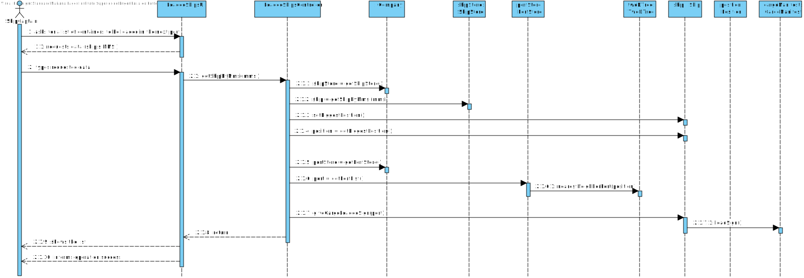
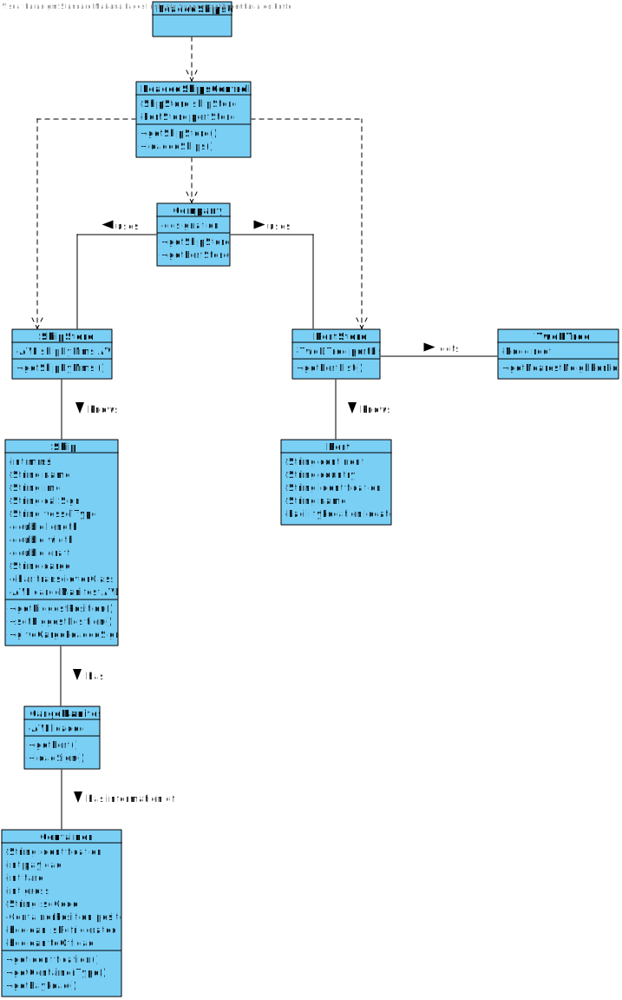

# US 206 - List of containers to be loaded in the next port

## 1. Requirements Engineering

## 1.1. User Story Description

* As Ship Captain, I want the list of containers to be loaded in the next port, including container identifier, type, and load.

## 1.2. Acceptance Criteria

* **AC1:** “next port” is properly identified.
* **AC2:** The containers being loaded are properly identified.
* **AC3:** Output is in accordance with the specification wrt the information about each container.

## 1.3. System Sequence Diagram (SSD)

## 2. OO Analysis

### Relevant Domain Model Excerpt

## 3. Design - User Story Realization

### 3.1. Sequence Diagram (SD)

### 3.2. Class Diagram (CD)

## 3.3 Use Case Diagram (UCD)

# 4. Tests

**Test 1:** Loaded Ships Controller 

    @Test
    void loadedShips() {
        //Arrange
        ship.insertPosition(position);
        container.setPosition(containerPosition);
        ship.getCargoManifestAVL().insert(cargoManifest);
        ctrl.getShipStore().addShip(ship);
        ship.addLoadedContainer(container, port);

        boolean expected = false;

        //Act
        boolean actual = ctrl.loadedShips(ship.getMmsi());

        //Assert
        assertEquals(expected, actual);
    }
    }

# 5. Construction (Implementation)

## Class Loaded Containers Controller

    public class LoadedContainersController {

    private final OffOrLoadContainers offOrLoadContainers;
    private final DatabaseConnection databaseConnection;

    /**
     * Constructor.
     */
    public LoadedContainersController() {
        this.offOrLoadContainers = new OffOrLoadContainers();
        this.databaseConnection = App.getInstance().getDatabaseConnection();
    }

    public String getLoadContainers(int mmsi, String type) throws ShipCargoCapacityException, ContainerGrossException, ContainersInsideCargoManifestListSizeException, CargoManifestIDException, CargoManifestDoesntBelongToThatShipException, VehicleIDNotValidException, IllegalArgumentException, SQLException {
        return (offOrLoadContainers.getResultLoaded(databaseConnection, mmsi, type));
    }
    }

##Class OffOrLoadedContainers

package lapr.project.data.DataBaseScripts;

import lapr.project.data.DatabaseConnection;
import lapr.project.model.CargoManifest;
import lapr.project.model.Container;

import java.sql.*;
import java.time.LocalDate;
import java.util.ArrayList;
import java.util.List;

public class OffOrLoadContainers {

    private DatabaseConnection databaseConnection = null;
    private List<CargoManifest> cargoManifests = new ArrayList<>();
    private int countCargos = 0;
    private int countContainers = 0;

    public OffOrLoadContainers() {
        //Empty constructor
    }

    private String getFacility(int mmsi) {
        Connection connection = databaseConnection.getConnection();

        String sqlCommand = "Select  f.FACILITYID from FACILITY f\n" +
                "inner join POSITIONALMESSAGE pm\n" +
                "on ABS(ABS(pm.LONGITUDE) + ABS(pm.LATITUDE)) - ABS(ABS(f.LATITUDE)+ ABS(f.LONGITUDE)) >0\n" +
                "where pm.MMSI = " + mmsi + "\n" +
                "and f.FACILITYID = (Select cm.FACILITYID from CargoManifest cm\n" +
                "    where cm.vehicleId = (Select s.VEHICLEID from Ship s\n" +
                "        where s.MMSI = " + mmsi + ")\n" +
                "    and cm.CargoManifestDate > pm.BASEDATETIME FETCH FIRST 1 ROW  ONLY )\n" +
                "order by f.FACILITYID Desc\n" +
                "FETCH first 1 ROW ONLY";

        try (PreparedStatement getPreparedStatement = connection.prepareStatement(sqlCommand)) {
            try (ResultSet resultSet = getPreparedStatement.executeQuery()) {

                if (resultSet.next()) {
                    return resultSet.getString("FACILITYID");
                } else {
                    return null;
                }
            }
        } catch (SQLException throwables) {
            throwables.printStackTrace();
            return null;
        }
    }

    private int countContainerByCargo(String facilityId, int mmsi, int type) {
        Connection connection = databaseConnection.getConnection();

        String sqlCommand = "select count(c.CONTAINERID) CountContainers  from CONTAINER c\n" +
                "inner join CARGOMANIFESTCONTAINER cmc\n" +
                "on cmc.CONTAINERID = c.CONTAINERID\n" +
                "where cmc.CARGOMANIFESTID = (select cm.CARGOMANIFESTID from CargoManifest cm\n" +
                "    where cm.CARGOMANIFESTTYPE = " + type + "\n" +
                "    and cm.idTrip = (Select t.IDTRIP from TRIP t\n" +
                "        inner join Ship s\n" +
                "        on t.VEHICLEID = s.VEHICLEID\n" +
                "            where s.MMSI = " + mmsi + ")\n" +
                "    and cm.FACILITYID = " + facilityId + ")";

        try (PreparedStatement getPreparedStatement = connection.prepareStatement(sqlCommand)) {
            try (ResultSet resultSet = getPreparedStatement.executeQuery()) {

                if (resultSet.next()) {
                    return countContainers += resultSet.getInt("COUNTCONTAINERS");
                } else {
                    return 0;
                }
            }
        } catch (SQLException throwables) {
            throwables.printStackTrace();
            return 0;
        }
    }

    private Container getContainerByCargoManifest(String facilityId, int mmsi, int j, int type) {
        Connection connection = databaseConnection.getConnection();

        String sqlCommand = "select * from CONTAINER c\n" +
                "inner join CARGOMANIFESTCONTAINER cmc\n" +
                "on cmc.CONTAINERID = c.CONTAINERID\n" +
                "where cmc.CARGOMANIFESTID = (select cm.CARGOMANIFESTID from CargoManifest cm\n" +
                "    where cm.CARGOMANIFESTTYPE = " + type + "\n" +
                "    and cm.idTrip = (Select t.IDTRIP from TRIP t\n" +
                "        inner join Ship s\n" +
                "        on t.VEHICLEID = s.VEHICLEID\n" +
                "            where s.MMSI = " + mmsi + ")\n" +
                "    and cm.FACILITYID = " + facilityId + ")";

        try (PreparedStatement getPreparedStatement = connection.prepareStatement(sqlCommand)) {
            try (ResultSet resultSet = getPreparedStatement.executeQuery()) {

                for (int i = 0; i < j; i++) {
                    resultSet.next();
                }
                if (resultSet.next()) {

                    String identification = resultSet.getString("CONTAINERID");
                    int payload = resultSet.getInt("PAYLOAD");
                    int tare = resultSet.getInt("TARE");
                    int gross = resultSet.getInt("GROSS");
                    String isoCode = resultSet.getString("ISOCODE");

                    return new Container(identification, payload, tare, gross, isoCode);

                } else return null;
            }
        } catch (SQLException throwables) {
            throwables.printStackTrace();
            return null;
        }
    }

    public boolean getContainersPerCargoOffLoad(int mmsi, int type) {

        String facilityId = getFacility(mmsi);
        int k = countContainerByCargo(facilityId, mmsi, type);
        if (k == 0) {
            return false;
        }
        int count2 = 0;

        while (k != 0) {
            Container c = getContainerByCargoManifest(facilityId, mmsi, count2, type);
            if (c != null) {
                System.out.println(c);
            }
            count2++;
            k--;
        }
        return true;
    }

    public boolean getResultOffLoaded(DatabaseConnection databaseConnection, int mmsi, int type) {
        this.databaseConnection = databaseConnection;

        return getContainersPerCargoOffLoad(mmsi, type);
    }

    //LoadContainers ------------------------------------------------------------

    public String getContainersToLoad(DatabaseConnection databaseConnection, String type, int mmsi) throws SQLException {
        Connection connection = databaseConnection.getConnection();

        StringBuilder stringBuilder = new StringBuilder();

        LocalDate ld = LocalDate.now();
        String todayDate = ld.getYear() + "-" + ld.getMonthValue() + "-" + ld.getDayOfMonth();

        LocalDate cargoManifestNearestDate = getDate(databaseConnection, type, ld);

        String sqlCommand = "select c.CONTAINERID,c.PAYLOAD\n" +
                "from CONTAINER c\n" +
                "         inner join CARGOMANIFESTCONTAINER cmc\n" +
                "                    on cmc.CONTAINERID = c.CONTAINERID\n" +
                "where cmc.CARGOMANIFESTID in (select cm.CARGOMANIFESTID\n" +
                "                              from CARGOMANIFEST cm\n" +
                "                              where cm.CARGOMANIFESTTYPE = '" + type + "'\n" +
                "                                and cm.IDTRIP = (select t.IDTRIP\n" +
                "                                                 FROM TRIP t\n" +
                "                                                          inner join VEHICLE v\n" +
                "                                                                     on t.VEHICLEID = v.VEHICLEID\n" +
                "                                                 where v.VEHICLEID = (select s.VEHICLEID\n" +
                "                                                                      from SHIP s\n" +
                "                                                                      where s.MMSI = '" + mmsi + "') and t.STARTDATE < '" + todayDate + "' and t.ENDDATE > '" + todayDate + "')\n" +
                "    and cm.CARGOMANIFESTDATE = '" + cargoManifestNearestDate + "')";

        try (PreparedStatement getPreparedStatement = connection.prepareStatement(sqlCommand)) {
            try (ResultSet resultSet = getPreparedStatement.executeQuery()) {

                while (resultSet.next()) {

                    boolean refrigerated = verifyContainerType(databaseConnection, resultSet.getString(1));

                    if (refrigerated) {
                        stringBuilder.append("Container ID: " + resultSet.getString(1)).append("; Load: ").append(resultSet.getString(2)).append("; Type: Refrigerated\n");
                    } else {
                        stringBuilder.append("Container ID: " + resultSet.getString(1)).append("; Load: ").append(resultSet.getString(2)).append("; Type: Not refrigerated\n");
                    }
                }
                return stringBuilder.toString();
            }
        }
    }

    public LocalDate getDate(DatabaseConnection databaseConnection, String type, LocalDate ld) throws SQLException {
        Connection connection = databaseConnection.getConnection();

        String sqlCommand = "select CARGOMANIFESTDATE from CARGOMANIFEST\n" +
                "where CARGOMANIFESTTYPE = '" + type + "'\n" +
                "ORDER BY 1";

        try (PreparedStatement getPreparedStatement = connection.prepareStatement(sqlCommand)) {
            try (ResultSet resultSet = getPreparedStatement.executeQuery()) {

                while (resultSet.next()) {
                    Timestamp timestamp = (Timestamp) resultSet.getObject(1);
                    LocalDate iteration = timestamp.toLocalDateTime().toLocalDate();

                    if (ld.isBefore(iteration)) {
                        return iteration;
                    }
                }
            }
        }
        return null;
    }

    public boolean verifyContainerType(DatabaseConnection databaseConnection, String idContainer) throws SQLException {
        Connection connection = databaseConnection.getConnection();

        String sqlCommand = "select * from CONTAINER\n" +
                "inner join REFRIGERATORCONTAINER R on CONTAINER.CONTAINERID = R.CONTAINERID\n" +
                "where R.CONTAINERID = '" + idContainer + "'";

        try (PreparedStatement getPreparedStatement = connection.prepareStatement(sqlCommand)) {
            try (ResultSet resultSet = getPreparedStatement.executeQuery()) {
                if (resultSet.next()) {
                    return true;
                }
            }
        }
        return false;
    }

    public String getResultLoaded(DatabaseConnection databaseConnection, int mmsi, String type) throws SQLException {
        this.databaseConnection = databaseConnection;

        return getContainersToLoad(databaseConnection, type, mmsi);
    }
    }
