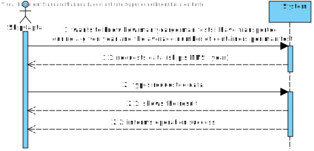
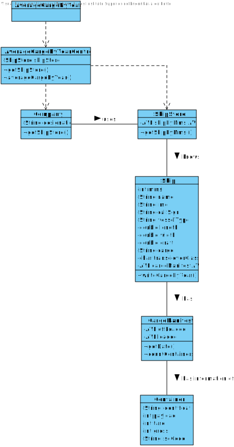

# US 207 - To know how many cargo manifests I have transported during a given year and the average number of containers per manifest.

## 1. Requirements Engineering

## 1.1. User Story Description

* As Ship Captain, I want to know how many cargo manifests I have transported
during a given year and the average number of containers per manifest

## 1.2. Acceptance Criteria

* Only the cargo manifests of the specified year are considered.
* Average containers per cargo manifest are properly computed.

## 1.3. System Sequence Diagram (SSD)

## 2. OO Analysis

### Relevant Domain Model Excerpt

## 3. Design - User Story Realization

### 3.1. Sequence Diagram (SD)

### 3.2. Class Diagram (CD)

## 3.3 Use Case Diagram (UCD)

# 4. Tests

**Test 1:** Average Cargo By Year Controller Test

    import static org.junit.jupiter.api.Assertions.*;
    
    class AverageCargoByYearControllerTest {

    AverageCargoByYearController ctrl = new AverageCargoByYearController();

    Ship ship = new Ship(111111111, "name", "IMO1111111", 1, 1, "A", "A", 1, 1, 1, 1);

    String sdate = "31/11/2020 23:16";
    DateTimeFormatter formatter = DateTimeFormatter.ofPattern("dd/MM/yyyy HH:mm");
    LocalDateTime date = LocalDateTime.from(formatter.parse(sdate));
    Position position = new Position(1, 0, 0, 1, 1, date);

    ContainerPosition containerPosition = new ContainerPosition(1, 1, 1);
    Container container = new Container("01", 1, 1, 1, "11", false, false);

    FacilityLocation facilityLocation = new FacilityLocation(2, 2);
    Port port = new Port("Asia", "Japan", "11", "port", facilityLocation);

    CargoManifest cargoManifest = new CargoManifest("11", port, new Date(2020, Calendar.DECEMBER, 25));

    @Test
    void averageCargoByYearController() {
        //Arrange
        ship.insertPosition(position);
        container.setPosition(containerPosition);
        ship.getCargoManifestAVL().insert(cargoManifest);
        ctrl.getShipStore().addShip(ship);
        ship.addLoadedContainer(container, port);

        String expected = "CargoManifest{identification='11', port=Facility{identification='Asia', name='Japan', continent='11', country='port', location=latitude = 2.0, longitude = 2.0}, date=Sat Dec 25 00:00:00 WET 3920}\n" +
                "\n" +
                "Average Containers by Cargo Manifest:1.0";

        //Act
        String actual = ctrl.averageCargoByYear(ship.getMmsi(), cargoManifest.getDate().getYear());

        //Assert
        assertEquals(expected, actual);
    }
    }

# 5. Construction (Implementation)

## Class Average Cargo By Year Controller

    public class AverageCargoByYearScript {

    public AverageCargoByYearScript() {
        //Empty constructor
    }

    private DatabaseConnection databaseConnection = null;

    public int getCargoManifestsOfATripFromDataBase(int mmsi, int date, int j) throws SQLException {
        String sqlCommand = "select cm.CARGOMANIFESTID from CARGOMANIFEST cm\n" +
                "                                   inner join TRIP T on T.IDTRIP = cm.IDTRIP and T.VEHICLEID = cm.VEHICLEID and Extract(YEAR from CARGOMANIFESTDATE) = " + date +
                "where t.VEHICLEID = (select v.VEHICLEID from VEHICLE v inner join Ship S on v.vehicleId = S.vehicleId\n" +
                "                     where s.MMSI = " + mmsi + ")";

        Connection connection = databaseConnection.getConnection();

        try (PreparedStatement getPreparedStatement = connection.prepareStatement(sqlCommand)) {
            try (ResultSet resultSet = getPreparedStatement.executeQuery()) {
                for (int i = 0; i < j; i++) {
                    resultSet.next();
                }

                if (resultSet.next()) {
                    return resultSet.getInt("CARGOMANIFESTID");

                } else return 0;
            }
        }
    }

    private int getCargoManifestOfATripSize(int mmsi, int date) throws SQLException {
        String sqlCommand = "select COUNT(*) COUNT_MANIFESTS from CARGOMANIFEST cm\n" +
                "                                   inner join TRIP T on T.IDTRIP = cm.IDTRIP and T.VEHICLEID = cm.VEHICLEID and Extract(YEAR from CARGOMANIFESTDATE) = " + date +
                "where t.VEHICLEID = (select v.VEHICLEID from VEHICLE v inner join Ship S on v.vehicleId = S.vehicleId\n" +
                "                     where s.MMSI = " + mmsi + ")";

        Connection connection = databaseConnection.getConnection();

        try (PreparedStatement getPreparedStatement = connection.prepareStatement(sqlCommand)) {
            try (ResultSet resultSet = getPreparedStatement.executeQuery()) {
                if (resultSet.next()) {
                    return resultSet.getInt("COUNT_MANIFESTS");

                } else {
                    return 0;
                }
            }
        }
    }

    private int getContainersCargoManifestOfATripSize(int cargoManifestID) throws SQLException {
        Connection connection = databaseConnection.getConnection();

        String sqlCommand = "select count(c.CONTAINERID) COUNT_CONTAINERS\n" +
                "from CONTAINER c\n" +
                "         inner join CARGOMANIFESTCONTAINER cm on cm.CONTAINERID = c.CONTAINERID\n" +
                "where cm.CARGOMANIFESTID = " + cargoManifestID;

        try (PreparedStatement getPreparedStatement = connection.prepareStatement(sqlCommand)) {
            try (ResultSet resultSet = getPreparedStatement.executeQuery()) {
                if (resultSet.next()) {
                    return (resultSet.getInt("COUNT_CONTAINERS"));
                }

                return 0;

            }
        }
    }

    public int getNumberOfContainersPerTrip(int mmsi, int date) throws NoContainersInsideThatTripException, NoCargoManifestInThatDateException, NoCargoManifestsWereFoundInThatTrip {

        int j = 0;

        try {
            j = getCargoManifestOfATripSize(mmsi, date);
        } catch (SQLException e) {
            throw new NoCargoManifestsWereFoundInThatTrip();
        }

        int cargoManifestID = 0;

        int sumContainers = 0;

        int count = 0;
        int aux = j;

        while (j != 0) {

            try {
                cargoManifestID = getCargoManifestsOfATripFromDataBase(mmsi, date, count);
            } catch (SQLException e) {
                throw new NoCargoManifestInThatDateException();
            }

            try {
                sumContainers += getContainersCargoManifestOfATripSize(cargoManifestID);
            } catch (SQLException e) {
                throw new NoContainersInsideThatTripException();
            }

            count++;
            j--;
        }

        if (aux == 0) {
            throw new NoCargoManifestsWereFoundInThatTrip();
        }

        return (sumContainers / aux);
    }

    public String numberOfContainers(DatabaseConnection databaseConnection, int mmsi, int date) throws SQLException, NoCargoManifestInThatDateException, NoCargoManifestsWereFoundInThatTrip, NoContainersInsideThatTripException {
        this.databaseConnection = databaseConnection;

        StringBuilder stringBuilder = new StringBuilder();

        stringBuilder.append("Number of cargo manifests in the given year: ").append(getCargoManifestOfATripSize(mmsi, date)).append("\n").append("Number of containers in the given year: ").append(getNumberOfContainersPerTrip(mmsi, date));

        return stringBuilder.toString();
    }
    }
