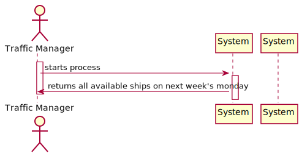
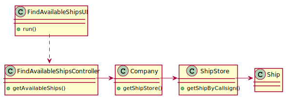

# US 210 - To know which ships will be available on Monday next week and their location.

## 1. Requirements Engineering

## 1.1. User Story Description

* As Traffic manager, I need to know which ships will be available on Monday next week and their location.

## 1.2. Acceptance Criteria

* **AC1:** Monday next week is properly identified.
* **AC2:** Only available ships are returned.
* **AC3:** All available ships are returned.

## 1.3. System Sequence Diagram (SSD)

## 2. OO Analysis

### Relevant Domain Model Excerpt

## 3. Design - User Story Realization

### 3.1. Sequence Diagram (SD)

### 3.2. Class Diagram (CD)

# 4. Tests

**Test 1:** Checks if imported no ships 

    @Test
    void testImportNoShips() {
        Assertions.assertThrows(Exception.class, () -> {
            ShipImporter.importsShips(new File("test.csv"));
        });
    }

**Test 2:** Check if a line is invalid to read

       @Test
    void testInvalidLine() throws IOException {

        tempFile = Files.createFile(tempDir.resolve("shipsInvalidLine.csv"));

        FileWriter fileWriter = new FileWriter(String.valueOf(tempFile));
        fileWriter.write("212180000,31/12/2020 21:08,26.20221,-84.95411,11.3,116.8,117,SAITA I,IMO9643544,5BBA4,70,228,32,14.4,NA,A,8\n");
        fileWriter.close();

        Assertions.assertThrows(Exception.class, () -> {
            ShipImporter.importsShips(new File("shipsInvalidLine.csv"));
        });

    }

**Test 3:** Check if an invalid line exists

       @Test
    void testInvalidLineExistsShip() throws IOException {

        tempFile = Files.createFile(tempDir.resolve("shipsInvalidLine.csv"));

        FileWriter fileWriter = new FileWriter(String.valueOf(tempFile));
        fileWriter.write("212170000,31/12/2020 21:08,26.20221,-84.95411,11.3,116.8,117,SAITA I,IMO9643544,5BBA4,70,228,32,14.4,NA,A,8\n");
        fileWriter.close();

        Assertions.assertThrows(Exception.class, () -> {
            ShipImporter.importsShips(new File("shipsInvalidLine.csv"));
        });

    }

# 5. Construction (Implementation)

## Class ImportShipsController

    public class ImportShipsController {

    private final Company company;

    public ImportShipsController() {
        this.company = App.getInstance().getCompany();
    }

    public boolean importShips(String fileName) throws InvalidLineException, FileNotFoundException {
        boolean returnValue = false;
        returnValue = ShipImporter.importsShips(new File(fileName));
        company.getShipStore().calculateTravelledDistanceOfAllShips();
        return returnValue;
    }
    }
##Class ShipImporter

    public class ShipImporter {

    public static boolean importsShips(File path) throws FileNotFoundException, InvalidLineException {
        DateTimeFormatter formatter = DateTimeFormatter.ofPattern("dd/MM/yyyy HH:mm");
        Company company = App.getInstance().getCompany();
        ShipStore shipStore = company.getShipStore();
        List<String[]> data = CsvUtils.readFile(path);

        for (String[] line : data) {
            Ship MmsiShip = null;
            Ship IMOShip = null;
            Ship CallSignShip = null;
            if (!shipStore.existsShip(Integer.parseInt(line[0]))) {
                if (line.length != 16) throw new InvalidLineException();

                MmsiShip = shipStore.createShip(Integer.parseInt(line[0]), line[7], line[8], line[9], line[10], Double.parseDouble(line[11]), Double.parseDouble(line[12]), Math.abs(Double.parseDouble(line[13])), line[14], line[15].charAt(0));
                IMOShip = shipStore.createShip(Integer.parseInt(line[0]), line[7], line[8], line[9], line[10], Double.parseDouble(line[11]), Double.parseDouble(line[12]), Math.abs(Double.parseDouble(line[13])), line[14], line[15].charAt(0));
                CallSignShip = shipStore.createShip(Integer.parseInt(line[0]), line[7], line[8], line[9], line[10], Double.parseDouble(line[11]), Double.parseDouble(line[12]), Math.abs(Double.parseDouble(line[13])), line[14], line[15].charAt(0));
                shipStore.addShip(MmsiShip);
            } else {
                if (line.length != 16) throw new InvalidLineException();
                MmsiShip = shipStore.getShipByMmsi(Integer.parseInt(line[0]));
                IMOShip = shipStore.getShipByIMO(line[8]);
                CallSignShip = shipStore.getShipByCallSign(line[9]);
            }
            Position position = MmsiShip.createPosition(LocalDateTime.parse(line[1], formatter), Double.parseDouble(line[2]), Double.parseDouble(line[3]), Double.parseDouble(line[6]), Double.parseDouble(line[4]), Math.abs(Double.parseDouble(line[5])));
            MmsiShip.insertPosition(position);
            position = IMOShip.createPosition(LocalDateTime.parse(line[1], formatter), Double.parseDouble(line[2]), Double.parseDouble(line[3]), Double.parseDouble(line[6]), Double.parseDouble(line[4]), Math.abs(Double.parseDouble(line[5])));
            IMOShip.insertPosition(position);
            position = CallSignShip.createPosition(LocalDateTime.parse(line[1], formatter), Double.parseDouble(line[2]), Double.parseDouble(line[3]), Double.parseDouble(line[6]), Double.parseDouble(line[4]), Math.abs(Double.parseDouble(line[5])));
            CallSignShip.insertPosition(position);
        }

        return data.size() != 0;
    }
    }

##Class CsvUtils
    public class CsvUtils {

    private CsvUtils() {
        //empty
    }

    public static List<String[]> readFile(File path) throws FileNotFoundException {
        List<String[]> lines = new ArrayList<>();
        Scanner sc = new Scanner(new File(String.valueOf(path)));
        sc.nextLine();
        do {
            lines.add(sc.nextLine().split(","));
        } while (sc.hasNextLine());
        sc.close();
        return lines;
    }
    }

#Class PositionTree
    public class PositionTreeStore {
    AVL<Position> positionBinarySearchTree;

    public PositionTreeStore() {
        this.positionBinarySearchTree = new AVL<>();
    }

    public Position getSmallestPosition() {
        return positionBinarySearchTree.smallestElement();
    }

    public Position getBiggestPosition() {
        return positionBinarySearchTree.biggestElement();
    }

    public int getSize() {
        return positionBinarySearchTree.size();
    }

    public Iterable<Position> getOrderList() {
        return positionBinarySearchTree.inOrder();
    }

    public Position getPosition(LocalDateTime date) {
        return positionBinarySearchTree.find(new Position(0, 0, 0, 0, 0, date));
    }

    public List<Position> getInOrderList() {
        Iterable<Position> dateIterable = getOrderList();
        List<Position> positionList = new ArrayList<>();
        dateIterable.iterator().forEachRemaining(positionList::add);

        return positionList;
    }

    public boolean addPosition(Position position) {
        try {
            positionBinarySearchTree.insert(position);
            return true;
        } catch (Exception e) {
            return false;
        }
    }
    }

#Class ShipStore
    public class ShipStore {

    public AVL<ShipByMmsi> shipByMmsiAVL;
    public AVL<ShipByIMO> shipByIMOAVL;
    public AVL<ShipByCallSign> shipByCallSignAVL;
    public AVL<PairOfShips> pairsOfShipsSearchTree = new AVL<>();

    public ShipStore() {
        this.shipByMmsiAVL = new AVL<>();
        this.shipByIMOAVL = new AVL<>();
        this.shipByCallSignAVL = new AVL<>();
    }

    public boolean existsShip(int mmsi) {
        try {
            getShipByMmsi(mmsi);
            return true;
        } catch (Exception e) {
            return false;
        }
    }
    
    public Ship getShipByMmsi(int mmsi) {
        ShipByMmsi ship = new ShipByMmsi(mmsi);
        return shipByMmsiAVL.find(ship);
        }

#Class Ship

    public class Ship {

    private char transceiverClass;
    private PositionTreeStore posDate;
    private String cargo;
    private int mmsi;
    private String name;
    private String imo;
    private int numGen;
    private long genPowerOutput;
    private String callSign;
    private String vesselType;
    private double length;
    private double width;
    private double capacity;
    private double draft;
    private double travelledDistance;
    private Position biggestPosition;
    private Position smallPosition;
    private double posDateSize;

    public Ship(int mmsi, String name, String imo, String callSign, String vesselType, double length, double width, double draft, String cargo, char transceiverClass) {
        checkIMO(imo);
        checkMMSI(mmsi);

        this.mmsi = mmsi;
        this.name = name;
        this.imo = imo;
        this.callSign = callSign;
        this.vesselType = vesselType;
        this.length = length;
        this.width = width;
        this.draft = draft;
        this.cargo = cargo;
        this.transceiverClass = transceiverClass;

        this.posDate = new PositionTreeStore();
        this.travelledDistance = 0;
        this.biggestPosition = null;
        this.smallPosition = null;
        this.posDateSize = 0;
    }

    public Ship(int mmsi, String name, String imo, int numGen, long genPowerOutput, String callSign, String vesselType, double length, double width, double capacity, double draft) {
        checkIMO(imo);
        checkMMSI(mmsi);

        this.mmsi = mmsi;
        this.name = name;
        this.imo = imo;
        this.numGen = numGen;
        this.genPowerOutput = genPowerOutput;
        this.callSign = callSign;
        this.vesselType = vesselType;
        this.length = length;
        this.width = width;
        this.capacity = capacity;
        this.draft = draft;

        this.posDate = new PositionTreeStore();
        this.travelledDistance = 0;
        this.biggestPosition = null;
        this.smallPosition = null;
        this.posDateSize = 0;
    }
     
     public Ship(){
       public void insertPosition(Position position) {
        posDate.addPosition(position);
    }}