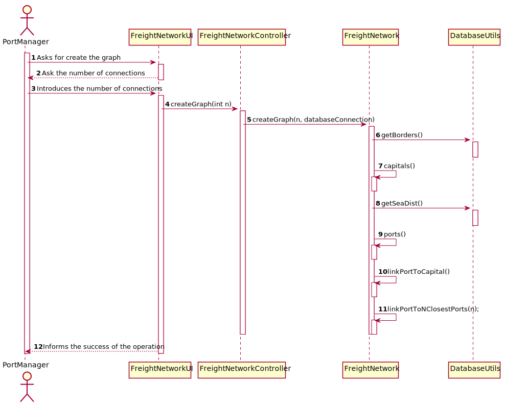

# US 301 -  To import data from countries, ports, borders and seadists files from the database to build a freight network.

## 1. Requirements Engineering

## 1.1. User Story Description

* As a Traffic manager, I which to import data from countries, ports, borders and
  seadists files from the database to build a freight network.

## 1.2. Acceptance Criteria

* **AC1:** The graph must be implemented using the adjacency matrix
  representation and ensuring the indistinct manipulation of capitals and
  seaports.
  
* **AC2:** The calculation of distances in Kms between capitals, and ports and
  capitals must be done using the GPS coordinates.

* **AC3:** The capital of a country has a direct connection with the capitals of the
  countries with which it borders. The ports of a country, besides connecting with all the ports of the same country, the port closest to the
  capital of the country connects with it; and finally, each port of a country
  connects with the n closest ports of any other country.

## 1.3. System Sequence Diagram (SSD)

## 2. OO Analysis

### Relevant Domain Model Excerpt

## 3. Design - User Story Realization

### 3.1. Sequence Diagram (SD)

### 3.2. Class Diagram (CD)

## 3.3 Use Case Diagram (UCD)

# 4. Tests

**Test 1:** FreightNetwork Test

class FreightNetworkTest {

@Test
void createGraphTest() {// uses a different user on database in order to have solid data to test
DatabaseConnection database = new DatabaseConnection("jdbc:oracle:thin:@vsgate-s1.dei.isep.ipp.pt:10676/xepdb1", "graphtest", "mypassword");
FreightNetwork f = new FreightNetwork();
try {
assertTrue(f.createGraph(5, database));
assertEquals(140, f.size());

        } catch (NullVerticesException e) {
            fail();
        }
    }

    @Test
    void numberOfVerticesTest() {
        FreightNetwork f = new FreightNetwork();
        Country country1 = new Country("pds", "df".toCharArray(), "dfs".toCharArray(), 15, Continent.EUROPE);
        City c1 = new City("dafg", 12, 23, country1);
        Country country2 = new Country("fgndfh", "gf".toCharArray(), "hkh".toCharArray(), 15, Continent.EUROPE);
        City c3 = new City("datg", 22, 33, country2);
        Country country3 = new Country("ads", "rf".toCharArray(), "sdg".toCharArray(), 15, Continent.EUROPE);
        City c2 = new City("dafr", 18, 28, country3);

        f.addEdgeAndCalculateWeight(c1, c3);
        f.addEdgeAndCalculateWeight(c1, c2);
        f.addEdgeAndCalculateWeight(c2, c3);
        assertEquals(3, f.size());

    }

    @Test
    void numberOfEdgesTest() {
        FreightNetwork f = new FreightNetwork();
        Country country1 = new Country("pds", "df".toCharArray(), "dfs".toCharArray(), 15, Continent.EUROPE);
        City c1 = new City("dafg", 12, 23, country1);
        Country country2 = new Country("fgndfh", "gf".toCharArray(), "hkh".toCharArray(), 15, Continent.EUROPE);
        City c3 = new City("datg", 22, 33, country2);
        Country country3 = new Country("ads", "rf".toCharArray(), "sdg".toCharArray(), 15, Continent.EUROPE);
        City c2 = new City("dafr", 18, 28, country3);

        f.addEdgeWithWeight(c1, c3, 5);
        f.addEdgeAndCalculateWeight(c1, c2);
        f.addEdgeAndCalculateWeight(c2, c3);

        assertEquals(6, f.connectionsSize());

    }

    @Test
    void createGraph() {
        FreightNetwork f = new FreightNetwork();
        Country country1 = new Country("pds", "df".toCharArray(), "dfs".toCharArray(), 15, Continent.EUROPE);
        City c1 = new City("dafg", 12, 23, country1);
        Country country2 = new Country("fgndfh", "gf".toCharArray(), "hkh".toCharArray(), 15, Continent.EUROPE);
        City c3 = new City("datg", 22, 33, country2);
        Country country3 = new Country("ads", "rf".toCharArray(), "sdg".toCharArray(), 15, Continent.EUROPE);
        City c2 = new City("dafr", 18, 28, country3);

        f.addEdgeAndCalculateWeight(c1, c3);
        f.addEdgeAndCalculateWeight(c1, c2);
        f.addEdgeAndCalculateWeight(c2, c3);

        String expected = "Vertices:\n" +
                "City{name='dafg', latitude=12.0, longitude=23.0, country=pds}\n" +
                "City{name='datg', latitude=22.0, longitude=33.0, country=fgndfh}\n" +
                "City{name='dafr', latitude=18.0, longitude=28.0, country=ads}\n" +
                "\n" +
                "Matrix:\n" +
                "   |  0  |  1  |  2 \n" +
                " 0 |     |  X  |  X  \n" +
                " 1 |  X  |     |  X  \n" +
                " 2 |  X  |  X  |     \n" +
                "\n" +
                "Edges:\n" +
                "From 0 to 1-> City{name='dafg', latitude=12.0, longitude=23.0, country=pds} -> City{name='datg', latitude=22.0, longitude=33.0, country=fgndfh}\n" +
                "Weight: 1537284.46\n" +
                "From 0 to 2-> City{name='dafg', latitude=12.0, longitude=23.0, country=pds} -> City{name='dafr', latitude=18.0, longitude=28.0, country=ads}\n" +
                "Weight: 856261.63\n" +
                "From 1 to 0-> City{name='datg', latitude=22.0, longitude=33.0, country=fgndfh} -> City{name='dafg', latitude=12.0, longitude=23.0, country=pds}\n" +
                "Weight: 1537284.46\n" +
                "From 1 to 2-> City{name='datg', latitude=22.0, longitude=33.0, country=fgndfh} -> City{name='dafr', latitude=18.0, longitude=28.0, country=ads}\n" +
                "Weight: 686004.95\n" +
                "From 2 to 0-> City{name='dafr', latitude=18.0, longitude=28.0, country=ads} -> City{name='dafg', latitude=12.0, longitude=23.0, country=pds}\n" +
                "Weight: 856261.63\n" +
                "From 2 to 1-> City{name='dafr', latitude=18.0, longitude=28.0, country=ads} -> City{name='datg', latitude=22.0, longitude=33.0, country=fgndfh}\n" +
                "Weight: 686004.95\n" +
                "\n";
        assertEquals(expected, f.toString());
    }
    }

# 5. Construction (Implementation)

##Class Graph
    public interface Graph<V, E> extends Cloneable {

    String toString();

    /**
     * Check if graph is directed
     *
     * @return true if graph is directed, false otherwise
     */
    boolean isDirected();

    /**
     * The total number of vertices in the graph
     *
     * @return the number of vertices of the graph
     */
    int numVertices();

    /**
     * All the vertices in the graph
     *
     * @return all the vertices of the graph as an ArrayList. Each vertex is in its key position in the ArrayList.
     */
    ArrayList<V> vertices();

    /**
     * Check is vertex is in graph
     *
     * @param vert the vertex to check
     * @return true is vert exists in the graph, false otherwise
     */
    boolean validVertex(V vert);

    /**
     * Check the numeric key for vert in the graph
     *
     * @param vert the vertex to check
     * @return the numeric key associated with vert, -1 if vert is not in the graph
     */
    int key(V vert);

    /**
     * Check the vertex associated with a numeric key in the graph
     *
     * @param key the key to check
     * @return the vertex associated with key, null if key is not in the graph
     */
    V vertex(int key);

    /**
     * Find the first vertex for which Predicate is true.
     * An example to get the Person vertex with a particular name:
     * <pre>
     *      Graph<Person, Integer> g = new ...;
     *      g.vertex( p -> p.getName().equals(name) );
     * </pre>
     *
     * @param p predicate (should be given in lambda form)
     * @return the first vertex for which predicate p is true, null if not found
     */
    V vertex(Predicate<V> p);

    /**
     * Find all adjacent vertices of a vertex
     *
     * @param vert the vertex for which to find adjacent vertices
     * @return a collection of all the adjacent vertices of vert
     */
    Collection<V> adjVertices(V vert);

    /**
     * The total number of edges of the graph
     *
     * @return the number of edges of the graph
     */
    int numEdges();

    /**
     * All the edges of the graph
     *
     * @return a collection with all the edges of the graph.
     */
    Collection<Edge<V, E>> edges();

    /**
     * Finds an edge in the graph given its end vertices
     *
     * @param vOrig origin vertex
     * @param vDest destination vertex
     * @return the edge from vOrig to vDest, or null if vertices are not adjacent
     */
    Edge<V, E> edge(V vOrig, V vDest);

    /**
     * Finds an edge in the graph given its end vertex keys
     *
     * @param vOrigKey the key of vertex vOrig
     * @param vDestKey the key of vertex vDist
     * @return the edge from vOrig to vDest, or null if vertices are not adjacent
     */
    Edge<V, E> edge(int vOrigKey, int vDestKey);

    /**
     * Finds the number of edges leaving a vertex
     *
     * @param vert the vertex of interest
     * @return the number of edges leaving vert
     */
    int outDegree(V vert);

    /**
     * Finds the number of edges for which a vertex is the destination
     *
     * @param vert the vertex of interest
     * @return the number of edges for which vert is the destination
     */
    int inDegree(V vert);

    /**
     * Finds the edges for which a vertex is the origin
     *
     * @param vert the vertex of interest
     * @return a collection of edges for which vert is the origin
     */
    Collection<Edge<V, E>> outgoingEdges(V vert);

    /**
     * Finds the edges for which a vertex is the destination
     *
     * @param vert the vertex of interest
     * @return a collection of edges for which vert is the destination
     */
    Collection<Edge<V, E>> incomingEdges(V vert);

    /**
     * Adds a new vertex into the graph
     *
     * @param vert the vertex to add
     * @return true if vert is not already in the graph, false otherwise
     */
    boolean addVertex(V vert) throws NullVerticesException;

    /**
     * Adds a new edge between two vertices. If the vertices are not already in the graph, they are added.
     *
     * @param vOrig  origin vertex
     * @param vDest  destination vertex
     * @param weight the weight of the edge
     * @return false if edge is already present, true otherwise
     */
    boolean addEdge(V vOrig, V vDest, E weight) throws NullVerticesException;

    /**
     * Removes a vertex and all its incident edges from the graph
     *
     * @param vert the vertex to remove
     * @return true if vert was present in the graph, false otherwise
     */
    boolean removeVertex(V vert) throws NullVerticesException;

    /**
     * Removes the edge between two vertices
     *
     * @param vOrig vertex origin of the edge
     * @param vDest vertex destination of the edge
     * @return true if an edge between vOrig and vDest was present in the graph, false otherwise
     */
    boolean removeEdge(V vOrig, V vDest) throws NullVerticesException;

    /**
     * Creates a deep copy clone of the graph
     *
     * @return a deep copy of graph
     */
    Graph<V, E> clone();
    }

##Class FreightNetwork

    public class FreightNetwork {
    private final Graph<Vertex, Double> graph;

    /**
     * Constructor.
     */
    public FreightNetwork() {
        this.graph = new MatrixGraph<>(false);
    }

    /**
     * Creates the graph.
     *
     * @param n          the N closest ports
     * @param connection the database connection
     * @return true if it succeeds, false if it doesn't
     * @throws NullVerticesException
     */
    public boolean createGraph(int n, DatabaseConnection connection) throws NullVerticesException {
        boolean ret = false;
        ret = (this.capitals(connection) && this.ports(n, connection));
        return ret;
    }

    /**
     * Gets the graph.
     *
     * @return the graph
     */
    public Graph<Vertex, Double> getGraph() {
        return graph;
    }

    /**
     * Adds all ports to the graph.
     *
     * @param n          the N closest ports
     * @param connection the database connection
     * @return true if it succeeds, false if it doesn't
     * @throws NullVerticesException
     */
    private boolean ports(int n, DatabaseConnection connection) throws NullVerticesException {
        Map<Port, Map<Port, Double>> map = DataBaseUtils.getSeaDist(connection);
        for (Map.Entry<Port, Map<Port, Double>> entry : map.entrySet()) {
            for (Map.Entry<Port, Double> dest : entry.getValue().entrySet()) {
                this.addEdgeWithWeight(entry.getKey(), dest.getKey(), dest.getValue());
            }
        }

        linkPortToCapital();
        linkPortToNClosestPorts(n);

        return true;
    }

    /**
     * Links the port to the N closest ports.
     *
     * @param n the N closest ports
     * @return true if it succeeds, false if it doesn't
     * @throws NullVerticesException
     */
    private boolean linkPortToNClosestPorts(int n) throws NullVerticesException {

        for (Vertex v : graph.vertices()) { //V
            if (v instanceof Facility) {
                boolean[] visited = new boolean[graph.numVertices()];
                ArrayList<Facility> list = new ArrayList<>();
                dfsPortsLink(v, 1, visited, list); //log(F)
                int finalI = graph.key(v);
                Comparator<Facility> comparator = (o1, o2) -> {
                    if (VertexDistanceCalculator.distanceCalculator(o1, graph.vertex(finalI)) > VertexDistanceCalculator.distanceCalculator(o2, graph.vertex(finalI))) {
                        return 1;
                    }
                    return -1;
                };

                list.sort(comparator); //FClog(FC)

                if (n - 1 <= list.size()) {
                    for (Vertex v1 : list.subList(n - 1, list.size())) { // FC-n
                        graph.removeEdge(v, v1);
                    }
                }
            }
        }
        return true;
    }

    /**
     * DFS to link the ports.
     *
     * @param vOriginal the original vertex
     * @param vKey      the vKey
     * @param visited   boolean that says if the vertex is visited or not
     * @param objects   the list of objects (Facility)
     */
    private void dfsPortsLink(Vertex vOriginal, int vKey, boolean[] visited, ArrayList<Facility> objects) {
        if (visited[vKey]) {
            return;
        }

        if (graph.vertex(vKey) instanceof Facility && !vOriginal.getCountry().equals(graph.vertex(vKey).getCountry())) {
            objects.add((Facility) graph.vertex(vKey));
        }
        visited[vKey] = true;

        for (Vertex vAdj : graph.adjVertices(graph.vertex(vKey))) {
            dfsPortsLink(vOriginal, graph.key(vAdj), visited, objects);
        }
    }

    /**
     * Links each port to its capital.
     *
     * @return true if it succeeds, false if it doesn't
     */
    private boolean linkPortToCapital() {
        boolean ret = false;
        for (Vertex c : graph.vertices()) {
            Vertex v = null;
            if (c instanceof City) {
                for (Vertex p : graph.vertices()) {
                    if (p instanceof Facility) {
                        if (p.getCountry().equals(c.getCountry())) {
                            if (VertexDistanceCalculator.distanceCalculator(c, p) <= VertexDistanceCalculator.distanceCalculator(c, v)) {
                                v = p;
                            }
                        }
                    }
                }
            }
            if ((v != null)) {
                ret = addEdgeAndCalculateWeight(c, v);
            }
        }
        return ret;
    }

    /**
     * Adds all capitals to the graph
     *
     * @param connection the database connection
     * @return true if it succeeds, false if it doesn't
     */
    private boolean capitals(DatabaseConnection connection) {
        try {
            Map<City, LinkedList<City>> map = DataBaseUtils.getBorders(connection);
            for (Map.Entry<City, LinkedList<City>> c : map.entrySet()) {
                LinkedList<City> list = c.getValue();
                while (!list.isEmpty()) {
                    this.addEdgeAndCalculateWeight(c.getKey(), list.removeFirst());
                }
            }

        } catch (SQLException e) {
            e.printStackTrace();
            return false;
        }
        return true;
    }

    /**
     * Adds an edge to the graph and calculates its weight.
     *
     * @param v1 the vertex 1
     * @param v2 the vertex2
     * @return true if it succeeds, false if it doesn't
     */
    protected boolean addEdgeAndCalculateWeight(Vertex v1, Vertex v2) {
        try {
            double weight = VertexDistanceCalculator.distanceCalculator(v1, v2);
            graph.addEdge(v1, v2, weight);
            return true;
        } catch (NullVerticesException e) {
            return false;
        }
    }

    /**
     * Adds a weighted edge to the graph.
     *
     * @param v1     the vertex 1
     * @param v2     the vertex 2
     * @param weight the edge's weight
     * @return true if it succeeds, false if it doesn't
     */
    protected boolean addEdgeWithWeight(Vertex v1, Vertex v2, double weight) {
        try {
            graph.addEdge(v1, v2, weight);
            return true;
        } catch (NullVerticesException e) {
            return false;
        }
    }

    /**
     * Gets the graph size.
     *
     * @return the graph size
     */
    public int size() {
        return graph.numVertices();
    }

    /**
     * Returns the textual description of the graph.
     *
     * @return the graph's characteristics
     */
    public String toString() {
        return graph.toString();
    }

    /**
     * Gets the graph's number of connections (edges).
     *
     * @return the graph's number of connections (edges)
     */
    public int connectionsSize() {
        return graph.numEdges();
    }
    }