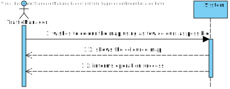
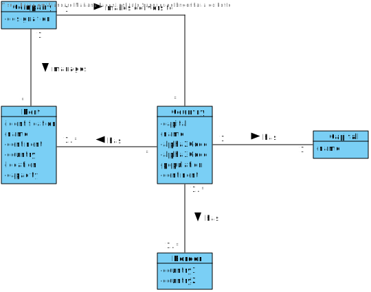
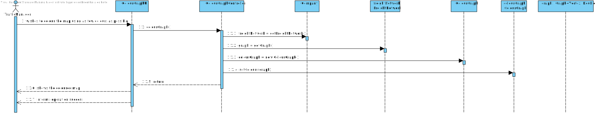
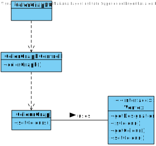
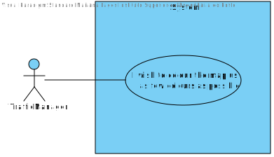

# US 302 - To colour the map using as few colours as possible

## 1. Requirements Engineering

## 1.1. User Story Description

* As a Traffic manager I wish to colour the map using as few colours as possible.

## 1.2. Acceptance Criteria

* **AC1:** Neighbouring countries must not share the same colour.

## 1.3. System Sequence Diagram (SSD)

## 2. OO Analysis

### Relevant Domain Model Excerpt

## 3. Design - User Story Realization

### 3.1. Sequence Diagram (SD)

### 3.2. Class Diagram (CD)

## 3.3 Use Case Diagram (UCD)

# 4. Tests

**Test 1:** Color Graph Test 

    class ColourGraphTest {

    static MatrixGraph<Vertex, Double> graph = new MatrixGraph<>(false);

    @BeforeAll
    static void beforeAll() {

        graph.addEdge(new City("Lisboa", 10, 40, new Country("Portugal", null, null, 2000, Continent.EUROPE)), new City("Madrid", 12, 36, new Country("Espanha", null, null, 7000, Continent.EUROPE)), 0.0);
        graph.addEdge(new City("Madrid", 12, 23, new Country("Espanha", null, null, 7000, Continent.EUROPE)), new City("Paris", 14, 40, new Country("França", null, null, 6500, Continent.EUROPE)), 0.0);
        graph.addEdge(new City("Paris", 14, 40, new Country("França", null, null, 6500, Continent.EUROPE)), new City("Berlim", 20, 45, new Country("Alemanha", null, null, 8000, Continent.EUROPE)), 0.0);
        graph.addEdge(new City("Paris", 14, 40, new Country("França", null, null, 6500, Continent.EUROPE)), new City("Bruxelas", 22, 28, new Country("Bélgica", null, null, 5500, Continent.EUROPE)), 0.0);
        graph.addEdge(new City("Paris", 14, 40, new Country("França", null, null, 6500, Continent.EUROPE)), new City("Luxemburgo", 30, 47, new Country("Luxemburgo", null, null, 8500, Continent.EUROPE)), 0.0);
        graph.addEdge(new City("Paris", 14, 40, new Country("França", null, null, 6500, Continent.EUROPE)), new City("Berna", 26.5, 50, new Country("Suíça", null, null, 6800, Continent.EUROPE)), 0.0);
        graph.addEdge(new City("Paris", 14, 40, new Country("França", null, null, 6500, Continent.EUROPE)), new City("Roma", 28, 30, new Country("Itália", null, null, 7500, Continent.EUROPE)), 0.0);
        graph.addEdge(new City("Berlim", 20, 45, new Country("Alemanha", null, null, 8000, Continent.EUROPE)), new City("Bruxelas", 22, 28, new Country("Bélgica", null, null, 5500, Continent.EUROPE)), 0.0);
        graph.addEdge(new City("Berlim", 20, 45, new Country("Alemanha", null, null, 8000, Continent.EUROPE)), new City("Luxemburgo", 30, 47, new Country("Luxemburgo", null, null, 8500, Continent.EUROPE)), 0.0);
        graph.addEdge(new City("Berlim", 20, 45, new Country("Alemanha", null, null, 8000, Continent.EUROPE)), new City("Berna", 26.5, 50, new Country("Suíça", null, null, 6800, Continent.EUROPE)), 0.0);
        graph.addEdge(new City("Berlim", 20, 45, new Country("Alemanha", null, null, 8000, Continent.EUROPE)), new City("Varsóvia", 34, 41, new Country("Polónia", null, null, 3000, Continent.EUROPE)), 0.0);
        graph.addEdge(new City("Bruxelas", 22, 28, new Country("Bélgica", null, null, 5500, Continent.EUROPE)), new City("Luxemburgo", 30, 47, new Country("Luxemburgo", null, null, 8500, Continent.EUROPE)), 0.0);
        graph.addEdge(new City("Berna", 26.5, 50, new Country("Suíça", null, null, 6800, Continent.EUROPE)), new City("Roma", 28, 30, new Country("Itália", null, null, 7500, Continent.EUROPE)), 0.0);

    }

    @Test
    void setColoursTest() {
        try {
            ColourGraph.setColours(graph);
        } catch (SetColoursException e) {

        }
    }
    }

# 5. Construction (Implementation)

##Class OffOrLoadedContainers

    public class ColourGraph {

    /**
     * Constructor.
     */
    private ColourGraph() {
        // Empty constructor
    }

    /**
     * Sets the colours.
     *
     * @param graph the graph
     * @return the colours assigned to each city of the graph (String)
     * @throws SetColoursException
     */
    public static String setColours(Graph<Vertex, Double> graph) throws SetColoursException {

        StringBuilder sb = new StringBuilder();

        int[] colours = new int[graph.numVertices()];
        int colour;
        ArrayList<Vertex> vertexArrayList = graph.vertices();

        for (Vertex v : vertexArrayList) {
            if (v instanceof City) {

                // All available colours
                for (int i = 0; i < colours.length; i++) {
                    colours[i] = i;
                }

                Collection<Vertex> vAdj = graph.adjVertices(v);

                // Banish colors from the adjacent vertices (make them -1)
                for (Vertex vCheck : vAdj) {
                    if (vCheck.isColour()) {
                        colours[vCheck.getColour()] = -1;
                    }
                }

                // Choose the next lowest value color
                colour = -1;
                int aux = 0;
                do {
                    if (colours[aux] != -1) {
                        colour = colours[aux];
                    }
                    aux++;
                } while (colour == -1);

                v.setColour(colour);
            }

            if (v instanceof City) {
                sb.append("City: ").append(v.getDesignation()).append(", Colour: ").append(v.getColour()).append("\n");
            }
        }
        return sb.toString();
    }
    }