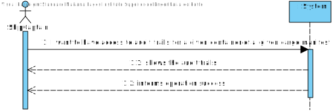
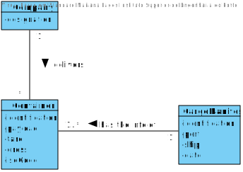
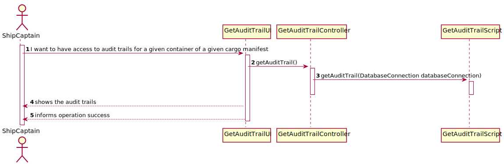
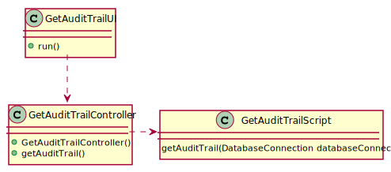
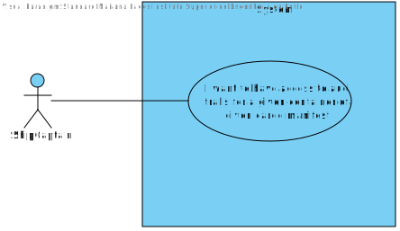

# US 304 - Have access to audit trails for a given container of a given cargo manifest

## 1. Requirements Engineering

## 1.1. User Story Description

* As Ship Captain, I want to have access to audit trails for a given container of a
  given cargo manifest, that is, I want to have access to a list of all operations performed on
  a given container of a given manifest, in chronological order. For each operation I want to
  know: the user/login that performed it, the date and time the operation was performed,
  the type of operation (INSERT, UPDATE, DELETE), the container identifier and the
  cargo manifest identifier.
  
## 1.2. Acceptance Criteria

* **AC1:** There is a table for recording audit trails, i.e., record all write-operations
  involving containers of a cargo manifest.
  
* **AC2:** Proper mechanisms for recording write-operations involving containers
  of a cargo manifest are implemented (INSERT, UPDATE, DELETE).

* **AC3:** A simple and effective audit trail consultation process is implemented.

## 1.3. System Sequence Diagram (SSD)

## 2. OO Analysis

### Relevant Domain Model Excerpt

## 3. Design - User Story Realization

### 3.1. Sequence Diagram (SD)

### 3.2. Class Diagram (CD)

## 3.3 Use Case Diagram (UCD)

# 4. Tests

**Test 1:** GetAuditTrailerController

    class GetAuditTrailControllerTest {

    @Test
    void getAuditTrail() {

        GetAuditTrailController getAuditTrailController = new GetAuditTrailController();

        try {
            String actual = getAuditTrailController.getAuditTrail();

            if (actual == null || actual.equals("")) fail();

        } catch (SQLException e) {
            System.out.println("NANI");
        }

    }
    }

# 5. Construction (Implementation)

##Class GetContainerRouteScript
    
    public class GetAuditTrailScript {

    /**
     * Constructor.
     */
    private GetAuditTrailScript() {
        //Empty constructor
    }

    /**
     * Gets the audit trail.
     *
     * @param databaseConnection the database connection
     * @return the audit trail
     * @throws SQLException
     */
    public static String getAuditTrail(DatabaseConnection databaseConnection) throws SQLException {

        Connection connection = databaseConnection.getConnection();

        StringBuilder sb = new StringBuilder();

        sb.append("\nAvailable Information about the CargoManifest/Container Table: \n");

        String sqlCommand = "SELECT * FROM AUDITTRAIL";
        try (PreparedStatement auditTrailStatement = connection.prepareStatement(sqlCommand)) {
            try (ResultSet auditTrailResultSet = auditTrailStatement.executeQuery()) {

                while (auditTrailResultSet.next()) {

                    sb.append("Cargo Manifest ID: ").append(auditTrailResultSet.getString(1))
                            .append("\nContainer ID: ").append(auditTrailResultSet.getString(2))
                            .append("\nOperation Date: ").append(auditTrailResultSet.getObject(3))
                            .append("\nOperation Type: ").append(auditTrailResultSet.getString(4))
                            .append("\nUser Logged: ").append(auditTrailResultSet.getString(5))
                            .append("\n\n");
                }
            }
        }
        return sb.toString();
    }
    }
