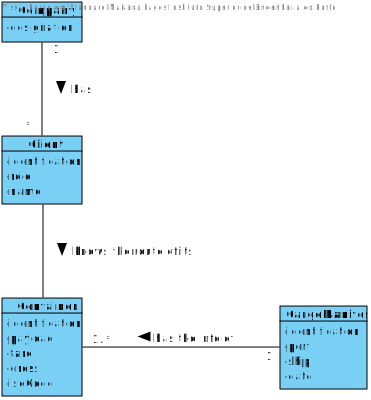

# US 303 - Closest to all other places

## 1. Requirements Engineering

## 1.1. User Story Description

* As Client, I want to know the route of a specific container I am leasing.

## 1.2. Acceptance Criteria

* **AC1:** Users provide their registration code, the container identifier and get its
  path, from source to current location indicating time of arrival and
  departure at each location and mean of transport (ship or truck) between
  each pair of locations.
  
* **AC2:** When the provided identifier is not valid or, being valid, is not leased by
  the client, a warning is returned.

## 1.3. System Sequence Diagram (SSD)

## 2. OO Analysis

### Relevant Domain Model Excerpt

## 3. Design - User Story Realization

### 3.1. Sequence Diagram (SD)

### 3.2. Class Diagram (CD)

## 3.3 Use Case Diagram (UCD)

# 4. Tests

**Test 1:** GetContainerRouteControllerTest

    class GetContainerRouteControllerTest {

    @Test
    void getContainerRoute() {

        GetContainerRouteController getContainerRouteController = new GetContainerRouteController();

        CreateFreightNetworkController createFreightNetworkController = new CreateFreightNetworkController();

        try {
            String actual = getContainerRouteController.getContainerRoute(2579, 1);

            createFreightNetworkController.createGraph(1);

            if (actual == null || actual.equals("")) fail();

        } catch (SQLException e) {
            System.out.println("NANI");
        }

    }

# 5. Construction (Implementation)

##Class GetContainerRouteScript

    public class GetContainerRouteScript {

    /**
     * Constructor.
     */
    public GetContainerRouteScript() {
        // Empty constructor
    }

    /**
     * Calls the function that gets the route of a container.
     *
     * @param containerID        the container ID
     * @param clientID           the client ID
     * @param databaseConnection the database connection
     * @return the route of a container
     * @throws SQLException
     * @throws NullPointerException
     */
    public static String callFunction(String containerID, String clientID, DatabaseConnection databaseConnection) throws SQLException, NullPointerException {

        StringBuilder sb = new StringBuilder();
        sb.append("\nContainer Route:");

        try (CallableStatement containerRouteStatement = databaseConnection.getConnection().prepareCall("{? = call fnGetContainerRouteCursor(?,?)}")) {

            containerRouteStatement.registerOutParameter(1, OracleTypes.CURSOR);
            containerRouteStatement.setString(2, clientID);
            containerRouteStatement.setString(3, containerID);
            containerRouteStatement.execute();

            try (ResultSet containerRoute = (ResultSet) containerRouteStatement.getObject(1)) {

                if (containerRoute == null)
                    throw new NullPointerException("There is no information available for that specific container/client!");

                while (containerRoute.next()) {

                    try (CallableStatement vehicleType = databaseConnection.getConnection().prepareCall("{? = call fnGetVehicleType(?)}")) {

                        vehicleType.registerOutParameter(1, Types.VARCHAR);
                        vehicleType.setString(2, containerRoute.getString("VEHICLE_NAME"));

                        vehicleType.execute();

                        sb.append("\nVehicle Type: ").append(vehicleType.getString(1))
                                .append("\nVehicle Name: ").append(containerRoute.getString("VEHICLE_NAME"))
                                .append("\nFacility Name: ").append(containerRoute.getString("FACILITY_NAME"))
                                .append("\nTrip Start Date: ").append(containerRoute.getObject("TRIP_START_DATE"))
                                .append("\nTrip End Date: ").append(containerRoute.getObject("TRIP_END_DATE"))
                                .append("\nCargo Manifest Date: ").append(containerRoute.getObject("CARGOMANIFEST_DATE"))
                                .append("\n\n");
                    }
                }
                return sb.toString();
            }
        }
    }
  }
