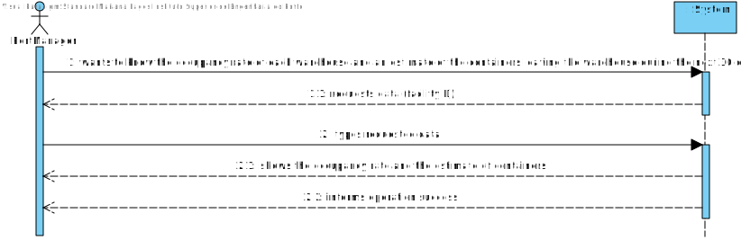
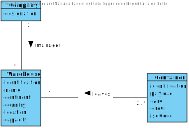
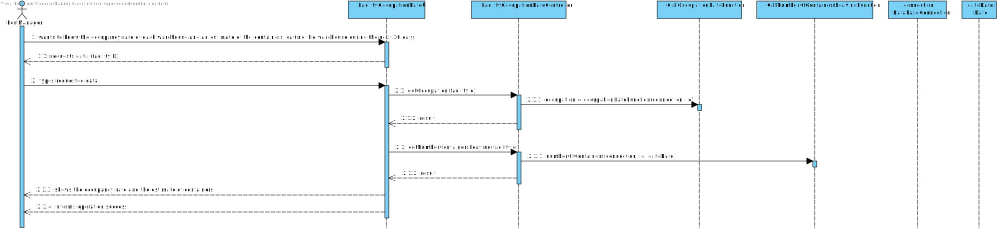
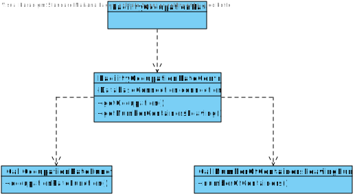
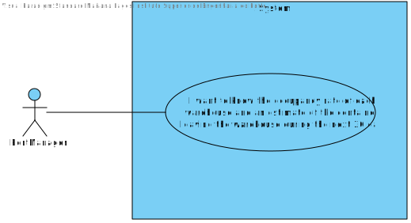

# US 306 -  Know the occupancy rate of each warehouse and an estimate of the containers leaving the warehouse during the next 30 days.

## 1. Requirements Engineering

## 1.1. User Story Description

* As Port manager, I want to know the occupancy rate of each warehouse and an
  estimate of the containers leaving the warehouse during the next 30 days.

## 1.2. Acceptance Criteria

* **AC1:** For each warehouse the required output is available
  
* **AC2:** The 30 days period is properly considered.

## 1.3. System Sequence Diagram (SSD)

## 2. OO Analysis

### Relevant Domain Model Excerpt

## 3. Design - User Story Realization

### 3.1. Sequence Diagram (SD)

### 3.2. Class Diagram (CD)

## 3.3 Use Case Diagram (UCD)

# 4. Tests

**Test 1:** Facility Occupation Rate Test

    class FacilityOccupationRateControllerTest {

    private final FacilityOccupationRateController facilityOccupationRateController = new FacilityOccupationRateController();

    @Test
    void getOccupation() {

        String actual = facilityOccupationRateController.getOccupation("500");
        String actual2 = facilityOccupationRateController.getOccupation("10");
        String actual3 = facilityOccupationRateController.getOccupation("10136");

        // if (!actual.equals("")) fail();

    }

    @Test
    void getNumberContainersLeaving() throws ParseException {

        String actual = facilityOccupationRateController.getNumberContainersLeaving("10136");

        if (!actual.equals("")) fail();

    }
    }

# 5. Construction (Implementation)

##Class CallOcupationRateFunction

    public class CallOccupationRateFunction {

    /**
     * Constructor.
     */
    private CallOccupationRateFunction() {
        // Empty constructor
    }

    /**
     * Calls the function that gets the warehouse occupation rate.
     *
     * @param connection the database connection
     * @param facilityId the facility ID
     * @return the warehouse occupation rate
     */
    public static double occupationRateFunction(DatabaseConnection connection, String facilityId) {
        double returnValue = 0;
        String sqlString = "{? = call GETWAREHOUSEOCCUPATIONRATE(?)}";
        try (CallableStatement cstmt = connection.getConnection().prepareCall(sqlString)) {
            cstmt.registerOutParameter(1, Types.FLOAT);
            cstmt.setString(2, facilityId);

            cstmt.execute();
            returnValue = cstmt.getDouble(1);
        } catch (SQLException e) {
            e.printStackTrace();
        }
        return returnValue;
    }
    }
