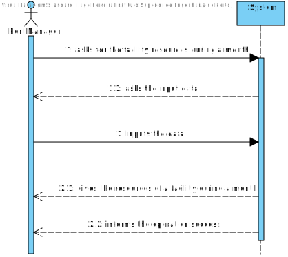

# US 303 -  intend to have a map of the occupation of the existing resources in the port during a given month.

## 1. Requirements Engineering

## 1.1. User Story Description

* As Port manager, I intend to have a map of the occupation of the existing
  resources in the port during a given month.

## 1.2. Acceptance Criteria

* **AC1:** Occupation of resources is restricted to the month provided.
  
* **AC2:** The reported occupation respects actual port capacity.

## 1.3. System Sequence Diagram (SSD)

## 2. OO Analysis

### Relevant Domain Model Excerpt

## 3. Design - User Story Realization

### 3.1. Sequence Diagram (SD)

### 3.2. Class Diagram (CD)

## 3.3 Use Case Diagram (UCD)

# 4. Tests

**Test 1:** Facility Resources Test

    class FacilityResourcesControllerTest {

    @Test
    void getFacilityResources() {

        FacilityResourcesController facilityResourcesController = new FacilityResourcesController();

    /*        try {
    String actual = facilityResourcesController.getFacilityResources(10, 2021, 8);

            if (actual == null || actual.equals("")) fail();

        } catch (SQLException | IOException e) {
            System.out.println("NANI");
        }*/

    }
    }

# 5. Construction (Implementation)

##Class FacilityResources

    public class CallTheAvailableResourcesFunction {

    /**
     * Constructor.
     */
    public CallTheAvailableResourcesFunction() {
        // Empty constructor
    }

    /**
     * Calls the function that gets the available resources of a facility.
     *
     * @param month      the month
     * @param year       the year
     * @param id         the facility ID
     * @param connection the database connection
     * @return the available resources of a facility
     * @throws SQLException
     */
    public String callFunction(int month, int year, int id, DatabaseConnection connection) throws SQLException {

        int day;

        if (month == 1 || month == 3 || month == 5 || month == 7 || month == 8 || month == 10 || month == 12)
            day = 31;
        else if (month == 2 && (year % 4 == 0) && (year % 100 != 0) || (year % 400 == 0))
            day = 29;
        else if (month == 2 && (year % 4 != 0) && (year % 100 == 0) || (year % 400 != 0))
            day = 28;
        else
            day = 30;

        Calendar cal = Calendar.getInstance();
        cal.set(Calendar.YEAR, year);
        cal.set(Calendar.MONTH, month - 1); // <-- months start
        // at 0.
        cal.set(Calendar.DAY_OF_MONTH, 1);

        java.sql.Date dateI = new java.sql.Date(cal.getTimeInMillis());

        try (CallableStatement cstmt = connection.getConnection().prepareCall("{? = call fnGetShipAreaByDate(?,?,?)}")) {

            cstmt.registerOutParameter(1, Types.VARCHAR);
            cstmt.setInt(2, id); //8
            cstmt.setDate(3, dateI);
            cstmt.setInt(4, day);

            cstmt.executeUpdate();

            try (CallableStatement cstmt2 = connection.getConnection().prepareCall("{? = call fnGetContainerByDate(?,?,?)}")) {

                cstmt2.registerOutParameter(1, Types.VARCHAR);
                cstmt2.setInt(2, id);
                cstmt2.setDate(3, dateI);
                cstmt2.setInt(4, day);

                cstmt2.executeUpdate();

                StringBuilder containerCapacity;
                String areaFacility;

                containerCapacity = new StringBuilder(cstmt2.getString(1));
                areaFacility = cstmt.getString(1);

                String[] split = containerCapacity.toString().split(",");
                String[] split2 = areaFacility.split(",");
                containerCapacity = new StringBuilder();

                for (int i = 1; i < split.length; i++) {
                    containerCapacity.append("Day").append(i).append(": ").append("\nContainer Capacity:").append(split[i]).append("%\n").append("Facility Area Capacity:").append(split2[i]).append("%\n");
                }

                return containerCapacity.toString();
            }
        }
    }
    }