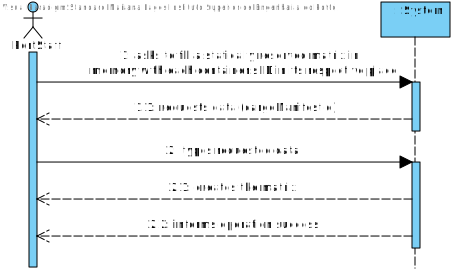
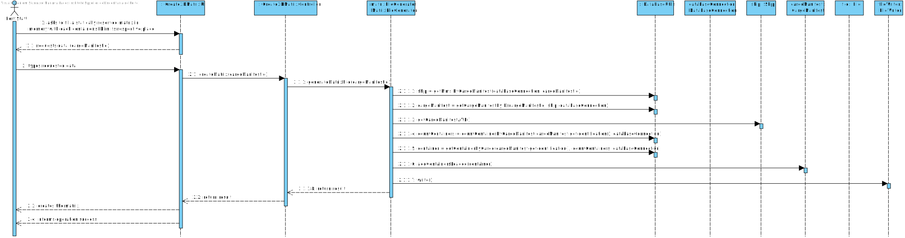
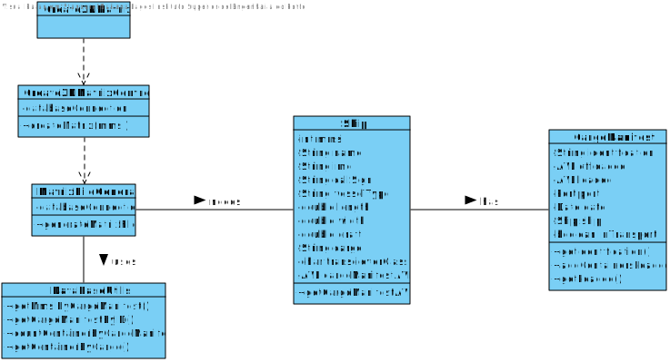
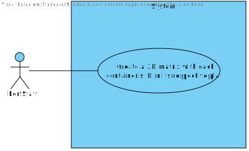

# US 303 -  Know the current situation of a specific container being used to transport my goods

## 1. Requirements Engineering

## 1.1. User Story Description

*  As Client, I want to know the current situation of a specific container being used to transport my goods –

## 1.2. Acceptance Criteria

* **AC1:** When the provided identifier is not valid or, being valid, is not leased by
  the client, a warning is returned. This warning has two elements, the
  error code and the identifier of the container. The error code will be: 10
  – invalid container id or 11 – container is not leased by client.

## 1.3. System Sequence Diagram (SSD)

## 2. OO Analysis

### Relevant Domain Model Excerpt

## 3. Design - User Story Realization

### 3.1. Sequence Diagram (SD)

### 3.2. Class Diagram (CD)

## 3.3 Use Case Diagram (UCD)

# 4. Tests

**Test 1:** Matrix File Generator Test

    class MatrixFileGeneratorTest {

    @Test
    void generateMatrixFile() {

        MatrixFileGenerator matrixFileGenerator = new MatrixFileGenerator(App.getInstance().getDatabaseConnection());

        String id = "1";

        try {
            matrixFileGenerator.generateMatrixFile(id);
        } catch (Exception e) {

        }

    }

    }

# 5. Construction (Implementation)

##Class MatrixFileGenerator
    
    public class MatrixFileGenerator {

    private final DatabaseConnection databaseConnection;

    /**
     * Constructor.
     *
     * @param databaseConnection the database connection
     */
    public MatrixFileGenerator(DatabaseConnection databaseConnection) {
        this.databaseConnection = databaseConnection;
    }

    /**
     * Generates the matrix file.
     *
     * @param cargoManifestId the cargo manifest ID
     * @return true if it succeeds, false if it doesn't
     * @throws SQLException
     * @throws IOException
     */
    public boolean generateMatrixFile(String cargoManifestId) throws SQLException, IOException {

        Ship ship = DataBaseUtils.getMmsiByCargoManifest(databaseConnection, cargoManifestId);

        int capacity = (int) ship.getCapacity() / 3;

        if (ship == null) {
            return false;
        }

        int countContainers;
        CargoManifest cargoManifest = DataBaseUtils.getCargoManifestByID(cargoManifestId, ship, databaseConnection);

        if (cargoManifest == null) {
            return false;
        }

        ship.getCargoManifestAVL().insert(cargoManifest);

        countContainers = DataBaseUtils.countContainerByCargoManifest(cargoManifest.getIdentification(), this.databaseConnection);

        while (countContainers != 0) {

            Container container = DataBaseUtils.getContainerByCargo(cargoManifest.getIdentification(), countContainers, this.databaseConnection);
            cargoManifest.addContainersLoaded(container);
            countContainers--;
        }

        File file = new File("container.txt");

        try (FileWriter fileWriter = new FileWriter(file)) {

            fileWriter.write(capacity+","+capacity+","+capacity + "\n");
            for (Container container : cargoManifest.getLoaded().inOrder()) {
                fileWriter.write(container.getPosition().xPos + "," + container.getPosition().yPos + "," + container.getPosition().zPos + "," + container.getIdentification() + "\n");
            }
        }
        return true;
    }
    }