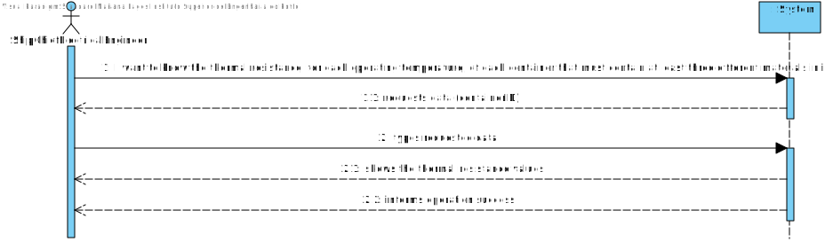
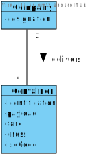
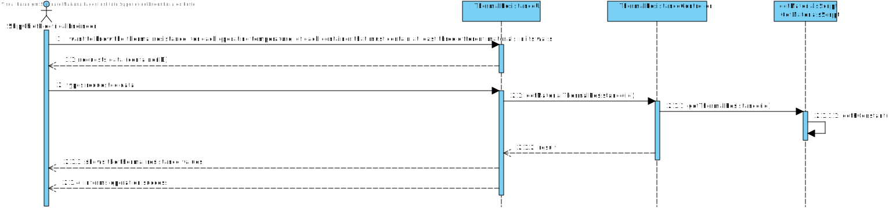
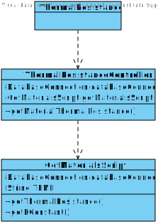
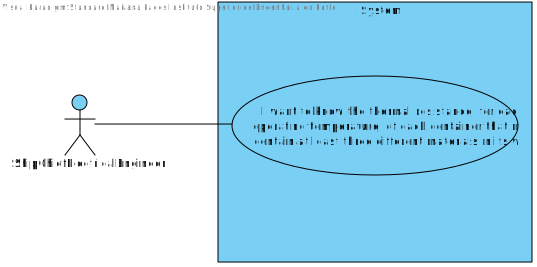

# US 319 - To know the thermal resistance, for each operating temperature, of each container that must contain at least three different materials in its walls

## 1. Requirements Engineering

## 1.1. User Story Description

* As Ship Chief Electrical Engineer I want to know the thermal resistance, for each
  operating temperature, of each container that must contain at least three different
  materials in its walls. One for the outer wall, one for the intermediate material, and one
  for the inner wall.

## 1.2. Acceptance Criteria

* **AC1:** For each container, working at a temperature of 7ºC, determine the
  thermal resistance it offers, according to the choice of materials made.
  
* **AC2:** For each container working at a temperature of -5ºC, determine the
  thermal resistance it offers according to the choice of materials

## 1.3. System Sequence Diagram (SSD)

## 2. OO Analysis

### Relevant Domain Model Excerpt

## 3. Design - User Story Realization

### 3.1. Sequence Diagram (SD)

### 3.2. Class Diagram (CD)

## 3.3 Use Case Diagram (UCD)

# 4. Tests

**Test 1:** MaterialTemperatureController Test

    class MaterialTemperatureControllerTest {

    @Test
    void materialTemperatureController() {

        MaterialTemperatureController materialTemperatureController = new MaterialTemperatureController();

        try {
            String actual = materialTemperatureController.materialTemperatureController(7);

            if(actual == null || actual.equals("")) fail();

        } catch (MaterialTypeNullException | NoMaterialsForThatTemperatureException | NoMaterialsFoundException e) {
            System.out.println("NANI");
        }

    }
  }

# 5. Construction (Implementation)

##Class GetMaterialScript

    public class GetMaterialsScript {

    private final DatabaseConnection databaseConnection;
    private static final String TEMP = "ºC :\n";

    /**
     * Constructor.
     *
     * @param databaseConnection the database connection
     */
    public GetMaterialsScript(DatabaseConnection databaseConnection) {
        this.databaseConnection = databaseConnection;
    }

    /**
     * Gets the thermal resistance.
     *
     * @param containerID the container ID
     * @return the thermal resistance
     * @throws ProportionalityConstantNullException
     */
    public String getThermalResistance(int containerID) throws ProportionalityConstantNullException {

        StringBuilder stringBuilder = new StringBuilder();
        String[] walls = {"Outer Walls", "Inner Walls", "Intermediate Layers"};
        DecimalFormat df = new DecimalFormat("#.#######");

        for (String wall : walls) {
            stringBuilder.append(wall).append(":\n");
            stringBuilder.append(df.format(Constants.GROSS / (getKConstant(containerID, wall) * Constants.AREA))).append(" W/(m·K)\n");
        }

        return stringBuilder.toString();
    }

    /**
     * Gets the materials for a specific temperature.
     *
     * @param temperature the temperature
     * @return the materials for a specific temperature
     * @throws MaterialTypeNullException
     * @throws NoMaterialsFoundException
     * @throws NoMaterialsForThatTemperatureException
     */
    public String materialScript(int temperature) throws MaterialTypeNullException, NoMaterialsFoundException, NoMaterialsForThatTemperatureException {

        StringBuilder stringBuilder = new StringBuilder();

        stringBuilder.append("Outer Walls for ").append(temperature).append(TEMP);

        int k = countMaterialsByTemperature(temperature);
        int count2 = 0;

        if (k == 0) {
            throw new NoMaterialsForThatTemperatureException();
        }

        if (temperature == 7) {
            while (k != 0) {

                if (count2 == 3)
                    stringBuilder.append("\nIntermediate Layers Material for ").append(temperature).append(TEMP);
                else if (count2 == 7)
                    stringBuilder.append("\nInner Walls Material for ").append(temperature).append(TEMP);
                stringBuilder.append(getMaterialByTemperature(temperature, count2));
                stringBuilder.append("\n");
                count2++;
                k--;

            }
        } else {
            while (k != 0) {

                if (count2 == 1)
                    stringBuilder.append("\nIntermediate Material for ").append(temperature).append(TEMP);
                else if (count2 == 2)
                    stringBuilder.append("\nInner Walls Material for ").append(temperature).append(TEMP);
                stringBuilder.append(getMaterialByTemperature(temperature, count2));
                stringBuilder.append("\n");
                count2++;
                k--;
            }
        }
        return stringBuilder.toString();
    }

    /**
     * Gets the K constant.
     *
     * @param containerId the container ID
     * @param wallType    the wall type
     * @return the K constant
     * @throws ProportionalityConstantNullException
     */
    public double getKConstant(int containerId, String wallType) throws ProportionalityConstantNullException {

        Connection connection = databaseConnection.getConnection();

        String sqlCommand = "SELECT m.PROPORTIONALITYCONSTANT from MATERIAL m\n" +
                "where m.ID = (Select  cm.MATERIALID from CONTAINERMATERIAL cm\n" +
                "where cm.REFRIGERATEDCONTAINERID = " + containerId + "\n" +
                "and cm.WALLTYPE = '" + wallType + "')";

        try (PreparedStatement getPreparedStatement = connection.prepareStatement(sqlCommand)) {
            try (ResultSet resultSet = getPreparedStatement.executeQuery()) {

                if (resultSet.next()) {
                    return resultSet.getDouble("PROPORTIONALITYCONSTANT");
                } else {
                    return 0;
                }
            }
        } catch (SQLException exception) {
            throw new ProportionalityConstantNullException();
        }
    }

    /**
     * Gets the materials by temperature.
     *
     * @param temperature the temperature
     * @param j           the count
     * @return the materials by temperature
     * @throws MaterialTypeNullException
     */
    public String getMaterialByTemperature(int temperature, int j) throws MaterialTypeNullException {

        Connection connection = databaseConnection.getConnection();

        String sqlCommand = "SELECT mt.TYPE from MATERIALTYPE  mt\n" +
                "inner join MATERIAL m\n" +
                "on mt.ID = m.ID\n" +
                "where m.TEMPERATURE =" + temperature;

        try (PreparedStatement getPreparedStatement = connection.prepareStatement(sqlCommand)) {
            try (ResultSet resultSet = getPreparedStatement.executeQuery()) {

                for (int i = 0; i < j; i++) {
                    resultSet.next();
                }

                if (resultSet.next()) {
                    return resultSet.getString("TYPE");
                }
            }
        } catch (SQLException exception) {
            throw new MaterialTypeNullException();
        }
        return null;
    }

    /**
     * Gets the number of materials by temperature.
     *
     * @param temperature the temperature
     * @return the number of materials by temperature
     * @throws NoMaterialsFoundException
     */
    public int countMaterialsByTemperature(int temperature) throws NoMaterialsFoundException {

        Connection connection = databaseConnection.getConnection();

        String sqlCommand = "SELECT count(mt.TYPE) COUNTMATERIALS from MATERIALTYPE  mt\n" +
                "inner join MATERIAL m\n" +
                "on mt.ID = m.ID\n" +
                "where m.TEMPERATURE = " + temperature;

        try (PreparedStatement getPreparedStatement = connection.prepareStatement(sqlCommand)) {
            try (ResultSet resultSet = getPreparedStatement.executeQuery()) {

                if (resultSet.next()) {
                    return resultSet.getInt("COUNTMATERIALS");
                } else {
                    return 0;
                }
            }
        } catch (SQLException exception) {
            throw new NoMaterialsFoundException();
        }
    }
    }