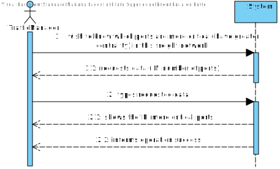
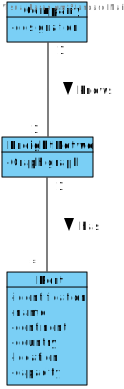
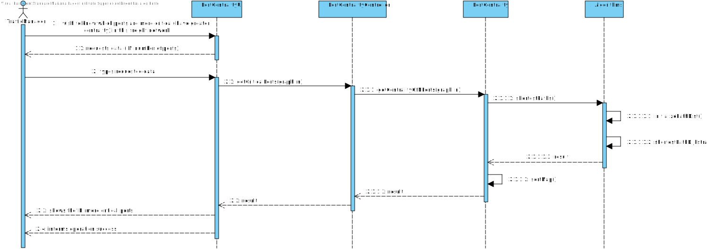
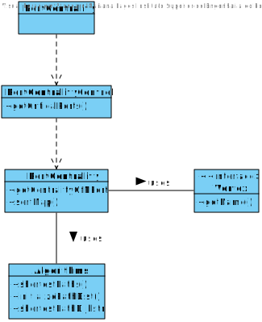

# US 401 - Know which ports are more critical (have greater centrality) in this freight network.
## 1. Requirements Engineering

## 1.1. User Story Description

As a Traffic manager I wish to know which ports are more critical (have greater
centrality) in this freight network.

## 1.2. Acceptance Criteria

* **AC1:** Return the n ports with greater centrality.
* **AC2:**  The centrality of a port is defined by the number of shortest paths that
  pass through it.

## 1.3. System Sequence Diagram (SSD)

## 2. OO Analysis

### Relevant Domain Model Excerpt

## 3. Design - User Story Realization

### 3.1. Sequence Diagram (SD)

### 3.2. Class Diagram (CD)

#4. Tests

**Test 1:**

    class PortCentralityControllerTest {

    static MatrixGraph<Vertex, Double> graph = new MatrixGraph<>(false);

    @BeforeAll
    static void beforeAll() {

        //Cities
        graph.addEdge(new City("Lisboa", 10, 40, new Country("Portugal", null, null, 2000, Continent.EUROPE)), new City("Madrid", 12, 36, new Country("Espanha", null, null, 7000, Continent.EUROPE)), 0.0);
        graph.addEdge(new City("Madrid", 12, 23, new Country("Espanha", null, null, 7000, Continent.EUROPE)), new City("Paris", 14, 40, new Country("França", null, null, 6500, Continent.EUROPE)), 0.0);
        graph.addEdge(new City("Paris", 14, 40, new Country("França", null, null, 6500, Continent.EUROPE)), new City("Berlim", 20, 45, new Country("Alemanha", null, null, 8000, Continent.EUROPE)), 0.0);
        graph.addEdge(new City("Paris", 14, 40, new Country("França", null, null, 6500, Continent.EUROPE)), new City("Bruxelas", 22, 28, new Country("Bélgica", null, null, 5500, Continent.EUROPE)), 0.0);
        graph.addEdge(new City("Paris", 14, 40, new Country("França", null, null, 6500, Continent.EUROPE)), new City("Luxemburgo", 30, 47, new Country("Luxemburgo", null, null, 8500, Continent.EUROPE)), 0.0);
        graph.addEdge(new City("Paris", 14, 40, new Country("França", null, null, 6500, Continent.EUROPE)), new City("Berna", 26.5, 50, new Country("Suíça", null, null, 6800, Continent.EUROPE)), 0.0);
        graph.addEdge(new City("Paris", 14, 40, new Country("França", null, null, 6500, Continent.EUROPE)), new City("Roma", 28, 30, new Country("Itália", null, null, 7500, Continent.EUROPE)), 0.0);
        graph.addEdge(new City("Berlim", 20, 45, new Country("Alemanha", null, null, 8000, Continent.EUROPE)), new City("Bruxelas", 22, 28, new Country("Bélgica", null, null, 5500, Continent.EUROPE)), 0.0);
        graph.addEdge(new City("Berlim", 20, 45, new Country("Alemanha", null, null, 8000, Continent.EUROPE)), new City("Luxemburgo", 30, 47, new Country("Luxemburgo", null, null, 8500, Continent.EUROPE)), 0.0);
        graph.addEdge(new City("Berlim", 20, 45, new Country("Alemanha", null, null, 8000, Continent.EUROPE)), new City("Berna", 26.5, 50, new Country("Suíça", null, null, 6800, Continent.EUROPE)), 0.0);
        graph.addEdge(new City("Berlim", 20, 45, new Country("Alemanha", null, null, 8000, Continent.EUROPE)), new City("Varsóvia", 34, 41, new Country("Polónia", null, null, 3000, Continent.EUROPE)), 0.0);
        graph.addEdge(new City("Bruxelas", 22, 28, new Country("Bélgica", null, null, 5500, Continent.EUROPE)), new City("Luxemburgo", 30, 47, new Country("Luxemburgo", null, null, 8500, Continent.EUROPE)), 0.0);
        graph.addEdge(new City("Berna", 26.5, 50, new Country("Suíça", null, null, 6800, Continent.EUROPE)), new City("Roma", 28, 30, new Country("Itália", null, null, 7500, Continent.EUROPE)), 0.0);
    }

    @Test
    void portCentralityControllerN5() {

        PortCentralityController controller = new PortCentralityController();

        try {
            //Arrange
            String actual = controller.getCriticalPorts(graph, 5);

            //Act
            String expected = "Port: Paris, Centrality: 53\n" +
                    "Port: Madrid, Centrality: 31\n" +
                    "Port: Berlim, Centrality: 31\n" +
                    "Port: Lisboa, Centrality: 17\n" +
                    "Port: Bruxelas, Centrality: 17\n";

            //Assert
            if (actual == null || actual.equals("")) {
                fail();
            }
            assertEquals(expected, actual);

        } catch (Exception e) {

        }
    }

    @Test
    void portCentralityControllerN9() {

        PortCentralityController controller = new PortCentralityController();

        try {
            //Arrange
            String actual = controller.getCriticalPorts(graph, 9);

            //Act
            String expected = "Port: Paris, Centrality: 53\n" +
                    "Port: Madrid, Centrality: 31\n" +
                    "Port: Berlim, Centrality: 31\n" +
                    "Port: Lisboa, Centrality: 17\n" +
                    "Port: Bruxelas, Centrality: 17\n" +
                    "Port: Luxemburgo, Centrality: 17\n" +
                    "Port: Berna, Centrality: 17\n" +
                    "Port: Roma, Centrality: 17\n" +
                    "Port: Varsóvia, Centrality: 17\n";

            //Assert
            if (actual == null || actual.equals("")) {
                fail();
            }
            assertEquals(expected, actual);

        } catch (Exception e) {

        }
    }
}

# 5. Construction (Implementation)

##PortCentrality    
    public class PortCentrality {

    /**
     * Constructor.
     */
    private PortCentrality() {
        // Empty constructor
    }

    /**
     * Gets the N more critical ports (have greater centrality).
     *
     * @param graph the graph
     * @param n     the N number of ports
     * @return the N more critical ports (in a string)
     */
    public static String getCentralityOfNPorts(MatrixGraph<Vertex, Double> graph, int n) {
        ArrayList<LinkedList<Vertex>> pathList = new ArrayList<>();
        ArrayList<Double> distanceList = new ArrayList<>();

        LinkedHashMap<Vertex, Integer> map = new LinkedHashMap<>();

        // Percorrer todos os vértices do grafo e calcular todos os caminhos mais curtos de cada um
        for (Vertex vertex1 : graph.vertices()) {
            Algorithms.shortestPaths(graph, vertex1, Double::compare, Double::sum, 0.0, pathList, distanceList);

            // Percorrer todos os caminhos
            for (LinkedList<Vertex> vertexLL : pathList) {
                if (vertexLL != null) {
                    // Percorrer todos os vértices de cada caminho
                    for (Vertex vertex2 : vertexLL) {
                        // Se o vértice for um porto, colocar num map como key e incrementar o valor que representa o número de vezes em que ele aparece
                        if (map.containsKey(vertex2)) {
                            map.put(vertex2, map.get(vertex2) + 1);
                        } else {
                            map.put(vertex2, 1);
                        }
                    }
                }
            }
        }

        // Ordenar o mapa
        map = sortMap(map);

        int aux = 0;
        StringBuilder sb = new StringBuilder();

        // Dar print aos N maiores
        for (Vertex vertex : map.keySet()) {
            if (aux == n) {
                break;
            }

            sb.append("Port: ").append(vertex.getName()).append(", Centrality: ").append(map.get(vertex)).append("\n");
            aux++;
        }

        return sb.toString();
    }

    /**
     * Sorts the map.
     *
     * @param map the map
     * @return the sorted map
     */
    public static LinkedHashMap<Vertex, Integer> sortMap(LinkedHashMap<Vertex, Integer> map) {
        List<Map.Entry<Vertex, Integer>> capitalList = new LinkedList<>(map.entrySet());

        // Usa List.sort para colocar os valores dos elementos da lista por ordem decrescente
        capitalList.sort((l1, l2) -> l2.getValue().compareTo(l1.getValue()));

        LinkedHashMap<Vertex, Integer> result = new LinkedHashMap<>();

        for (Map.Entry<Vertex, Integer> entry : capitalList) {
            result.put(entry.getKey(), entry.getValue());
        }

        return result;
    }
    }

##PositionalCentralityController:
    public class PortCentralityController {

    /**
     * Constructor.
     */
    public PortCentralityController() {
        // Empty constructor
    }

    /**
     * Gets the N more critical ports.
     *
     * @param graph the graph
     * @param n     the ´N´ number
     * @return
     */
    public String getCriticalPorts(MatrixGraph<Vertex, Double> graph, int n) {
        return PortCentrality.getCentralityOfNPorts(graph, n);
    }
    }

##Class PortCentralityUI

    public class PortCentralityUI implements Runnable {

    Company company;
    FreightNetwork freightNetwork;
    PortCentralityController controller;

    public PortCentralityUI() {
        this.company = App.getInstance().getCompany();
        this.freightNetwork = company.getFreightNetwork();
        this.controller = new PortCentralityController();
    }

    public void run() {
        int numberOfNPorts;

        do {
            try {
                numberOfNPorts = Utils.readIntegerFromConsole("Please type the N number of ports:");
                if (numberOfNPorts < 0)
                    throw new NumberFormatException("Please enter a valid number! (No negative numbers! It must be above 0)");
            } catch (NumberFormatException ex1) {
                System.out.println(ex1.getMessage());
                numberOfNPorts = -1;
            } catch (IllegalArgumentException ex2) {
                System.out.println("Please enter a number! (Don't enter a letter nor a symbol!)");
                numberOfNPorts = -1;
            }
        } while (numberOfNPorts == -1);

        try {
            System.out.println(controller.getCriticalPorts(freightNetwork.getGraph(), numberOfNPorts));
        } catch (Exception exception) {
            System.out.println(exception.getMessage());
            System.out.println("Something went wrong. Please, try again.");
        }
    }
    }