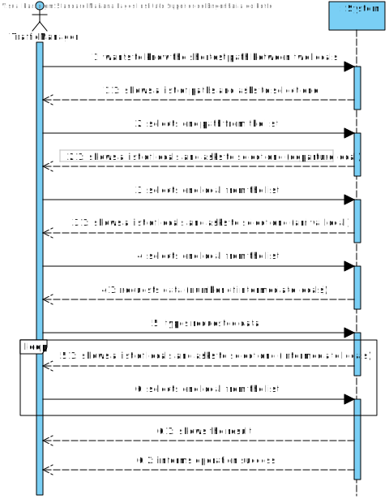
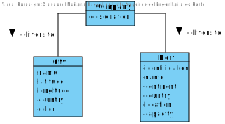
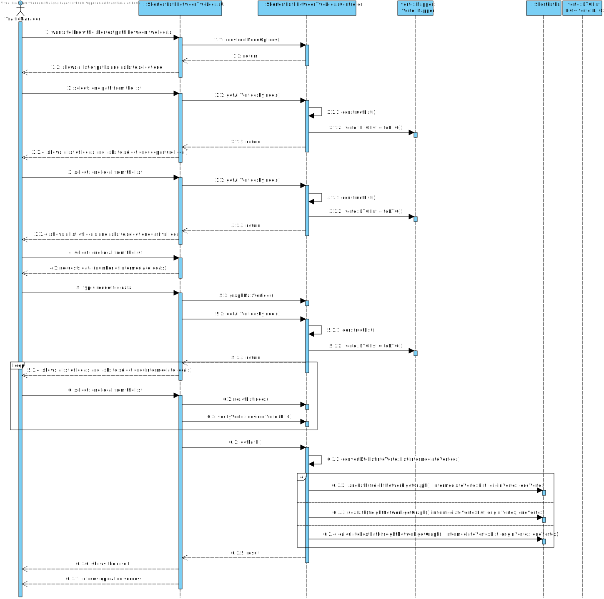
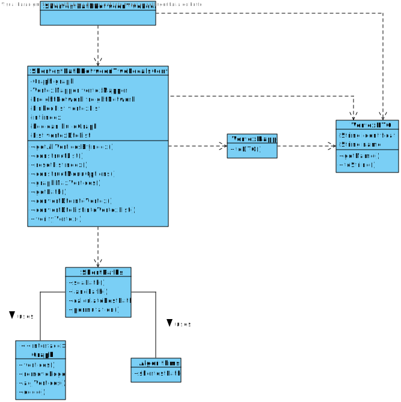

# US 402 - As a Traffic manager I wish to know the shortest path between two locals (city and/or port).

## 1. Requirements Engineering

## 1.1. User Story Description

As a Traffic manager I wish to know the shortest path between two locals (city
and/or port).

## 1.2. Acceptance Criteria

* **AC1:** Land path (only includes land routes, may start/end in port/city).
* **AC2:**  Maritime path (only includes ports).
* **AC3:**  Land or sea path (may include cities and ports).
* **AC4:**  Obligatorily passing through n indicated places.

## 1.3. System Sequence Diagram (SSD)

## 2. OO Analysis

### Relevant Domain Model Excerpt

## 3. Design - User Story Realization

### 3.1. Sequence Diagram (SD)

### 3.2. Class Diagram (CD)

#4.Test

##Test 1:
    class ShortestPathBetweenTwoLocalsControllerTest {

    private final ShortestPathBetweenTwoLocalsController shortestPathBetweenTwoLocalsController = new ShortestPathBetweenTwoLocalsController();

    @Test
    void getAllVerticesByIndex() {

        try {
            shortestPathBetweenTwoLocalsController.resetListIndex(0);
            List<VertexDTO> vertexDTOList = shortestPathBetweenTwoLocalsController.getAllVerticesByIndex();
            if (vertexDTOList.isEmpty()) fail();

        } catch (Exception e) {

        }

    }

    @Test
    void constructMenuOptions() {
    }

    @Test
    void graphMaxVertices() {
        try {
            int num = shortestPathBetweenTwoLocalsController.graphMaxVertices();

        } catch (Exception e) {

        }
    }

    @Test
    void getPath() {
        try {
            String path = shortestPathBetweenTwoLocalsController.getPath("Land Path", new VertexDTO("City", "Lisbon"), new VertexDTO("City", "Madrid"), new ArrayList<>());

        } catch (Exception e) {

        }
    }

    @Test
    void convertDtoIntoVertex() {
        try {
            Vertex v = shortestPathBetweenTwoLocalsController.convertDtoIntoVertex(new VertexDTO("Port", "Yah"));

        } catch (Exception e) {

        }
    }

    @Test
    void convertDtoListIntoVertexList() {
        try {
            List<Vertex> v = shortestPathBetweenTwoLocalsController.convertDtoListIntoVertexList(new ArrayList<>());

        } catch (Exception e) {

        }

    }

    @Test
    void verifyVertex() {
        try {
            String v = shortestPathBetweenTwoLocalsController.verifyVertex(new VertexDTO("Port", "Yah"));

        } catch (Exception e) {

        }
    }
    }

##Test 2:

    class ShortPathsTest {

    @BeforeAll
    static void init() throws NullVerticesException {
        f.createGraph(5, App.getInstance().getDatabaseConnection());
    }

    @Test
    void landPathTest() throws NullVerticesException {
        List<Vertex> list = new ArrayList<>();
        list.add(new City("Lisbon", 38.71666667, -9.133333, new Country("Portugal", "PT".toCharArray(), "PTR".toCharArray(), 10.31, Continent.EUROPE)));
        list.add(new City("Madrid", 40.4, -3.683333, new Country("Spain", "ES".toCharArray(), "ESP".toCharArray(), 46.53, Continent.EUROPE)));

        Vertex vInitial = new City("Monaco", 40.4, -3.683333, new Country("Monaco", "MC".toCharArray(), "MCO".toCharArray(), 46.53, Continent.EUROPE));
        Vertex vFinal = new City("Paris", 48.86666667, 2.333333, new Country("France", "FR".toCharArray(), "FRA".toCharArray(), 66.99, Continent.EUROPE));

        List<Vertex> actual = ShortPaths.landPath(f.getGraph(), list, vInitial, vFinal);

        LinkedList<Vertex> expected = new LinkedList<>();

        expected.add(new City("Monaco", 40.4, -3.683333, new Country("Monaco", "MC".toCharArray(), "MCO".toCharArray(), 46.53, Continent.EUROPE)));
        expected.add(new City("Paris", 48.86666667, 2.333333, new Country("France", "FR".toCharArray(), "FRA".toCharArray(), 66.99, Continent.EUROPE)));
        expected.add(new City("Madrid", 40.4, -3.683333, new Country("Spain", "ES".toCharArray(), "ESP".toCharArray(), 46.53, Continent.EUROPE)));
        expected.add(new City("Lisbon", 38.71666667, -9.133333, new Country("Portugal", "PT".toCharArray(), "PTR".toCharArray(), 10.31, Continent.EUROPE)));
        expected.add(new City("Madrid", 40.4, -3.683333, new Country("Spain", "ES".toCharArray(), "ESP".toCharArray(), 46.53, Continent.EUROPE)));
        expected.add(new City("Paris", 48.86666667, 2.333333, new Country("France", "FR".toCharArray(), "FRA".toCharArray(), 66.99, Continent.EUROPE)));

        for (int i = 0; i < expected.size(); i++) {
            Assertions.assertEquals(expected.iterator().next(), actual.iterator().next());
        }

    }

    @Test
    void seaPathTest() throws NullVerticesException {
        List<Vertex> list = new ArrayList<>();
        list.add(new Port("17386", "Barcelona", "Europe", "Spain", new FacilityLocation(-8.7, 41.18333333), 500));

        Vertex vInitial = new Port("13012", "Leixoes", "Europe", "Portugal", new FacilityLocation(-8.7, 41.18333333), 500);
        Vertex vFinal = new Port("21457", "Monaco", "Europe", "Monaco", new FacilityLocation(-8.7, 41.18333333), 500);

        LinkedList<Vertex> actual = (LinkedList<Vertex>) ShortPaths.seaPath(f.getGraph(), list, vInitial, vFinal);

        LinkedList<Vertex> expected = new LinkedList<>();

        expected.add(new Port("13012", "Leixoes", "Europe", "Portugal", new FacilityLocation(-8.7, 41.18333333), 500));
        expected.add(new Port("13012", "Barcelona", "Europe", "Portugal", new FacilityLocation(-8.7, 41.18333333), 500));
        expected.add(new Port("13012", "Monaco", "Europe", "Portugal", new FacilityLocation(-8.7, 41.18333333), 500));

        for (int i = 0; i < expected.size(); i++) {
            Assertions.assertEquals(expected.iterator().next(), actual.iterator().next());
        }
    }

    @Test
    void onlyOneIntermedianTest() throws NullVerticesException {
        List<Vertex> list = new ArrayList<>();
        list.add(new Port("17386", "Barcelona", "Europe", "Spain", new FacilityLocation(-8.7, 41.18333333), 500));

        Vertex vInitial = new Port("13012", "Leixoes", "Europe", "Portugal", new FacilityLocation(-8.7, 41.18333333), 500);
        Vertex vFinal = new Port("21457", "Monaco", "Europe", "Monaco", new FacilityLocation(-8.7, 41.18333333), 500);

        LinkedList<Vertex> actual = (LinkedList<Vertex>) ShortPaths.seaPath(f.getGraph(), list, vInitial, vFinal);

        LinkedList<Vertex> expected = new LinkedList<>();

        expected.add(new Port("13012", "Leixoes", "Europe", "Portugal", new FacilityLocation(-8.7, 41.18333333), 500));
        expected.add(new Port("13012", "Barcelona", "Europe", "Portugal", new FacilityLocation(-8.7, 41.18333333), 500));
        expected.add(new Port("13012", "Monaco", "Europe", "Portugal", new FacilityLocation(-8.7, 41.18333333), 500));

        for (int i = 0; i < expected.size(); i++) {
            Assertions.assertEquals(expected.iterator().next(), actual.iterator().next());
        }

    }

    @Test
    void getPathTest() {
        ArrayList<Vertex> list = new ArrayList<>();
        list.add(new City("Lisbon", 38.71666667, -9.133333, new Country("Portugal", "PT".toCharArray(), "PTR".toCharArray(), 10.31, Continent.EUROPE)));
        list.add(new City("Madrid", 40.4, -3.683333, new Country("Spain", "ES".toCharArray(), "ESP".toCharArray(), 46.53, Continent.EUROPE)));

        Vertex vInitial = new Port("13012", "Leixoes", "Europe", "Portugal", new FacilityLocation(-8.7, 41.18333333), 500);
        Vertex vFinal = new City("Paris", 48.86666667, 2.333333, new Country("France", "FR".toCharArray(), "FRA".toCharArray(), 66.99, Continent.EUROPE));

        List<Vertex> actual = ShortPaths.calculateBestPath(f.getGraph(), list, vInitial, vFinal);
        List<Vertex> expected = new LinkedList<>();

        expected.add(new Port("13012", "Leixoes", "Europe", "Portugal", new FacilityLocation(-8.7, 41.18333333), 500));
        expected.add(new Port("13012", "Setubal", "Europe", "Portugal", new FacilityLocation(-8.7, 41.18333333), 500));
        expected.add(new City("Lisbon", 38.71666667, -9.133333, new Country("Portugal", "PT".toCharArray(), "PTR".toCharArray(), 10.31, Continent.EUROPE)));
        expected.add(new City("Madrid", 40.4, -3.683333, new Country("Spain", "ES".toCharArray(), "ESP".toCharArray(), 46.53, Continent.EUROPE)));
        expected.add(new Port("13012", "Valencia", "Europe", "Portugal", new FacilityLocation(-8.7, 41.18333333), 500));
        expected.add(new Port("13012", "Barcelona", "Europe", "Portugal", new FacilityLocation(-8.7, 41.18333333), 500));
        expected.add(new Port("13012", "Monaco", "Europe", "Portugal", new FacilityLocation(-8.7, 41.18333333), 500));
        expected.add(new City("Monaco", 40.4, -3.683333, new Country("Monaco", "MC".toCharArray(), "MCO".toCharArray(), 46.53, Continent.EUROPE)));
        expected.add(new City("Paris", 48.86666667, 2.333333, new Country("France", "FR".toCharArray(), "FRA".toCharArray(), 66.99, Continent.EUROPE)));

        for (int i = 0; i < expected.size(); i++) {
            Assertions.assertEquals(expected.iterator().next(), actual.iterator().next());
        }
    }
    }

# 5. Construction (Implementation)

##ShortestPathBetweenTwoLocalsController
    public class ShortestPathBetweenTwoLocalsController {

    private final Graph<Vertex, Double> graph;
    private final VertexMapper vertexMapper;
    private final FreightNetwork freightNetwork;
    private final LinkedList<List<Vertex>> vertexList;
    private int index = 0;
    private boolean buildGraph = false;
    private List<VertexDTO> vertexDTOList;

    /**
     * Constructor.
     */
    public ShortestPathBetweenTwoLocalsController() {
        freightNetwork = App.getInstance().getCompany().getFreightNetwork();
        this.vertexList = new LinkedList<>();
        this.graph = freightNetwork.getGraph();
        this.vertexMapper = new VertexMapper();
        this.vertexDTOList = new ArrayList<>();
    }

    /**
     * Gets all vertices by its index.
     *
     * @return a list of vertices
     */
    public List<VertexDTO> getAllVerticesByIndex() {

        if (!this.buildGraph) {
            constructList();
            this.buildGraph = true;
        }

        List<Vertex> listByIndex = vertexList.get(index);
        this.vertexDTOList = vertexMapper.toDTO(listByIndex);
        index++;
        return vertexDTOList;
    }

    /**
     * Constructs the list of vertices.
     */
    private void constructList() {
        List<Vertex> auxList = new ArrayList<>();
        int auxIndex = 0;
        for (int i = 0; i < 4; i++) {
            for (int j = 0; j < 35; j++) {
                auxList.add(graph.vertex(auxIndex));
                auxIndex++;
            }
            vertexList.add(auxList);
            auxList = new ArrayList<>();
        }
    }

    /**
     * Resets the index.
     *
     * @param index the index
     */
    public void resetListIndex(int index) {
        this.index = index;
    }

    /**
     * Constructs the menu options.
     *
     * @return the options list
     */
    public List<String> constructMenuOptions() {
        List<String> options = new ArrayList<>();
        options.add("Land path");
        options.add("Maritime path");
        options.add("Land or sea path");
        return options;
    }

    /**
     * Gets the number of vertices of the graph.
     *
     * @return the number of vertices of the graph
     */
    public int graphMaxVertices() {
        return graph.numVertices();
    }

    /**
     * Gets the path.
     *
     * @param pathOption           path option
     * @param originVertexDTO      the origin vertex
     * @param endVertexDTO         the end vertex
     * @param intermediateVertices the intermediate vertices
     * @return the path (in a string)
     */
    public String getPath(String pathOption, VertexDTO originVertexDTO, VertexDTO endVertexDTO, List<VertexDTO> intermediateVertices) {

        if (pathOption == null) {
            throw new NullPointerException("The entered path is null! There was an error while entering data!");
        } else if (originVertexDTO == null || endVertexDTO == null) {
            throw new NullPointerException("The entered origin vertex or end vertex is null! There was an error while entering data!");
        }

        Vertex originVertex = convertDtoIntoVertex(originVertexDTO);
        Vertex endVertex = convertDtoIntoVertex(endVertexDTO);

        List<Vertex> intermediateVertexList = convertDtoListIntoVertexList(intermediateVertices);

        List<Vertex> vertexList = new ArrayList<>();

        switch (pathOption) {
            case ("Land path"):
                try {
                    vertexList = ShortPaths.landPath(freightNetwork.getGraph(), intermediateVertexList, originVertex, endVertex);
                } catch (NullVerticesException e) {
                    vertexList = emptyList();
                }
                break;
            case ("Maritime path"):
                try {
                    vertexList = ShortPaths.seaPath(freightNetwork.getGraph(), intermediateVertexList, originVertex, endVertex);
                } catch (NullVerticesException e) {
                    vertexList = emptyList();
                }
                break;
            case ("Land or sea path"):

                vertexList = ShortPaths.calculateBestPath(freightNetwork.getGraph(), intermediateVertexList, originVertex, endVertex);

                break;

            default:
                break;
        }

        StringBuilder sb = new StringBuilder();
        sb.append("\n\nPath: \n");

        for (int i = 0; i < vertexList.size(); i++) {
            sb.append(vertexList.get(i).getName());
            if (i != vertexList.size() - 1) {
                sb.append(" -> ");
            }
        }

        if (sb.toString().isEmpty()) {
            throw new NullPointerException();
        }

        return sb.toString();
    }

    /**
     * Converts DTO into vertex.
     *
     * @param vertexDto the vertex DTO
     * @return the vertex (success) or null (failed)
     */
    public Vertex convertDtoIntoVertex(VertexDTO vertexDto) {
        for (Vertex v : graph.vertices()) {
            if (v.getName().equals(vertexDto.getName())) {
                return v;
            }
        }
        return null;
    }

    /**
     * Converts DTO list into vertex list.
     *
     * @param intermediateVertices the intermediate vertices
     * @return the vertex list
     */
    public List<Vertex> convertDtoListIntoVertexList(List<VertexDTO> intermediateVertices) {
        List<Vertex> vertexList = new ArrayList<>();

        for (VertexDTO vDto : intermediateVertices) {
            for (Vertex v : graph.vertices()) {
                if (v.getName().equals(vDto.getName())) {
                    vertexList.add(v);
                }
            }
        }
        return vertexList;
    }

    /**
     * Verifies the vertex (city or port).
     *
     * @param vertexDto the vertex DTO
     * @return "City" (if the vertex is a city) or "Port" (if the vertex is a port)
     */
    public String verifyVertex(VertexDTO vertexDto) {
        for (Vertex v : graph.vertices()) {
            if (v.getName().equals(vertexDto.getName())) {
                if (v instanceof City) return "City";
                else if (v instanceof Port) return "Port";
            }
        }
        return null;
    }
}