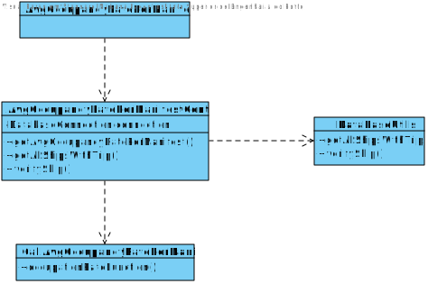

# US 405 - Know the average occupancy rate per manifest of a given ship during a given period.

## 1. Requirements Engineering

## 1.1. User Story Description

As Fleet Manager, I want to know the average occupancy rate per manifest of a
given ship during a given period.

## 1.2. Acceptance Criteria

* **AC1:** hip is properly identified and considered.
* **AC2:**  Period is properly identified and considered.
* **AC3:**  Average occupancy rate per manifest and ship is correctly computed.

## 1.3. System Sequence Diagram (SSD)

## 2. OO Analysis

### Relevant Domain Model Excerpt

## 3. Design - User Story Realization

### 3.1. Sequence Diagram (SD)

### 3.2. Class Diagram (CD)

## 4.Test
###Test 1:

    class AvgOccupancyRatePerManifestControllerTest {

    @Test
    void getAvgOccupancyRatePerManifest() {

        AvgOccupancyRatePerManifestController avgOccupancyRatePerManifestController = new AvgOccupancyRatePerManifestController();
        String value = null;

        try {
            value = avgOccupancyRatePerManifestController.getAvgOccupancyRatePerManifest(999333222, "2021-12-01 00:00:00", "2022-01-10 00:00:00").toString();
            if (value.isEmpty()) fail();
        } catch (Exception e) {

        }

    }

    @Test
    void getAllShipsWithTrip() {

        AvgOccupancyRatePerManifestController avgOccupancyRatePerManifestController = new AvgOccupancyRatePerManifestController();

        try {
            List<String> listShips = avgOccupancyRatePerManifestController.getAllShipsWithTrip();

            if (listShips.isEmpty()) fail();

        } catch (SQLException exception) {

        }

    }

    @Test
    void verifyShip() {
        AvgOccupancyRatePerManifestController avgOccupancyRatePerManifestController = new AvgOccupancyRatePerManifestController();

        try {
            boolean flag = avgOccupancyRatePerManifestController.verifyShip("999333222");

            if (flag == false) fail();

        } catch (SQLException exception) {

        }
    }
    }

##Classes:

###AvgOccupancyRatePerManifestController
    public class AvgOccupancyRatePerManifestController {

    private final DatabaseConnection connection;

    /**
     * Constructor.
     */
    public AvgOccupancyRatePerManifestController() {
        this.connection = App.getInstance().getDatabaseConnection();
    }

    /**
     * Gets the result values of the average occupancy rate per manifest of a given ship during a given period.
     *
     * @param mmsi  the ship MMSI
     * @param begin the begin date
     * @param end   the end date
     * @return a string with all the result values
     * @throws InvalidShipException
     */
    public StringBuilder getAvgOccupancyRatePerManifest(int mmsi, String begin, String end) throws InvalidShipException {
        StringBuilder sb = new StringBuilder();
        double average = CallAvgOccupancyRatePerManifest.occupationRateFunction(connection, mmsi, begin, end);

        return sb.append("Ship MMSI: ").append(mmsi).append("\nPeriod: ").append(begin).append(" - ").append(end).append("\nAverage occupancy rate per manifest: ").append(average).append("%\n");
    }

    /**
     * Gets all the ships with trips.
     *
     * @return all the ships with trips
     * @throws SQLException
     */
    public List<String> getAllShipsWithTrip() throws SQLException {
        return DataBaseUtils.getAllShipsWithTrips(connection);
    }

    /**
     * Verifies if the ship exists.
     *
     * @param mmsi the ship MMSI
     * @return true if it exists, false if it doesn't
     * @throws SQLException
     */
    public boolean verifyShip(String mmsi) throws SQLException {
        return DataBaseUtils.verifyShip(mmsi, connection);
    }

    }

##AvfOccupancyRatePerManifestUI

    public class AvgOccupancyRatePerManifestUI implements Runnable {

    private final AvgOccupancyRatePerManifestController controller;
    private final DateTimeFormatter formatter = DateTimeFormatter.ofPattern("yyyy-MM-dd HH:mm:ss");

    public AvgOccupancyRatePerManifestUI() {
        this.controller = new AvgOccupancyRatePerManifestController();
    }

    public void run() {
        int mmsi;

        String begin;
        String end;
        String option = null;

        try {
            do {
                try {
                    option = (String) Utils.showAndSelectOne(controller.getAllShipsWithTrip(), "\n### SHIPS WITH TRIPS LIST ###\n Please choose one:\n");

                    if (option == null || option.trim().equals("")) {
                        throw new IllegalArgumentException("Invalid Ship! Please enter a valid option! (See the ship list above)");
                    }

                    if (!controller.verifyShip(option)) {
                        throw new IllegalArgumentException("Invalid Ship! Please enter a valid option! (See the ship list above)");
                    }

                } catch (SQLException ex1) {
                    System.out.println("Invalid ship! Please enter a valid option! (Note: enter a number that corresponds to the option, not a invalid character or a set of invalid characters nor a number that does not exist in the list!) \n");
                    option = null;
                } catch (Exception e) {
                    System.out.println(e.getMessage());
                    option = null;
                }

            } while (option == null);

            mmsi = Integer.parseInt(option);

            do {
                try {
                    begin = Utils.readLineFromConsole("Please enter the begin date (Follow this format: yyyy-MM-dd HH:mm:ss):");
                    LocalDateTime startTime = LocalDateTime.from(formatter.parse(begin));
                } catch (Exception e) {
                    System.out.println("Please enter a valid date! (Follow this format: yyyy-MM-dd HH:mm:ss)");
                    begin = null;
                }
            } while (begin == null);

            do {
                try {
                    end = Utils.readLineFromConsole("Please enter the end date (Follow this format: yyyy-MM-dd HH:mm:ss)");
                    LocalDateTime endTime = LocalDateTime.from(formatter.parse(end));
                } catch (Exception e) {
                    System.out.println("Please enter a valid date! (Follow this format: yyyy-MM-dd HH:mm:ss)");
                    end = null;
                }
            } while (end == null);

            System.out.println("\n" + controller.getAvgOccupancyRatePerManifest(mmsi, begin, end));
            System.out.println("\nOperation Success!\n");
        } catch (Exception ex1) {
            System.out.println(ex1.getMessage());
            System.out.println("\nOperation Failed!\n");
        }
    }
    }

##CountDausEachShipScriptUI

    public class MostEfficientCircuitUI implements Runnable {

    public MostEfficientCircuitUI(){
        //Empty Constructor
        }

    @Override
    public void run(){

        String designation;
        boolean hasNumber;
        MostEfficientCircuitController mostEfficientCircuitController;

        do {
            hasNumber = false;
            mostEfficientCircuitController = new MostEfficientCircuitController();
            designation = Utils.readLineFromConsole("Which Place?");

            char [] chars = designation.toCharArray();

            for(char c : chars){

                if(Character.isDigit(c))
                    hasNumber = true;
            }

           if(hasNumber){
                System.out.println("Please do not insert numbers!");
            }

        }while (hasNumber);
        LinkedList <Vertex> ls = mostEfficientCircuitController.mostEfficientCircuit(designation);

        if(ls.getFirst() != null) {
            for (Vertex v : ls) {
                System.out.println(v.getDesignation() + ", Country:"+v.getCountry()+ ", Continent:" +v.getContinent()+"\n");
            }
        }
        else {
            System.out.println("There isn't any valid course for that facility, or it doesn't exist in the graph.");
        }
    }
    }

##getAllSHipsWithTrip

    public static List<String> getAllShipsWithTrips(DatabaseConnection databaseConnection) throws SQLException {

        Connection connection = databaseConnection.getConnection();
        List<String> shipsList = new ArrayList<>();

        String sqlCommand = "select distinct s.Mmsi\n" +
                "from SHIP s\n" +
                "         inner join TRIP T on s.VEHICLEID = T.VEHICLEID\n" +
                "order by s.MMSI";

        try (PreparedStatement getPreparedStatement = connection.prepareStatement(sqlCommand)) {
            try (ResultSet resultSet = getPreparedStatement.executeQuery()) {

                while (resultSet.next()) {
                    shipsList.add(resultSet.getString(1));
                }

            }
        }
        return shipsList;
    }

