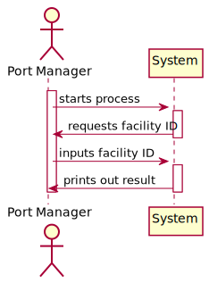
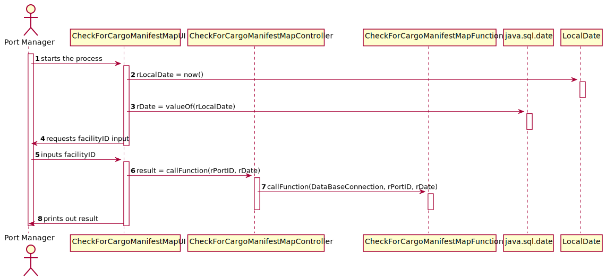
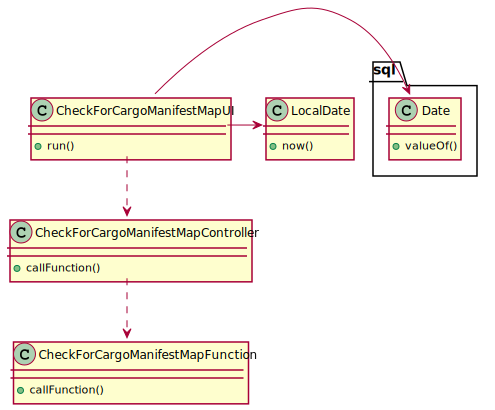

# US 406 - Intend to generate, a week in advance, the loading and unloading map based on ships and trucks load manifests and corresponding travel plans to anticipate the level of sufficient and necessary resources (loading and unloading staff, warehouse staff, ...).

## 1. Requirements Engineering

## 1.1. User Story Description

As Port manager, I intend to generate, a week in advance, the loading and unloading map based on ships and trucks load manifests and corresponding travel plans to anticipate the level of sufficient and necessary resources (loading and unloading staff, warehouse staff, ...).

## 1.2. Acceptance Criteria

* **AC1:** Week in advance is properly identified.
* **AC2:**  Loading and unloading map is comprehensive.
* **AC3:**  Loading and unloading map is clear with respect to the sufficient and necessary resources for loading and unloading tasks.
## 1.3. System Sequence Diagram (SSD)

## 2. OO Analysis

### Relevant Domain Model Excerpt

## 3. Design - User Story Realization

### 3.1. Sequence Diagram (SD)

### 3.2. Class Diagram (CD)

##5 Classes:

##CheckForCargoManifestMapFunction

    public class CheckForCargoManifestMapFunction {

    /**
     * Constructor.
     */
    public CheckForCargoManifestMapFunction() {
        //Empty constructor
    }

    //US407

    /**
     * Calls the function that generates the loading and unloading map.
     *
     * @param databaseConnection the database connection
     * @param facilityID         the facility ID
     * @param date               the date
     * @return the loading and unloading map
     * @throws SQLException
     */
    public static String callFunction(DatabaseConnection databaseConnection, String facilityID, java.sql.Date date) throws SQLException {
        try (CallableStatement cstmt = databaseConnection.getConnection().prepareCall("{? = call fncCheckForCargoManifestMap(?,?)}")) {

            cstmt.registerOutParameter(1, Types.VARCHAR);
            cstmt.setString(2, facilityID); //8
            cstmt.setDate(3, date);

            cstmt.executeUpdate();

            return cstmt.getString(1);
        }
    }
        }

##CheckForCargoManifestMapController

    public class CheckForCargoManifestMapController {

    private final DatabaseConnection databaseConnection;

    /**
     * Constructor.
     */
    public CheckForCargoManifestMapController() {
        this.databaseConnection = App.getInstance().getDatabaseConnection();
    }

    /**
     * Gets the function that generates the loading and unloading map.
     *
     * @param rPortID the port ID
     * @param rDate   the date
     * @return the loading and unloading map
     * @throws SQLException
     */
    public String callFunction(String rPortID, Date rDate) throws SQLException {
        return CheckForCargoManifestMapFunction.callFunction(databaseConnection, rPortID, rDate);
    }
    }

##CheckForCargoManifestUI
  
    public class CheckForCargoManifestMapUI implements Runnable {

    private final CheckForCargoManifestMapController ctrl;

    public CheckForCargoManifestMapUI(){
        this.ctrl = new CheckForCargoManifestMapController();
    }

    @Override
    public void run() {
        java.sql.Date rDate = Date.valueOf(LocalDate.now());
        String rPortID = Utils.readLineFromConsole("Please enter the facility ID: ");

        try {
            String result = ctrl.callFunction(rPortID,rDate);
            System.out.println(result);

        } catch (Exception exception) {
            System.out.println(exception.getMessage());
        }
    }
    }

