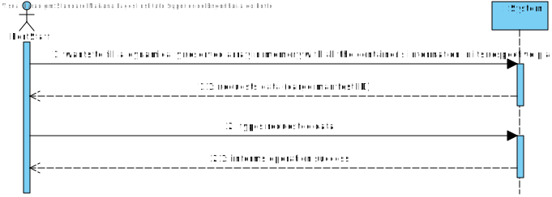
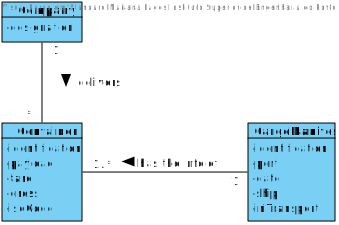
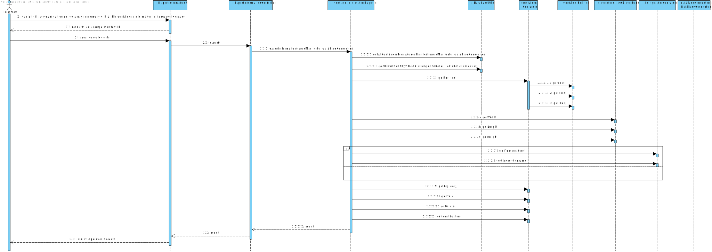
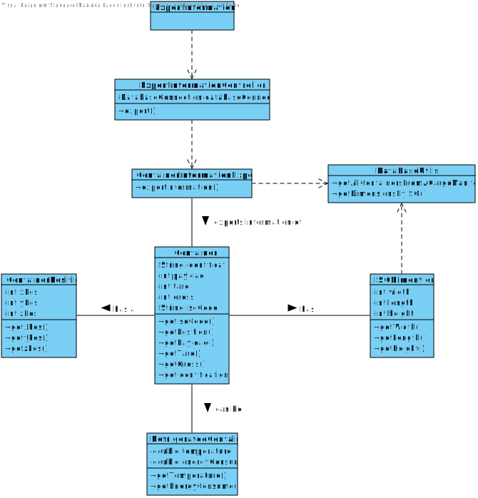

# US 409 -  As a Port staff given a Cargo Manifest, I wish to fill a dynamically reserved array in memory with all the container's information in its respective place.

## 1. Requirements Engineering

## 1.1. User Story Description

As Fleet Manager, I want to know which ship voyages – place and date of origin
and destination – had an occupancy rate below a certain threshold; by default, consider an
occupancy rate threshold of 66%. Only the trips already concluded are to be considered.

## 1.2. Acceptance Criteria

* **AC1:** The matrix array should be dynamically reserved in C, adjusting the size of the matrix array to the amount of handled data.
* **AC2:**  All the details of a container can be present in more than one file. As  such, define a struct that represents a container. Therefore, in the end,  you should have a matrix of structs.
* **AC3:** The data types chosen for each field of the struct should be adjusted to  the types of values they store. Memory usage should be kept to theminimum required. Also consider the order of fields that minimizes  memory consumption.
* **AC4:** The function should be developed in C.

## 1.3. System Sequence Diagram (SSD)

## 2. OO Analysis

### Relevant Domain Model Excerpt

## 3. Design - User Story Realization

### 3.1. Sequence Diagram (SD)

### 3.2. Class Diagram (CD)

##5 Classes:

###ISODimentions
    
    public class ISODimentions {
    private int width;
    private int length;
    private int height;

    /**
     * Constructor.
     *
     * @param width  the width in the ISO Code
     * @param length the length in the ISO Code
     * @param height the height in the ISO Code
     */
    public ISODimentions(int width, int length, int height) {
        this.width = width;
        this.length = length;
        this.height = height;
    }

    /**
     * Gets the width in the ISO Code
     *
     * @return
     */
    public int getWidth() {
        return width;
    }

    /**
     * Sets the width in the ISO Code
     *
     * @param width the width
     */
    public void setWidth(int width) {
        this.width = width;
    }

    /**
     * Gets the length in the ISO Code
     *
     * @return the length in the ISO Code
     */
    public int getLength() {
        return length;
    }

    /**
     * Sets the length in the ISO Code
     *
     * @param length the length
     */
    public void setLength(int length) {
        this.length = length;
    }

    /**
     * Gets the height in the ISO Code
     *
     * @return the height in the ISO Code
     */
    public int getHeight() {
        return height;
    }

    /**
     * Sets the height in the ISO Code
     *
     * @param height the height
     */
    public void setHeight(int height) {
        this.height = height;
    }
    }