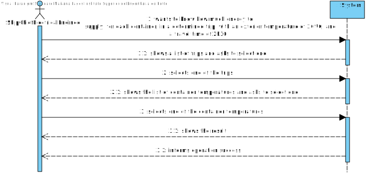
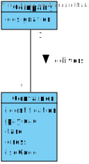
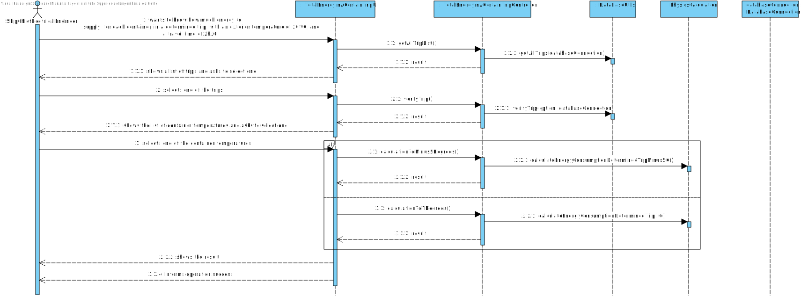
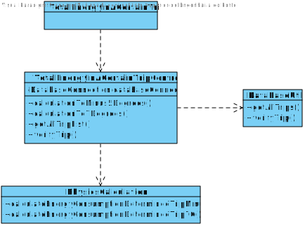

# US 406 -  Intend to know how much energy to supply, for each container, in a determined trip, with an exterior temperature of 20 ºC, and a travel time of 2h30.

## 1. Requirements Engineering

## 1.1. User Story Description

As Ship Chief Electrical Engineer, we intend to know how much energy to
supply, for each container, in a determined trip, with an exterior temperature of 20 ºC, and
a travel time of 2h30.

## 1.2. Acceptance Criteria

* **AC1:** The total energy to be delivered to a container with an operating temperature of 7 °C.
* **AC2:**  The total energy to be delivered to a container with an operating temperature of - 5 °C.

## 1.3. System Sequence Diagram (SSD)

## 2. OO Analysis

### Relevant Domain Model Excerpt

## 3. Design - User Story Realization

### 3.1. Sequence Diagram (SD)

### 3.2. Class Diagram (CD)

## 4.Test
###Test 1:

    class TotalEnergySuppliedControllerTest {

    TotalEnergySuppliedController controller = new TotalEnergySuppliedController();
    int numberOfContainers = 10;
    double temperature = 20;
    int time = 9000;

    @Test
    void calculationToMinus5() {
        //Arrange
        String expected = "134338.27436138067";
        //Act
        String actual = String.valueOf(controller.calculationToMinus5(numberOfContainers, temperature, time));
        //Assert
        assertEquals(expected, actual);
    }

    @Test
    void calculationTo7() {
        //Arrange
        String expected = "851266.5028210469";
        //Act
        String actual = String.valueOf(controller.calculationTo7(numberOfContainers, temperature, time));
        //Assert
        assertEquals(expected, actual);
    }
    }

##5 Classes:

###TotalEnergySuppliedController
public class TotalEnergySuppliedController {

    private final DatabaseConnection connection;

    /**
     * Constructor.
     */
    public TotalEnergySuppliedController() {
        this.connection = App.getInstance().getDatabaseConnection();
    }

    /**
     * Gets the result values of the total energy needed to supply to a set of containers of -5ºC.
     *
     * @param numberOfContainers the number of containers
     * @param temperature        the container temperature
     * @param journeyTime        the journey time
     * @return a string with all the result values
     */
    public Double calculationToMinus5(int numberOfContainers, double temperature, int journeyTime) {
        return PhysicsCalculation.calculateTotalEnergySuppliedMinus5(numberOfContainers, temperature, journeyTime);
    }

    /**
     * Gets the result values of the total energy needed to supply to a set of containers of 7ºC.
     *
     * @param numberOfContainers the number of containers
     * @param temperature        the container temperature
     * @param journeyTime        the journey time
     * @return a string with all the result values
     */
    public Double calculationTo7(int numberOfContainers, double temperature, int journeyTime) {
        return PhysicsCalculation.calculateTotalEnergySupplied7(numberOfContainers, temperature, journeyTime);
    }

    /**
     * Gets a list with all the trips.
     *
     * @return a list with all the trips
     * @throws SQLException
     */
    public String getAllTripList() throws SQLException {
        return DataBaseUtils.getAllTrips(connection);
    }

    /**
     * Verifies if the trip exists.
     *
     * @param option the trip ID chosen by the user
     * @return true if it exists, false if it doesn't
     * @throws SQLException
     */
    public boolean verifyTrip(String option) throws SQLException {
        return DataBaseUtils.verifyTrip(option, connection);
    }
    }
##TotalEnergySuppliedUI

    public class AvgOccupancyRateWithThresholdPerVoyageController {

    private final DatabaseConnection connection;

    /**
     * Constructor.
     */
    public AvgOccupancyRateWithThresholdPerVoyageController() {
        this.connection = App.getInstance().getDatabaseConnection();
    }

    /**
     * Gets the ship voyages that had an average occupancy rate below a certain threshold.
     *
     * @param mmsi      the ship MMSI
     * @param begin     the begin date
     * @param end       the end date
     * @param threshold the threshold
     * @return the ship voyages that had an average occupancy rate below a certain threshold
     * @throws InvalidShipException
     */

    public String getAvgOccupancyRateThreshold(int mmsi, String begin, String end, int threshold) throws InvalidShipException {
        String result = CallAvgOccupancyRateThreshold.occupationRateFunction(connection, mmsi, begin, end, threshold);

        if (result.equals("Given the default Threshold, there are no trips that have an occupancy rate below the given default threshold!!")) {
            throw new IllegalArgumentException("\nGiven the default Threshold, there are no trips that have an occupancy rate below the given default threshold!!");
        }

        return result;
    }

    /**
     * Gets all the ships with trips.
     *
     * @return all the ships with trips
     * @throws SQLException
     */
    public List<String> getAllShipsWithTrip() throws SQLException {
        return DataBaseUtils.getAllShipsWithTrips(connection);
    }

    /**
     * Verifies if the ship exists.
     *
     * @param mmsi the ship MMSI
     * @return true if it exists, false if it doesn't
     * @throws SQLException
     */
    public boolean verifyShip(String mmsi) throws SQLException {
        return DataBaseUtils.verifyShip(mmsi, connection);
    }

    }

##CountDausEachShipScriptUI

    public class MostEfficientCircuitUI implements Runnable {

    public MostEfficientCircuitUI(){
        //Empty Constructor
        }

    @Override
    public void run(){

        String designation;
        boolean hasNumber;
        MostEfficientCircuitController mostEfficientCircuitController;

        do {
            hasNumber = false;
            mostEfficientCircuitController = new MostEfficientCircuitController();
            designation = Utils.readLineFromConsole("Which Place?");

            char [] chars = designation.toCharArray();

            for(char c : chars){

                if(Character.isDigit(c))
                    hasNumber = true;
            }

           if(hasNumber){
                System.out.println("Please do not insert numbers!");
            }

        }while (hasNumber);
        LinkedList <Vertex> ls = mostEfficientCircuitController.mostEfficientCircuit(designation);

        if(ls.getFirst() != null) {
            for (Vertex v : ls) {
                System.out.println(v.getDesignation() + ", Country:"+v.getCountry()+ ", Continent:" +v.getContinent()+"\n");
            }
        }
        else {
            System.out.println("There isn't any valid course for that facility, or it doesn't exist in the graph.");
        }
    }
    }

