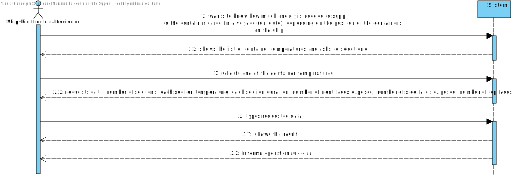
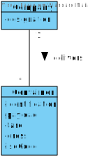
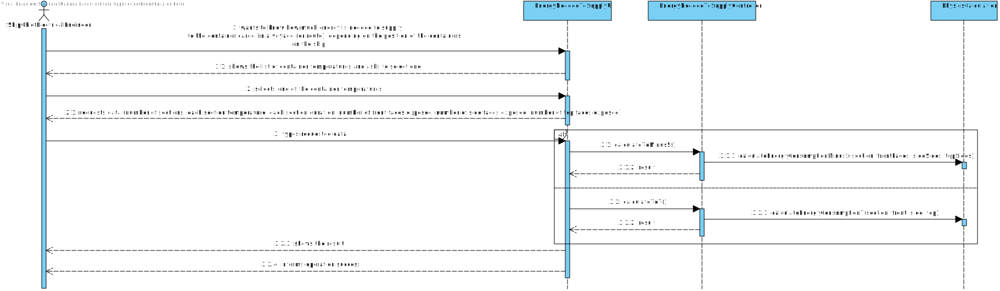
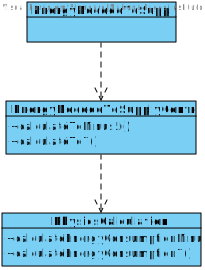

# US 406 -  Know the total energy to be supplied to the set of containers in a certain established trip, assuming that all the containers have the same behaviour

## 1. Requirements Engineering

## 1.1. User Story Description

As Ship Chief Electrical Engineer, the objective is to know the total energy to be
supplied to the set of containers in a certain established trip, assuming that all the
containers have the same behaviour

## 1.2. Acceptance Criteria

* **AC1:** Know the journey time.
* **AC2:** Know the temperatures of the travel sections.
* **AC3:**  Know how many sides of each container are subject to temperature variation.
* **AC4:**  Determine the energy required for one trip of the containers at a temperature of 7 ºC, depending on their position in the load.
* **AC6:** Determine the energy required for one trip of the containers at a temperature of -5 ºC, depending on their position in the cargo.

## 1.3. System Sequence Diagram (SSD)

## 2. OO Analysis

### Relevant Domain Model Excerpt

## 3. Design - User Story Realization

### 3.1. Sequence Diagram (SD)

### 3.2. Class Diagram (CD)

## 4.Test
###Test 1:

    class TotalEnergySuppliedControllerTest {

    TotalEnergySuppliedController controller = new TotalEnergySuppliedController();
    int numberOfContainers = 10;
    double temperature = 20;
    int time = 9000;

    @Test
    void calculationToMinus5() {
        //Arrange
        String expected = "134338.27436138067";
        //Act
        String actual = String.valueOf(controller.calculationToMinus5(numberOfContainers, temperature, time));
        //Assert
        assertEquals(expected, actual);
    }

    @Test
    void calculationTo7() {
        //Arrange
        String expected = "851266.5028210469";
        //Act
        String actual = String.valueOf(controller.calculationTo7(numberOfContainers, temperature, time));
        //Assert
        assertEquals(expected, actual);
    }
    }

##Test 2:

    class PhysicsCalculationTest {
        LinkedHashMap<Integer, Double> map;

    @BeforeEach
    public void setUp() {
        map = new LinkedHashMap<>();

        System.setProperty("thermalConductivity.inner.minus5", "0.033");
        System.setProperty("thermalConductivity.mid.minus5", "25");
        System.setProperty("thermalConductivity.outer.minus5", "0.13");
        System.setProperty("thermalConductivity.outer.7", "15");
        System.setProperty("thermalConductivity.mid.7", "0.028");
        System.setProperty("thermalConductivity.inner.7", "0.13");

    }

    @Test
    void Minus5ZeroTest() {

        try {
            assertEquals(0, PhysicsCalculation.calculateEnergyConsumptionMinus5(map, 0, 0, 0));
        } catch (Exception e) {
            fail();
        }
    }

    @Test
    void SevenZeroTest() {
        try {
            assertEquals(0, PhysicsCalculation.calculateEnergyConsumption7(map, 0, 0, 0));
        } catch (Exception e) {
            fail();
        }
    }

    @Test
    void SevenTest2Section() {

        map.put(7200, 20.0);
        map.put(3600, 30.0);
        try {
            assertEquals(2.3352179108136587E7, PhysicsCalculation.calculateEnergyConsumption7(map, 5, 4, 5));
        } catch (Exception e) {
            fail();
        }
    }

    @Test
    void SevenMinus5Section() {

        map.put(7200, 20.0);
        map.put(3600, 30.0);
        try {
            assertEquals(859132.8908588162, PhysicsCalculation.calculateEnergyConsumptionMinus5(map, 5, 4, 5));
        } catch (Exception e) {
            fail();
        }
    }

    @Test
    void calculateEnergyConsumptionDeterminedTripMinusFive() {

        try {
            double value = PhysicsCalculation.calculateEnergyConsumptionDeterminedTripMinus5C();
            assertEquals(13433.827436138068, value);
        } catch (Exception e) {
            fail();
        }
    }

    @Test
    void calculateEnergyConsumptionDeterminedTripSeven() {

        try {
            double value = PhysicsCalculation.calculateEnergyConsumptionDeterminedTrip7C();
            assertEquals(85126.65028210469, value);
        } catch (Exception e) {
            fail();
        }
    }

    @Test
    void calculateSuppliesNeededFor7(){
        try {
            double value = PhysicsCalculation.calculateSuppliesNeededFor7(2,20,9000);
            assertEquals(2.0, value);
        } catch (Exception e) {
            fail();
        }

    }

    @Test
    void calculateSuppliesNeededForMinus5(){
        try {
            double value = PhysicsCalculation.calculateSuppliesNeededForMinus5(2,20,9000);
            assertEquals(1.0, value);
        } catch (Exception e) {
            fail();
        }

    }

    @Test
    void calculateSuppliesNeededForMinus5Ex(){
        try {
            double value = PhysicsCalculation.calculateSuppliesNeededForMinus5(2,0,0);
            assertEquals(1.0, value);
        } catch (Exception e) {
            fail();
        }

    }

    @Test
    void calculateSuppliesNeededFor7Ex(){
        try {
            double value = PhysicsCalculation.calculateSuppliesNeededFor7(2,0,0);
            assertEquals(1.0, value);
        } catch (Exception e) {
            fail();
        }

    }

    @Test
    void calculateCenterMassOneDimZero() {
        ArrayList<Double> list = new ArrayList<>();

        assertEquals(0, PhysicsCalculation.calculateCenterMassOneDim(list));
    }

    @Test
    void calculateCenterMassOneDimSomeValues() {
        ArrayList<Double> list = new ArrayList<>();
        list.add(11.0);
        list.add(11.0);
        list.add(11.0);
        list.add(11.0);
        list.add(11.0);
        list.add(11.0);
        list.add(11.0);
        list.add(11.0);
        list.add(11.0);
        list.add(11.0);
        list.add(11.0);
        list.add(13.0);
        list.add(13.0);
        list.add(13.0);
        list.add(13.0);
        list.add(13.0);
        list.add(13.0);
        list.add(13.0);
        list.add(13.0);
        list.add(13.0);

        assertEquals(11.9, PhysicsCalculation.calculateCenterMassOneDim(list));
    }

    @Test
    void calculateCenterMassOneDimHugeValues() {
        ArrayList<Double> list = new ArrayList<>();
        list.add(67.0);
        list.add(69.0);
        list.add(69.0);
        list.add(71.0);
        list.add(71.0);
        list.add(73.0);
        list.add(73.0);
        list.add(75.0);
        list.add(75.0);
        list.add(77.0);
        list.add(77.0);
        list.add(79.0);
        list.add(79.0);
        list.add(81.0);
        list.add(81.0);
        list.add(83.0);
        list.add(83.0);
        list.add(85.0);
        list.add(85.0);
        list.add(87.0);

        assertEquals(77, PhysicsCalculation.calculateCenterMassOneDim(list));
    }

    }

##5 Classes:

###PhysicsCalculation

    public class PhysicsCalculation {

    /**
     * Calculates the energy needed to supply to a container of -5ºC with an exterior temperature of 20ºC and a travel time of 2h30.
     *
     * @return the energy needed to supply to a container of -5ºC with an exterior temperature of 20ºC and a travel time of 2h30
     */
    public static double calculateEnergyConsumptionDeterminedTripMinus5C() {
        double stainlessSteelResistance = 0.95 / (15 * Constants.AREA);
        double polyurethaneFoamResistance = 30 / (0.029 * Constants.AREA);
        double marinePlywoodResistance = 11.75 / (0.13 * Constants.AREA);

        double totalResistance = stainlessSteelResistance + polyurethaneFoamResistance + marinePlywoodResistance;

        // Q = temperature difference / total resistance
        double q = (20 + 5.0) / totalResistance;

        //Return = Q x time
        return (q * Constants.VOYAGE_TIME);
    }

    /**
     * Calculates the energy needed to supply to a container of 7ºC with an exterior temperature of 20ºC and a travel time of 2h30.
     *
     * @return the energy needed to supply to a container of 7ºC with an exterior temperature of 20ºC and a travel time of 2h30
     */
    public static double calculateEnergyConsumptionDeterminedTrip7C() {
        double cortenSteelResistance = 2 / (25 * Constants.AREA);
        double extrudedPolystyreneResistance = 6.10 / (3.30 * Constants.AREA);
        double marinePlywoodResistance = 11.75 / (0.13 * Constants.AREA);

        double totalResistance = cortenSteelResistance + extrudedPolystyreneResistance + marinePlywoodResistance;

        // Q = temperature difference / total resistance
        double q = (20 - 7.0) / totalResistance;

        //Return = Q x time
        return (q * Constants.VOYAGE_TIME);
    }

    /**
     * Calculates the total energy to be supplied to a set of containers of -5ºC.
     *
     * @param numberOfContainers the number of containers
     * @param temperature        the container temperature
     * @param voyageTime         the trip time
     * @return the total energy to be supplied to a set of containers of -5ºC
     */
    public static double calculateTotalEnergySuppliedMinus5(int numberOfContainers, double temperature, int voyageTime) {
        double stainlessSteelResistance = 0.95 / (15 * Constants.AREA);
        double polyurethaneFoamResistance = 30 / (0.029 * Constants.AREA);
        double marinePlywoodResistance = 11.75 / (0.13 * Constants.AREA);

        double totalResistance = stainlessSteelResistance + polyurethaneFoamResistance + marinePlywoodResistance;

        // Q = temperature difference / total resistance
        double q = (temperature + 5.0) / totalResistance;

        //Energy = Q x time
        double energy = q * voyageTime;

        return (energy * numberOfContainers);
    }

    /**
     * Calculates the total energy to be supplied to a set of containers of 7ºC.
     *
     * @param numberOfContainers the number of containers
     * @param temperature        the container temperature
     * @param voyageTime         the trip time
     * @return the total energy to be supplied to a set of containers of 7ºC
     */
    public static double calculateTotalEnergySupplied7(int numberOfContainers, double temperature, int voyageTime) {
        double cortenSteelResistance = 2 / (25 * Constants.AREA);
        double extrudedPolystyreneResistance = 6.10 / (3.30 * Constants.AREA);
        double marinePlywoodResistance = 11.75 / (0.13 * Constants.AREA);

        double totalResistance = cortenSteelResistance + extrudedPolystyreneResistance + marinePlywoodResistance;

        // Q = temperature difference / total resistance
        double q = (temperature - 7.0) / totalResistance;

        //Energy = Q x time
        double energy = q * voyageTime;

        return (energy * numberOfContainers);
    }

    /**
     * Calculates the energy needed to supply to the container cargo (with a temperature of -5ºC) in a voyage, depending on the position of the containers on the ship.
     *
     * @param section    the trip section
     * @param frontFaces the number of front faces
     * @param sideFaces  the number of side faces
     * @param topFaces   the number of top faces
     * @return the energy needed to supply to the container cargo (with a temperature of -5ºC) in a voyage, depending on the position of the containers on the ship
     */
    public static double calculateEnergyConsumptionMinus5(Map<Integer, Double> section, int frontFaces, int sideFaces, int topFaces) {

        double areaFront = frontFaces * Constants.CONTAINER_HEIGHT * Constants.CONTAINER_WIDTH;
        double areaSide = sideFaces * Constants.CONTAINER_HEIGHT * Constants.CONTAINER_LENGTH;
        double areaTop = topFaces * Constants.CONTAINER_WIDTH * Constants.CONTAINER_LENGTH;
        double areaTotal = areaFront + areaSide + areaTop;
        double thermalResistance = (1 / areaTotal) * (Constants.CONTAINER_EXTERIOR_MINUS5 / Double.parseDouble(System.getProperty("thermalConductivity.outer.minus5"))) + (Constants.CONTAINER_MID_MINUS5 / Double.parseDouble(System.getProperty("thermalConductivity.mid.minus5"))) + (Constants.CONTAINER_INTERIOR / Double.parseDouble(System.getProperty("thermalConductivity.inner.minus5")));

        double total = 0;
        for (Map.Entry<Integer, Double> entry : section.entrySet()) {

            total += (Math.abs(entry.getValue() - (-5)) / thermalResistance) * entry.getKey();

        }

        return total;
    }

    /**
     * Calculates the energy needed to supply to the container cargo (with a temperature of 7ºC) in a voyage, depending on the position of the containers on the ship.
     *
     * @param section    the trip section
     * @param frontFaces the number of front faces
     * @param sideFaces  the number of side faces
     * @param topFaces   the number of top faces
     * @return the energy needed to supply to the container cargo (with a temperature of 7ºC) in a voyage, depending on the position of the containers on the ship
     */
    public static double calculateEnergyConsumption7(Map<Integer, Double> section, int frontFaces, int sideFaces, int topFaces) {
        double areaFront = frontFaces * Constants.CONTAINER_HEIGHT * Constants.CONTAINER_WIDTH;
        double areaSide = sideFaces * Constants.CONTAINER_HEIGHT * Constants.CONTAINER_LENGTH;
        double areaTop = topFaces * Constants.CONTAINER_WIDTH * Constants.CONTAINER_LENGTH;
        double areaTotal = areaFront + areaSide + areaTop;

        double thermalResistance = (1 / areaTotal) * (Constants.CONTAINER_EXTERIOR_7 / Double.parseDouble(System.getProperty("thermalConductivity.outer.7")) + (Constants.CONTAINER_MID_7 / Double.parseDouble(System.getProperty("thermalConductivity.mid.7"))) + (Constants.CONTAINER_INTERIOR / Double.parseDouble(System.getProperty("thermalConductivity.inner.7"))));

        double total = 0;
        for (Map.Entry<Integer, Double> entry : section.entrySet()) {
            total += (Math.abs(entry.getValue() - 7) / thermalResistance) * entry.getKey();
        }

        return total;
    }

    /**
     * Calculates the energy needed to supply to the container cargo (with a temperature of 7ºC) in a voyage, depending on the position of the containers on the ship.
     *
     * @param numberOfContainers the number of containers
     * @param temperature        the container temperature
     * @param voyageTime         the voyage time
     * @return the energy needed to supply to the container cargo (with a temperature of 7ºC) in a voyage, depending on the position of the containers on the ship
     */
    public static int calculateSuppliesNeededFor7(int numberOfContainers, double temperature, int voyageTime) {
        double energykw = (calculateTotalEnergySupplied7(numberOfContainers, temperature, voyageTime));
        int supliesNeeded = (int) Math.abs(Math.round(energykw / (75 * 1000)));

        if (supliesNeeded == 0) supliesNeeded = 1;

        return supliesNeeded;
    }

    /**
     * Calculates the energy needed to supply to the container cargo (with a temperature of -5ºC) in a voyage, depending on the position of the containers on the ship.
     *
     * @param numberOfContainers the number of containers
     * @param temperature        the container temperature
     * @param voyageTime         the voyage time
     * @return the energy needed to supply to the container cargo (with a temperature of -5ºC) in a voyage, depending on the position of the containers on the ship
     */
    public static int calculateSuppliesNeededForMinus5(int numberOfContainers, double temperature, int voyageTime) {
        double energykw = (calculateTotalEnergySuppliedMinus5(numberOfContainers, temperature, voyageTime));
        int supliesNeeded = (int) Math.abs(Math.round(energykw / (75 * 1000 * voyageTime)));

        if (supliesNeeded == 0) supliesNeeded = 1;

        return supliesNeeded;
    }

    public static double calculateCenterMassOneDim(List<Double> positionList) {
        if (positionList.size() == 0) {
            return 0;
        }
        double sum = 0;
        for (Double d : positionList) {
            sum += d;
        }
        return sum / positionList.size();
    }

        }
##TotalEnergySuppliedUI

    public class AvgOccupancyRateWithThresholdPerVoyageController {

    private final DatabaseConnection connection;

    /**
     * Constructor.
     */
    public AvgOccupancyRateWithThresholdPerVoyageController() {
        this.connection = App.getInstance().getDatabaseConnection();
    }

    /**
     * Gets the ship voyages that had an average occupancy rate below a certain threshold.
     *
     * @param mmsi      the ship MMSI
     * @param begin     the begin date
     * @param end       the end date
     * @param threshold the threshold
     * @return the ship voyages that had an average occupancy rate below a certain threshold
     * @throws InvalidShipException
     */

    public String getAvgOccupancyRateThreshold(int mmsi, String begin, String end, int threshold) throws InvalidShipException {
        String result = CallAvgOccupancyRateThreshold.occupationRateFunction(connection, mmsi, begin, end, threshold);

        if (result.equals("Given the default Threshold, there are no trips that have an occupancy rate below the given default threshold!!")) {
            throw new IllegalArgumentException("\nGiven the default Threshold, there are no trips that have an occupancy rate below the given default threshold!!");
        }

        return result;
    }

    /**
     * Gets all the ships with trips.
     *
     * @return all the ships with trips
     * @throws SQLException
     */
    public List<String> getAllShipsWithTrip() throws SQLException {
        return DataBaseUtils.getAllShipsWithTrips(connection);
    }

    /**
     * Verifies if the ship exists.
     *
     * @param mmsi the ship MMSI
     * @return true if it exists, false if it doesn't
     * @throws SQLException
     */
    public boolean verifyShip(String mmsi) throws SQLException {
        return DataBaseUtils.verifyShip(mmsi, connection);
    }

    }

##PhysicsCalcultion

    public class PhysicsCalculation {

    /**
     * Calculates the energy needed to supply to a container of -5ºC with an exterior temperature of 20ºC and a travel time of 2h30.
     *
     * @return the energy needed to supply to a container of -5ºC with an exterior temperature of 20ºC and a travel time of 2h30
     */
    public static double calculateEnergyConsumptionDeterminedTripMinus5C() {
        double stainlessSteelResistance = 0.95 / (15 * Constants.AREA);
        double polyurethaneFoamResistance = 30 / (0.029 * Constants.AREA);
        double marinePlywoodResistance = 11.75 / (0.13 * Constants.AREA);

        double totalResistance = stainlessSteelResistance + polyurethaneFoamResistance + marinePlywoodResistance;

        // Q = temperature difference / total resistance
        double q = (20 + 5.0) / totalResistance;

        //Return = Q x time
        return (q * Constants.VOYAGE_TIME);
    }

    /**
     * Calculates the energy needed to supply to a container of 7ºC with an exterior temperature of 20ºC and a travel time of 2h30.
     *
     * @return the energy needed to supply to a container of 7ºC with an exterior temperature of 20ºC and a travel time of 2h30
     */
    public static double calculateEnergyConsumptionDeterminedTrip7C() {
        double cortenSteelResistance = 2 / (25 * Constants.AREA);
        double extrudedPolystyreneResistance = 6.10 / (3.30 * Constants.AREA);
        double marinePlywoodResistance = 11.75 / (0.13 * Constants.AREA);

        double totalResistance = cortenSteelResistance + extrudedPolystyreneResistance + marinePlywoodResistance;

        // Q = temperature difference / total resistance
        double q = (20 - 7.0) / totalResistance;

        //Return = Q x time
        return (q * Constants.VOYAGE_TIME);
    }

    /**
     * Calculates the total energy to be supplied to a set of containers of -5ºC.
     *
     * @param numberOfContainers the number of containers
     * @param temperature        the container temperature
     * @param voyageTime         the trip time
     * @return the total energy to be supplied to a set of containers of -5ºC
     */
    public static double calculateTotalEnergySuppliedMinus5(int numberOfContainers, double temperature, int voyageTime) {
        double stainlessSteelResistance = 0.95 / (15 * Constants.AREA);
        double polyurethaneFoamResistance = 30 / (0.029 * Constants.AREA);
        double marinePlywoodResistance = 11.75 / (0.13 * Constants.AREA);

        double totalResistance = stainlessSteelResistance + polyurethaneFoamResistance + marinePlywoodResistance;

        // Q = temperature difference / total resistance
        double q = (temperature + 5.0) / totalResistance;

        //Energy = Q x time
        double energy = q * voyageTime;

        return (energy * numberOfContainers);
    }

    /**
     * Calculates the total energy to be supplied to a set of containers of 7ºC.
     *
     * @param numberOfContainers the number of containers
     * @param temperature        the container temperature
     * @param voyageTime         the trip time
     * @return the total energy to be supplied to a set of containers of 7ºC
     */
    public static double calculateTotalEnergySupplied7(int numberOfContainers, double temperature, int voyageTime) {
        double cortenSteelResistance = 2 / (25 * Constants.AREA);
        double extrudedPolystyreneResistance = 6.10 / (3.30 * Constants.AREA);
        double marinePlywoodResistance = 11.75 / (0.13 * Constants.AREA);

        double totalResistance = cortenSteelResistance + extrudedPolystyreneResistance + marinePlywoodResistance;

        // Q = temperature difference / total resistance
        double q = (temperature - 7.0) / totalResistance;

        //Energy = Q x time
        double energy = q * voyageTime;

        return (energy * numberOfContainers);
    }

    /**
     * Calculates the energy needed to supply to the container cargo (with a temperature of -5ºC) in a voyage, depending on the position of the containers on the ship.
     *
     * @param section    the trip section
     * @param frontFaces the number of front faces
     * @param sideFaces  the number of side faces
     * @param topFaces   the number of top faces
     * @return the energy needed to supply to the container cargo (with a temperature of -5ºC) in a voyage, depending on the position of the containers on the ship
     */
    public static double calculateEnergyConsumptionMinus5(Map<Integer, Double> section, int frontFaces, int sideFaces, int topFaces) {

        double areaFront = frontFaces * Constants.CONTAINER_HEIGHT * Constants.CONTAINER_WIDTH;
        double areaSide = sideFaces * Constants.CONTAINER_HEIGHT * Constants.CONTAINER_LENGTH;
        double areaTop = topFaces * Constants.CONTAINER_WIDTH * Constants.CONTAINER_LENGTH;
        double areaTotal = areaFront + areaSide + areaTop;
        double thermalResistance = (1 / areaTotal) * (Constants.CONTAINER_EXTERIOR_MINUS5 / Double.parseDouble(System.getProperty("thermalConductivity.outer.minus5"))) + (Constants.CONTAINER_MID_MINUS5 / Double.parseDouble(System.getProperty("thermalConductivity.mid.minus5"))) + (Constants.CONTAINER_INTERIOR / Double.parseDouble(System.getProperty("thermalConductivity.inner.minus5")));

        double total = 0;
        for (Map.Entry<Integer, Double> entry : section.entrySet()) {

            total += (Math.abs(entry.getValue() - (-5)) / thermalResistance) * entry.getKey();

        }

        return total;
    }

    /**
     * Calculates the energy needed to supply to the container cargo (with a temperature of 7ºC) in a voyage, depending on the position of the containers on the ship.
     *
     * @param section    the trip section
     * @param frontFaces the number of front faces
     * @param sideFaces  the number of side faces
     * @param topFaces   the number of top faces
     * @return the energy needed to supply to the container cargo (with a temperature of 7ºC) in a voyage, depending on the position of the containers on the ship
     */
    public static double calculateEnergyConsumption7(Map<Integer, Double> section, int frontFaces, int sideFaces, int topFaces) {
        double areaFront = frontFaces * Constants.CONTAINER_HEIGHT * Constants.CONTAINER_WIDTH;
        double areaSide = sideFaces * Constants.CONTAINER_HEIGHT * Constants.CONTAINER_LENGTH;
        double areaTop = topFaces * Constants.CONTAINER_WIDTH * Constants.CONTAINER_LENGTH;
        double areaTotal = areaFront + areaSide + areaTop;

        double thermalResistance = (1 / areaTotal) * (Constants.CONTAINER_EXTERIOR_7 / Double.parseDouble(System.getProperty("thermalConductivity.outer.7")) + (Constants.CONTAINER_MID_7 / Double.parseDouble(System.getProperty("thermalConductivity.mid.7"))) + (Constants.CONTAINER_INTERIOR / Double.parseDouble(System.getProperty("thermalConductivity.inner.7"))));

        double total = 0;
        for (Map.Entry<Integer, Double> entry : section.entrySet()) {
            total += (Math.abs(entry.getValue() - 7) / thermalResistance) * entry.getKey();
        }

        return total;
    }

    /**
     * Calculates the energy needed to supply to the container cargo (with a temperature of 7ºC) in a voyage, depending on the position of the containers on the ship.
     *
     * @param numberOfContainers the number of containers
     * @param temperature        the container temperature
     * @param voyageTime         the voyage time
     * @return the energy needed to supply to the container cargo (with a temperature of 7ºC) in a voyage, depending on the position of the containers on the ship
     */
    public static int calculateSuppliesNeededFor7(int numberOfContainers, double temperature, int voyageTime) {
        double energykw = (calculateTotalEnergySupplied7(numberOfContainers, temperature, voyageTime));
        int supliesNeeded = (int) Math.abs(Math.round(energykw / (75 * 1000)));

        if (supliesNeeded == 0) supliesNeeded = 1;

        return supliesNeeded;
    }

    /**
     * Calculates the energy needed to supply to the container cargo (with a temperature of -5ºC) in a voyage, depending on the position of the containers on the ship.
     *
     * @param numberOfContainers the number of containers
     * @param temperature        the container temperature
     * @param voyageTime         the voyage time
     * @return the energy needed to supply to the container cargo (with a temperature of -5ºC) in a voyage, depending on the position of the containers on the ship
     */
    public static int calculateSuppliesNeededForMinus5(int numberOfContainers, double temperature, int voyageTime) {
        double energykw = (calculateTotalEnergySuppliedMinus5(numberOfContainers, temperature, voyageTime));
        int supliesNeeded = (int) Math.abs(Math.round(energykw / (75 * 1000 * voyageTime)));

        if (supliesNeeded == 0) supliesNeeded = 1;

        return supliesNeeded;
    }

    public static double calculateCenterMassOneDim(List<Double> positionList) {
        if (positionList.size() == 0) {
            return 0;
        }
        double sum = 0;
        for (Double d : positionList) {
            sum += d;
        }
        return sum / positionList.size();
    }

    }