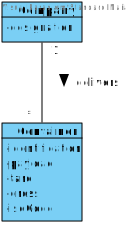
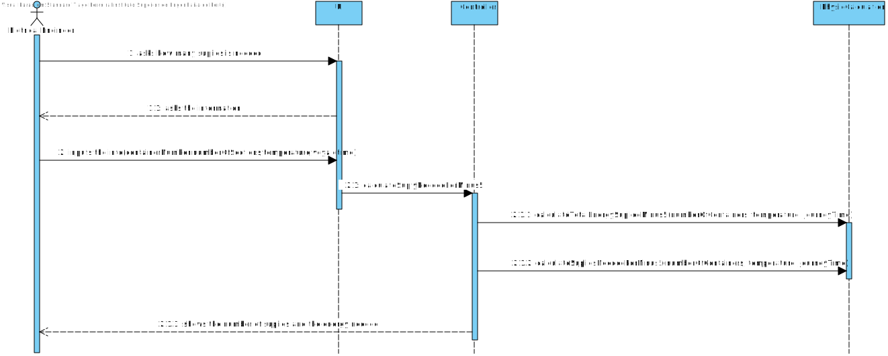

# US 415 -  As the ship's captain I need to know how many auxiliary power equipment are needed for the voyage, knowing that each one supplies a maximum of 75 KW.
## 1. Requirements Engineering

## 1.1. User Story Description

As Ship Chief Electrical Engineer, the objective is to know the total energy to be
supplied to the set of containers in a certain established trip, assuming that all the
containers have the same behaviour

## 1.2. Acceptance Criteria

* **AC1:** Know the amount of energy required per type of container for a trip.
* **AC2:** Determine the total energy required to load containers on a given voyage (or route) as a function of their position in the load.
* **AC3:**  Determine how many generators of the stated power are required for the  trip.
## 1.3. System Sequence Diagram (SSD)

## 2. OO Analysis

### Relevant Domain Model Excerpt

## 3. Design - User Story Realization

### 3.1. Sequence Diagram (SD)

### 3.2. Class Diagram (CD)

##5 Classes:

###PhysicsCalculation

    public class PhysicsCalculation {

    /**
     * Calculates the energy needed to supply to a container of -5ºC with an exterior temperature of 20ºC and a travel time of 2h30.
     *
     * @return the energy needed to supply to a container of -5ºC with an exterior temperature of 20ºC and a travel time of 2h30
     */
    public static double calculateEnergyConsumptionDeterminedTripMinus5C() {
        double stainlessSteelResistance = 0.95 / (15 * Constants.AREA);
        double polyurethaneFoamResistance = 30 / (0.029 * Constants.AREA);
        double marinePlywoodResistance = 11.75 / (0.13 * Constants.AREA);

        double totalResistance = stainlessSteelResistance + polyurethaneFoamResistance + marinePlywoodResistance;

        // Q = temperature difference / total resistance
        double q = (20 + 5.0) / totalResistance;

        //Return = Q x time
        return (q * Constants.VOYAGE_TIME);
    }

    /**
     * Calculates the energy needed to supply to a container of 7ºC with an exterior temperature of 20ºC and a travel time of 2h30.
     *
     * @return the energy needed to supply to a container of 7ºC with an exterior temperature of 20ºC and a travel time of 2h30
     */
    public static double calculateEnergyConsumptionDeterminedTrip7C() {
        double cortenSteelResistance = 2 / (25 * Constants.AREA);
        double extrudedPolystyreneResistance = 6.10 / (3.30 * Constants.AREA);
        double marinePlywoodResistance = 11.75 / (0.13 * Constants.AREA);

        double totalResistance = cortenSteelResistance + extrudedPolystyreneResistance + marinePlywoodResistance;

        // Q = temperature difference / total resistance
        double q = (20 - 7.0) / totalResistance;

        //Return = Q x time
        return (q * Constants.VOYAGE_TIME);
    }

    /**
     * Calculates the total energy to be supplied to a set of containers of -5ºC.
     *
     * @param numberOfContainers the number of containers
     * @param temperature        the container temperature
     * @param voyageTime         the trip time
     * @return the total energy to be supplied to a set of containers of -5ºC
     */
    public static double calculateTotalEnergySuppliedMinus5(int numberOfContainers, double temperature, int voyageTime) {
        double stainlessSteelResistance = 0.95 / (15 * Constants.AREA);
        double polyurethaneFoamResistance = 30 / (0.029 * Constants.AREA);
        double marinePlywoodResistance = 11.75 / (0.13 * Constants.AREA);

        double totalResistance = stainlessSteelResistance + polyurethaneFoamResistance + marinePlywoodResistance;

        // Q = temperature difference / total resistance
        double q = (temperature + 5.0) / totalResistance;

        //Energy = Q x time
        double energy = q * voyageTime;

        return (energy * numberOfContainers);
    }

    /**
     * Calculates the total energy to be supplied to a set of containers of 7ºC.
     *
     * @param numberOfContainers the number of containers
     * @param temperature        the container temperature
     * @param voyageTime         the trip time
     * @return the total energy to be supplied to a set of containers of 7ºC
     */
    public static double calculateTotalEnergySupplied7(int numberOfContainers, double temperature, int voyageTime) {
        double cortenSteelResistance = 2 / (25 * Constants.AREA);
        double extrudedPolystyreneResistance = 6.10 / (3.30 * Constants.AREA);
        double marinePlywoodResistance = 11.75 / (0.13 * Constants.AREA);

        double totalResistance = cortenSteelResistance + extrudedPolystyreneResistance + marinePlywoodResistance;

        // Q = temperature difference / total resistance
        double q = (temperature - 7.0) / totalResistance;

        //Energy = Q x time
        double energy = q * voyageTime;

        return (energy * numberOfContainers);
    }

    /**
     * Calculates the energy needed to supply to the container cargo (with a temperature of -5ºC) in a voyage, depending on the position of the containers on the ship.
     *
     * @param section    the trip section
     * @param frontFaces the number of front faces
     * @param sideFaces  the number of side faces
     * @param topFaces   the number of top faces
     * @return the energy needed to supply to the container cargo (with a temperature of -5ºC) in a voyage, depending on the position of the containers on the ship
     */
    public static double calculateEnergyConsumptionMinus5(Map<Integer, Double> section, int frontFaces, int sideFaces, int topFaces) {

        double areaFront = frontFaces * Constants.CONTAINER_HEIGHT * Constants.CONTAINER_WIDTH;
        double areaSide = sideFaces * Constants.CONTAINER_HEIGHT * Constants.CONTAINER_LENGTH;
        double areaTop = topFaces * Constants.CONTAINER_WIDTH * Constants.CONTAINER_LENGTH;
        double areaTotal = areaFront + areaSide + areaTop;
        double thermalResistance = (1 / areaTotal) * (Constants.CONTAINER_EXTERIOR_MINUS5 / Double.parseDouble(System.getProperty("thermalConductivity.outer.minus5"))) + (Constants.CONTAINER_MID_MINUS5 / Double.parseDouble(System.getProperty("thermalConductivity.mid.minus5"))) + (Constants.CONTAINER_INTERIOR / Double.parseDouble(System.getProperty("thermalConductivity.inner.minus5")));

        double total = 0;
        for (Map.Entry<Integer, Double> entry : section.entrySet()) {

            total += (Math.abs(entry.getValue() - (-5)) / thermalResistance) * entry.getKey();

        }

        return total;
    }

    /**
     * Calculates the energy needed to supply to the container cargo (with a temperature of 7ºC) in a voyage, depending on the position of the containers on the ship.
     *
     * @param section    the trip section
     * @param frontFaces the number of front faces
     * @param sideFaces  the number of side faces
     * @param topFaces   the number of top faces
     * @return the energy needed to supply to the container cargo (with a temperature of 7ºC) in a voyage, depending on the position of the containers on the ship
     */
    public static double calculateEnergyConsumption7(Map<Integer, Double> section, int frontFaces, int sideFaces, int topFaces) {
        double areaFront = frontFaces * Constants.CONTAINER_HEIGHT * Constants.CONTAINER_WIDTH;
        double areaSide = sideFaces * Constants.CONTAINER_HEIGHT * Constants.CONTAINER_LENGTH;
        double areaTop = topFaces * Constants.CONTAINER_WIDTH * Constants.CONTAINER_LENGTH;
        double areaTotal = areaFront + areaSide + areaTop;

        double thermalResistance = (1 / areaTotal) * (Constants.CONTAINER_EXTERIOR_7 / Double.parseDouble(System.getProperty("thermalConductivity.outer.7")) + (Constants.CONTAINER_MID_7 / Double.parseDouble(System.getProperty("thermalConductivity.mid.7"))) + (Constants.CONTAINER_INTERIOR / Double.parseDouble(System.getProperty("thermalConductivity.inner.7"))));

        double total = 0;
        for (Map.Entry<Integer, Double> entry : section.entrySet()) {
            total += (Math.abs(entry.getValue() - 7) / thermalResistance) * entry.getKey();
        }

        return total;
    }

    /**
     * Calculates the energy needed to supply to the container cargo (with a temperature of 7ºC) in a voyage, depending on the position of the containers on the ship.
     *
     * @param numberOfContainers the number of containers
     * @param temperature        the container temperature
     * @param voyageTime         the voyage time
     * @return the energy needed to supply to the container cargo (with a temperature of 7ºC) in a voyage, depending on the position of the containers on the ship
     */
    public static int calculateSuppliesNeededFor7(int numberOfContainers, double temperature, int voyageTime) {
        double energykw = (calculateTotalEnergySupplied7(numberOfContainers, temperature, voyageTime));
        int supliesNeeded = (int) Math.abs(Math.round(energykw / (75 * 1000)));

        if (supliesNeeded == 0) supliesNeeded = 1;

        return supliesNeeded;
    }

    /**
     * Calculates the energy needed to supply to the container cargo (with a temperature of -5ºC) in a voyage, depending on the position of the containers on the ship.
     *
     * @param numberOfContainers the number of containers
     * @param temperature        the container temperature
     * @param voyageTime         the voyage time
     * @return the energy needed to supply to the container cargo (with a temperature of -5ºC) in a voyage, depending on the position of the containers on the ship
     */
    public static int calculateSuppliesNeededForMinus5(int numberOfContainers, double temperature, int voyageTime) {
        double energykw = (calculateTotalEnergySuppliedMinus5(numberOfContainers, temperature, voyageTime));
        int supliesNeeded = (int) Math.abs(Math.round(energykw / (75 * 1000 * voyageTime)));

        if (supliesNeeded == 0) supliesNeeded = 1;

        return supliesNeeded;
    }

    public static double calculateCenterMassOneDim(List<Double> positionList) {
        if (positionList.size() == 0) {
            return 0;
        }
        double sum = 0;
        for (Double d : positionList) {
            sum += d;
        }
        return sum / positionList.size();
    }

        }
##AuxiliaryPowerNeededForVoyageController
    public class AuxiliaryPowerNeededForVoyageController {

    /**
     * Constructor.
     */
    public AuxiliaryPowerNeededForVoyageController() {
        // Empty constructor
    }

    /**
     * Gets the result values of the auxiliary power equipment needed for voyage for containers of -5ºC.
     *
     * @param numberOfContainers the number of containers
     * @param temperature        the container temperature
     * @param journeyTime        the journey time
     * @return a string with all the result values
     */
    public String calculateSupplyNeededForMinus5(int numberOfContainers, double temperature, int journeyTime) {
        StringBuilder stringBuilder = new StringBuilder();

        stringBuilder.append("Energy Needed: " + PhysicsCalculation.calculateTotalEnergySuppliedMinus5(numberOfContainers, temperature, journeyTime));
        stringBuilder.append("\nThe amount of auxiliary power equipment needed for the trip is " + PhysicsCalculation.calculateSuppliesNeededForMinus5(numberOfContainers, temperature, journeyTime) + " generator(s).");

        return "The amount of auxiliary power equipment needed for the trip is " +
                PhysicsCalculation.calculateSuppliesNeededForMinus5(numberOfContainers, temperature, journeyTime) +
                " generator(s).";
    }

    /**
     * Gets the result values of the auxiliary power equipment needed for voyage for containers of 7ºC.
     *
     * @param numberOfContainers the number of containers
     * @param temperature        the container temperature
     * @param journeyTime        the journey time
     * @return a string with all the result values
     */
    public String calculateSupplyNeededFor7(int numberOfContainers, double temperature, int journeyTime) {
        StringBuilder stringBuilder = new StringBuilder();

        stringBuilder.append("Energy Needed: " + PhysicsCalculation.calculateTotalEnergySupplied7(numberOfContainers, temperature, journeyTime));
        stringBuilder.append("\nThe amount of auxiliary power equipment needed for the trip is " +
                PhysicsCalculation.calculateSuppliesNeededFor7(numberOfContainers, temperature, journeyTime) +
                " generator(s).");
        return stringBuilder.toString();
    }
    }
##AuxiliaryPowerNeededForVoyageUI

    public class AuxiliaryPowerNeededForVoyageUI implements Runnable {

    AuxiliaryPowerNeededForVoyageController controller;

    public AuxiliaryPowerNeededForVoyageUI() {
        controller = new AuxiliaryPowerNeededForVoyageController();
    }

    @Override
    public void run() {
        List<String> optionList = new ArrayList<>();

        optionList.add("-5 ºC");
        optionList.add("7 ºC");
        StringBuilder sb = new StringBuilder();

        try {
            int i = 0;

            int numberOfContainers = Utils.readIntegerFromConsole("Please enter the number of containers:");

            String index = (String) Utils.showAndSelectOne(optionList, "Please select the temperature of the containers:");
            if (index == null) {
                return;
            }

            do {
                try {
                    i = Utils.readIntegerFromConsole("Please enter the number of sections with different temperatures during the trip:");
                    if (i == 0) {
                        System.out.println("There must be at least 1 section");
                    }
                } catch (IllegalArgumentException ex2) {
                    System.out.println("Please enter a number! (Don't enter a letter nor a symbol!)");
                    i = 0;
                }
            } while (i == 0);

            for (int j = 0; j < i; j++) {
                double temperature = 0;
                int duration = 0;

                do {
                    try {
                        temperature = Double.parseDouble(Utils.readLineFromConsole("Please, enter the temperature of the section: " + (j + 1)));

                    } catch (NumberFormatException ex2) {
                        System.out.println("Please enter a number! (Don't enter a letter nor a symbol!)");
                        temperature = -99;
                    }
                } while (temperature == -99);

                do {
                    try {
                        duration = duration + Utils.readIntegerFromConsole("Please enter the hour duration of the section: " + (j + 1)) * 3600;
                        duration = duration + Utils.readIntegerFromConsole("Please enter the minute duration of the section: " + (j + 1)) * 60;
                        duration = duration + Utils.readIntegerFromConsole("Please enter the second duration of the section: " + (j + 1));
                        System.out.println();

                    } catch (NumberFormatException ex2) {
                        System.out.println("Please enter a number! (Don't enter a letter nor a symbol!)");
                        duration = -99;
                    }
                } while (duration == -99);

                if (Objects.requireNonNull(index).equals("-5 ºC")) {
                    sb.append("\n");
                    sb.append("Section ").append(j + 1).append("\n");
                    sb.append(controller.calculateSupplyNeededForMinus5(numberOfContainers, temperature, duration));
                } else {
                    sb.append("\n");
                    sb.append("Section ").append(j + 1).append("\n");
                    sb.append(controller.calculateSupplyNeededFor7(numberOfContainers, temperature, duration));
                }
                sb.append("\n");
            }
            System.out.println(sb);
            System.out.println("\nOperation Success!");

        } catch (Exception e) {
            System.out.println(e.getMessage());
            System.out.println("\nOperation failed! Please try again.");
        }
    }
        }
