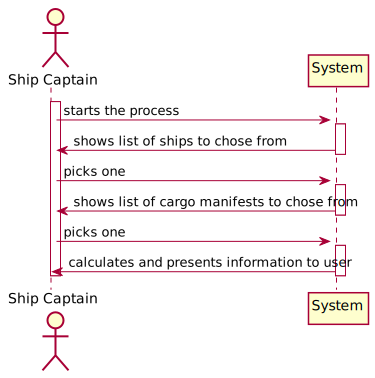
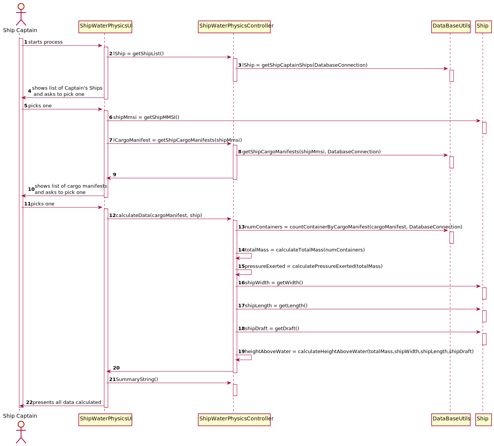
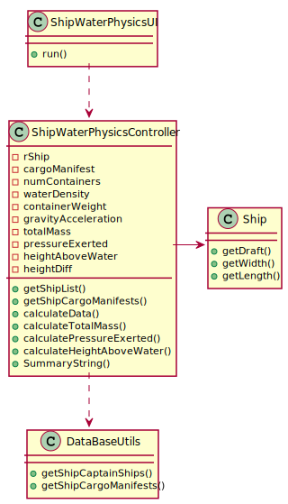

# US 406 -   As the Ship Captain I want to know for a specific vessel, how much did the vessel sink, assuming that each container has half a ton of mass.
## 1. Requirements Engineering

## 1.1. User Story Description

As the Ship Captain I want to know for a specific vessel, how much did the
vessel sink, assuming that each container has half a ton of mass.

## 1.2. Acceptance Criteria

* **AC1:** Determine the total mass placed on the vessel and the pressure exerted by it on the water.
* **AC2:**  Determine the difference in height that the vessel has suffered, above water level
## 1.3. System Sequence Diagram (SSD)

## 2. OO Analysis

### Relevant Domain Model Excerpt

## 3. Design - User Story Realization

### 3.1. Sequence Diagram (SD)

### 3.2. Class Diagram (CD)

###4 Tests

##Test 1:
    class ShipWaterPhysicsControllerTest {

    ShipWaterPhysicsController ctrl = new ShipWaterPhysicsController();

    @Test
    void calculateTotalMassTest() throws InvalidDataException {
        //Arrange Data
        double expected1 = 25000;
        double expected2 = 0;

        //Actual
        double actual1 = ctrl.calculateTotalMass(50);
        double actual2 = ctrl.calculateTotalMass(0);

        //Result
        assertEquals(expected1, actual1);
        assertEquals(expected2, actual2);

        try {
            ctrl.calculateData("200", new Ship());
            String value = ctrl.SummaryString();

            if (value.isEmpty()) fail();
        } catch (Exception e) {

        }

    }

    @Test
    void calculatePressureExertedTest() {
        //Arrange Data
        double expected1 = 245250;
        double expected2 = 0;

        //Actual
        double actual1 = ctrl.calculatePressureExerted(25000);
        double actual2 = ctrl.calculatePressureExerted(0);

        //Result
        assertEquals(actual1, expected1);
        assertEquals(actual2, expected2);

        try {
            String value = ctrl.SummaryString();

            if (value.isEmpty()) fail();
        } catch (Exception e) {

        }
    }

    @Test
    void calculateHeightAboveWater() throws InvalidDataException {
        //Arrange Data
        double expected1 = 2.93;

        //Actual
        double actual1 = ctrl.calculateHeightAboveWater(2500, 10, 40, 9);

        //Result
        assertEquals(actual1, expected1, 2);

        try {
            List<String> value = ctrl.getShipCargoManifests(999333222);

            if (value.isEmpty()) fail();
        } catch (Exception e) {

        }

    }

    @Test
    void getShipList() throws InvalidDataException {
        //Arrange Data
        double expected1 = 2.93;

        //Actual
        double actual1 = ctrl.calculateHeightAboveWater(2500, 10, 40, 9);

        //Result
        assertEquals(actual1, expected1, 2);

        try {
            List<Ship> value = ctrl.getShiplist();

            if (value.isEmpty()) fail();
        } catch (Exception e) {

        }

    }

    }

##5 Classes:

##ShipWaterPhysicController

    public class ShipWaterPhysicsController {

    private Ship rShip;
    private String cargoManifest;
    private int numContainers;

    /**
     * Salt water's average density (kg/m^3)
     */
    private static final double waterDensity = 1.030;

    /**
     * Container's weight (Kg)
     */
    private static final double containerWeight = 500;

    /**
     * Gravity accelaration (m/s^2)
     */
    private static final double gravityAcceleration = 9.81;

    /**
     * All the container's combined weight
     */
    private double totalMass = 0;

    /**
     * Pressure the container's exert on the water
     */
    private double pressureExerted = 0;

    /**
     * Ship's height above water
     */
    private double heightAboveWater = 0;

    /**
     * Ship's submerged height, calculated from the container's added weight on the vessel
     */
    private double heightDiff = 0;

    /**
     * Finds the list of ship instances associated with the Ship Captain in the Database
     */
    public List<Ship> getShiplist() throws SQLException {
        List<Ship> lShip = DataBaseUtils.getShipCaptainShips(App.getInstance().getDatabaseConnection());
        return lShip;
    }

    public List<String> getShipCargoManifests(int shipmmsi) throws SQLException {
        return DataBaseUtils.getShipCargoManifests(shipmmsi, App.getInstance().getDatabaseConnection());
    }

    /**
     * Calculates all the data for the parameters: totalMass, pressureExerted and heightDiff
     */
    public void calculateData(String cargoManifest, Ship ship) throws SQLException, InvalidDataException {
        this.rShip = ship;
        this.cargoManifest = cargoManifest;
        this.numContainers = DataBaseUtils.countContainerByCargoManifest(cargoManifest, App.getInstance().getDatabaseConnection());
        this.totalMass = calculateTotalMass(this.numContainers);
        this.pressureExerted = calculatePressureExerted(this.totalMass);
        this.heightAboveWater = calculateHeightAboveWater(this.totalMass, this.rShip.getWidth(), this.rShip.getLength(), this.rShip.getDraft());
    }

    /**
     * Calculates the total mass of all the containers in the cargo manifest
     *
     * @return the total mass of the containers present in the ship
     * @throws
     */
    public double calculateTotalMass(int numContainers) throws InvalidDataException {
        double totalMass = numContainers * this.containerWeight;

        if (totalMass < 0) {
            throw new InvalidDataException("Número de containers inválido!");
        }

        return totalMass;
    }

    /**
     * Calculates the pressure exerted on the water from the containers present in the ship
     *
     * @return the mass of the container's pressure exerted on the water
     * @throws
     */
    public double calculatePressureExerted(double totalMass) {
        double pressureExerted = totalMass * this.gravityAcceleration;
        return pressureExerted;
    }

    /**
     * Calculates the ship's water height lost with all the extra weight of the containers and substracts that to the current set ship's draft
     *
     * @return the ship's current height above water
     */
    public double calculateHeightAboveWater(double totalMass, double shipWidth, double shipLength, double shipDraft) throws InvalidDataException {
        this.heightDiff = totalMass / (this.waterDensity * shipWidth * shipLength);

        if (this.heightDiff > shipDraft || shipLength <= 0 || shipWidth <= 0 || shipDraft <= 0) {
            throw new InvalidDataException("Dimensões do navio inválidas!");
        }

        return shipDraft - this.heightDiff;
    }

    /**
     * Returns the textual description in the format: ship, cargo manifest ID, total mass, pressure exerted on water, height above water, ship's draft height.
     *
     * @return the ship water physics' characteristics
     */
    public String SummaryString() {
        StringBuilder sb = new StringBuilder();
        sb.append("Ship: " + this.rShip.getCallSign() + " - " + this.rShip.getMmsi() + "\n");
        sb.append("Cargo manifest ID: " + this.cargoManifest);
        sb.append("Total mass = " + new BigDecimal(this.totalMass).setScale(2, RoundingMode.HALF_DOWN) + " Kg\n");
        sb.append("Pressure exerted on water: " + new BigDecimal(this.pressureExerted).setScale(2, RoundingMode.HALF_DOWN) + " N\n");
        sb.append("Height above water: " + new BigDecimal(this.heightAboveWater).setScale(2, RoundingMode.HALF_DOWN) + " m\n");

        if (this.totalMass > 0) {
            sb.append("Original ship's draft height: " + new BigDecimal(this.rShip.getDraft()).setScale(2, RoundingMode.HALF_DOWN) + " m --> Height difference: " + new BigDecimal(this.heightDiff).setScale(2, RoundingMode.HALF_DOWN) + " m\n");
        } else {
            sb.append("The ship has no loaded containers!!\n");
        }

        return sb.toString();
    }

    }

##DataBaseUtils

    public class DataBaseUtils {

    private static final ShipStoreData shipStoreData = App.getInstance().getCompany().getShipStoreData();

    private DataBaseUtils() {
        //EMPTY
    }

    public static Port getPort(String facilityID, DatabaseConnection databaseConnection) throws SQLException {

        Connection connection = databaseConnection.getConnection();

        String sqlCommand = "SELECT * FROM FACILITY\n" +
                "                WHERE FACILITYID = " + facilityID;

        try (PreparedStatement getPreparedStatement = connection.prepareStatement(sqlCommand)) {
            try (ResultSet resultSet = getPreparedStatement.executeQuery()) {

                if (resultSet.next()) {

                    //String continentID = getContinentID(resultSet.getString("ALPHA3CODE"), databaseConnection);

                    String identification = resultSet.getString("FACILITYID");
                    String name = resultSet.getString("NAME");
                    Country country = new Country(resultSet.getString("COUNTRYID"), null, null, 0, null);
                    double longitude = resultSet.getDouble("LONGITUDE");
                    double latitude = resultSet.getDouble("LATITUDE");

                    if (latitude < -90) latitude += 90;
                    if (longitude < -180) longitude += 180;

                    return new Port(identification, name, null, country, new FacilityLocation(longitude, latitude), 0);

                } else return null;

            }
        }

    }

    public static String getContinentID(String countryID, DatabaseConnection databaseConnection) throws SQLException {

        String sqlCommand = "SELECT CONTINENTID FROM COUNTRY WHERE ALPHA3CODE = '" + countryID + "'";

        return executeQueryAndReturnString(sqlCommand, databaseConnection);

    }

    public static String getContinent(String continentID, DatabaseConnection databaseConnection) throws SQLException {

        String sqlCommand = "SELECT CONTINENTID FROM COUNTRY WHERE ALPHA3CODE = '" + continentID + "'";

        return executeQueryAndReturnString(sqlCommand, databaseConnection);

    }

    public static int countCargoManifestByShip(int mmsi, DatabaseConnection databaseConnection) throws SQLException {

        String sqlCommand = "select count(*) COUNTCARGOMANIFESTS from CARGOMANIFEST cm\n" +
                "inner join SHIP s\n" +
                "on cm.VEHICLEID = s.VEHICLEID\n" +
                "where s.MMSI = " + mmsi;

        return executeQueryAndReturnInteger(sqlCommand, databaseConnection);
    }

    public static String executeQueryAndReturnString(String sqlCommand, DatabaseConnection databaseConnection) throws SQLException {

        Connection connection = databaseConnection.getConnection();

        try (PreparedStatement getPreparedStatement = connection.prepareStatement(sqlCommand)) {
            try (ResultSet resultSet = getPreparedStatement.executeQuery()) {

                if (resultSet.next()) {

                    return resultSet.getString(1);

                } else return null;

            }
        }
    }

    public static int executeQueryAndReturnInteger(String sqlCommand, DatabaseConnection databaseConnection) throws SQLException {

        Connection connection = databaseConnection.getConnection();

        try (PreparedStatement getPreparedStatement = connection.prepareStatement(sqlCommand)) {
            try (ResultSet resultSet = getPreparedStatement.executeQuery()) {

                if (resultSet.next()) {

                    return resultSet.getInt(1);

                } else return 0;

            }
        }
    }

    public static CargoManifest getCargoManifestByMmsi(int mmsi, int j, Ship s, DatabaseConnection databaseConnection) throws SQLException {

        Connection connection = databaseConnection.getConnection();

        String sqlCommand = "select * from CARGOMANIFEST cm\n" +
                "inner join SHIP s\n" +
                "on cm.VEHICLEID = s.VEHICLEID\n" +
                "where s.MMSI = " + mmsi;

        try (PreparedStatement getPreparedStatement = connection.prepareStatement(sqlCommand)) {
            try (ResultSet resultSet = getPreparedStatement.executeQuery()) {

                for (int i = 1; i < j; i++) {
                    resultSet.next();
                }
                if (resultSet.next()) {

                    String cargoManifestId = resultSet.getString("CARGOMANIFESTID");
                    Port p = null;

                    return new CargoManifest(cargoManifestId, p, s, true);
                }
            }
            return null;
        }
    }

    public static int countContainerByCargoManifest(String id, DatabaseConnection databaseConnection) throws SQLException {

        Connection connection = databaseConnection.getConnection();

        String sqlCommand = "Select count(*) COUNTCONTAINERS from CARGOMANIFESTCONTAINER cmc\n" +
                "where cmc.CargoManifestId =" + id;

        try (PreparedStatement getPreparedStatement = connection.prepareStatement(sqlCommand)) {
            try (ResultSet resultSet = getPreparedStatement.executeQuery()) {

                if (resultSet.next()) {
                    return resultSet.getInt("COUNTCONTAINERS");
                } else {
                    return 0;
                }
            }
        }
    }

    public static CargoManifest getCargoManifestByID(String id, Ship s, DatabaseConnection databaseConnection) throws SQLException {

        Connection connection = databaseConnection.getConnection();

        String sqlCommand = "SELECT * from CargoManifest where CARGOMANIFESTID =" + id;

        try (PreparedStatement getPreparedStatement = connection.prepareStatement(sqlCommand)) {
            try (ResultSet resultSet = getPreparedStatement.executeQuery()) {

                if (resultSet.next()) {
                    String idCargo = resultSet.getString("CARGOMANIFESTID");

                    return new CargoManifest(idCargo, null, s, true);
                } else {
                    return null;
                }
            } catch (SQLException throwables) {
                throwables.printStackTrace();
            }
        }
        return null;
    }

    public static Container getContainerByCargo(String id, int j, DatabaseConnection databaseConnection) throws SQLException {

        Connection connection = databaseConnection.getConnection();

        String sqlCommand = "SELECT  cmc.CONTAINERID from CARGOMANIFESTCONTAINER cmc\n" +
                "where cmc.CARGOMANIFESTID =" + id;

        try (PreparedStatement getPreparedStatement = connection.prepareStatement(sqlCommand)) {
            try (ResultSet resultSet = getPreparedStatement.executeQuery()) {

                for (int i = 1; i < j; i++) {
                    resultSet.next();
                }

                if (resultSet.next()) {

                    String identification = resultSet.getString("CONTAINERID");
                    return new Container(identification, 0, 0, 0, "iso");
                }
            }
            return null;
        }
    }

    public static List<Container> getAllContainersFromACargoManifest(String cargoManifestId, DatabaseConnection databaseConnection) throws SQLException {

        LinkedList<Container> list = null;

        Connection connection = databaseConnection.getConnection();

        String sqlCommand = "Select CARGOMANIFESTID,\n" +
                "       xpos,\n" +
                "       ypos,\n" +
                "       zpos,\n" +
                "       C2.containerid,\n" +
                "       isocode,\n" +
                "       payload,\n" +
                "       tare,\n" +
                "       gross,\n" +
                "       energyconsume,\n" +
                "       temperature\n" +
                "from CARGOMANIFESTCONTAINER\n" +
                "         join CONTAINER C2 on C2.CONTAINERID = CARGOMANIFESTCONTAINER.CONTAINERID\n" +
                "         left join REFRIGERATORCONTAINER R on C2.CONTAINERID = R.CONTAINERID\n" +
                "where CARGOMANIFESTID = " + "'" + cargoManifestId + "'";

        try (PreparedStatement getPreparedStatement = connection.prepareStatement(sqlCommand)) {
            try (ResultSet resultSet = getPreparedStatement.executeQuery()) {

                list = new LinkedList<>();
                while (resultSet.next()) {

                    if (resultSet.getString("ENERGYCONSUME") != null) {

                        RefrigeratedContainer refrigeratedContainer = new RefrigeratedContainer(resultSet.getString("CONTAINERID"), resultSet.getInt("PAYLOAD"), resultSet.getInt("TARE"), resultSet.getInt("GROSS"), resultSet.getString("ISOCODE"), resultSet.getInt("ENERGYCONSUME"), resultSet.getInt("TEMPERATURE"));
                        refrigeratedContainer.setPosition(new ContainerPosition(resultSet.getInt("XPOS"), resultSet.getInt("YPOS"), resultSet.getInt("ZPOS")));
                        list.add(refrigeratedContainer);

                    } else {

                        Container container = new Container(resultSet.getString("CONTAINERID"), resultSet.getInt("PAYLOAD"), resultSet.getInt("TARE"), resultSet.getInt("GROSS"), resultSet.getString("ISOCODE"));
                        container.setPosition(new ContainerPosition(resultSet.getInt("XPOS"), resultSet.getInt("YPOS"), resultSet.getInt("ZPOS")));
                        list.add(container);

                    }
                }
            }
        }
        return list;
    }

    public static ISODimentions getDimensionsByISO(String ISO, DatabaseConnection databaseConnection) {
        Connection connection = databaseConnection.getConnection();
        ISODimentions isoDimentions;

        String sqlCommand = "SELECT *\n" +
                "from ISOCODE\n" +
                "where ID = '" + ISO + "'";

        try (PreparedStatement getPreparedStatement = connection.prepareStatement(sqlCommand)) {
            try (ResultSet resultSet = getPreparedStatement.executeQuery()) {
                resultSet.next();
                isoDimentions = new ISODimentions(resultSet.getInt("WIDTH"), resultSet.getInt("LENGTH"), resultSet.getInt("HEIGHT"));

            }
        } catch (SQLException e) {
            e.printStackTrace();
            return null;

        }

        return isoDimentions;
    }

    public static Ship getShipByMmsi(int mmsi, DatabaseConnection databaseConnection) {
        return (Ship) shipStoreData.getElement(databaseConnection, mmsi);
    }

    public static Map<Port, Map<Port, Double>> getSeaDist(DatabaseConnection databaseConnection) {
        Connection connection = databaseConnection.getConnection();
        Map<Port, Map<Port, Double>> seaDists = new HashMap<>();
        String sqlCommand = "Select * from SEADISTANCE";
        try (PreparedStatement getPreparedStatement = connection.prepareStatement(sqlCommand)) {
            try (ResultSet resultSet = getPreparedStatement.executeQuery()) {
                while (resultSet.next()) {
                    sqlCommand = "SELECT ID,\n" +
                            "       PORT.FACILITYID,\n" +
                            "       DOCKINGAREA,\n" +
                            "       F.LONGITUDE   as FacilityLongitude,\n" +
                            "       F.LATITUDE    as FacilityLatitude,\n" +
                            "       f.NAME        as FacilitiName,\n" +
                            "       CAPACITY,\n" +
                            "       c2.ALPHA2CODE as ALPHA2CODE,\n" +
                            "       c2.ALPHA3CODE as ALPHA3CODE,\n" +
                            "       CONTINENT,\n" +
                            "       C2.NAME       as CountryName,\n" +
                            "       CAPITAL,\n" +
                            "       POPULATION\n" +
                            "from PORT\n" +
                            "         join FACILITY F on F.FACILITYID = PORT.FACILITYID\n" +
                            "         join COUNTRY C2 on F.ALPHA2CODE = C2.ALPHA2CODE\n" +
                            "where F.FACILITYID like ('" + resultSet.getString(1) + "')";

                    try (PreparedStatement getPrepared1Statement = connection.prepareStatement(sqlCommand)) {
                        try (ResultSet resultSet1 = getPrepared1Statement.executeQuery()) {
                            if (resultSet1.next()) {
                                Country country = new Country(resultSet1.getString(11), resultSet1.getString(8).toCharArray(), resultSet1.getString(9).toCharArray(), resultSet1.getDouble(13), Continent.valueOfName(resultSet1.getString(10)));

                                Port port = new Port(resultSet1.getString(1), resultSet1.getString(6), resultSet1.getString(10), country, new FacilityLocation(resultSet1.getDouble(4), resultSet1.getDouble(5)), resultSet1.getInt(7));

                                if (!seaDists.containsKey(port)) {
                                    seaDists.put(port, new HashMap<>());
                                }

                                sqlCommand = "SELECT ID,\n" +
                                        "       PORT.FACILITYID,\n" +
                                        "       DOCKINGAREA,\n" +
                                        "       F.LONGITUDE   as FacilityLongitude,\n" +
                                        "       F.LATITUDE    as FacilityLatitude,\n" +
                                        "       f.NAME        as FacilitiName,\n" +
                                        "       CAPACITY,\n" +
                                        "       c2.ALPHA2CODE as ALPHA2CODE,\n" +
                                        "       c2.ALPHA3CODE as ALPHA3CODE,\n" +
                                        "       CONTINENT,\n" +
                                        "       C2.NAME       as CountryName,\n" +
                                        "       CAPITAL,\n" +
                                        "       POPULATION\n" +
                                        "from PORT\n" +
                                        "         join FACILITY F on F.FACILITYID = PORT.FACILITYID\n" +
                                        "         join COUNTRY C2 on F.ALPHA2CODE = C2.ALPHA2CODE\n" +
                                        "where F.FACILITYID like ('" + resultSet.getString(2) + "')";

                                try (PreparedStatement getPrepared2Statement = connection.prepareStatement(sqlCommand)) {
                                    try (ResultSet resultSet2 = getPrepared2Statement.executeQuery()) {

                                        if (resultSet2.next()) {
                                            Country country1 = new Country(resultSet2.getString(11), resultSet2.getString(8).toCharArray(), resultSet2.getString(9).toCharArray(), resultSet2.getDouble(13), Continent.valueOfName(resultSet2.getString(10)));

                                            Port port1 = new Port(resultSet2.getString(1), resultSet2.getString(6), resultSet2.getString(10), country1, new FacilityLocation(resultSet2.getDouble(4), resultSet2.getDouble(5)), resultSet2.getInt(7));
                                            seaDists.get(port).put(port1, resultSet.getDouble(3));

                                        }
                                    }
                                }
                            }
                        }
                    }
                }
            }
        } catch (SQLException ex) {
            ex.printStackTrace();
            return Collections.emptyMap();
        }
        return seaDists;
    }

    public static Map<City, LinkedList<City>> getBorders(DatabaseConnection databaseConnection) throws SQLException {
        Connection connection = databaseConnection.getConnection();
        HashMap<City, LinkedList<City>> borders = new HashMap<>();
        String sqlCommand = "Select * from BORDER";
        try (PreparedStatement getPreparedStatement = connection.prepareStatement(sqlCommand)) {
            try (ResultSet resultSet = getPreparedStatement.executeQuery()) {
                resultSet.next();
                do {
                    sqlCommand = "Select c2.ALPHA3CODE,\n" +
                            "       C2.ALPHA2CODE,\n" +
                            "       C2.NAME,\n" +
                            "       C2.CONTINENT,\n" +
                            "       C2.POPULATION,\n" +
                            "       C3.NAME,\n" +
                            "       C3.LATITUDE,\n" +
                            "       C3.LONGITUDE\n" +
                            "from COUNTRY C2\n" +
                            "         inner join CITY C3 on C2.ALPHA2CODE = C3.COUNTRYALPHA2CODE and C2.ALPHA3CODE = C3.COUNTRYALPHA3CODE\n" +
                            "where C2.ALPHA3CODE like '" + resultSet.getString(2) + "'";
                    try (PreparedStatement getPrepared1Statement = connection.prepareStatement(sqlCommand)) {
                        try (ResultSet resultSet1 = getPrepared1Statement.executeQuery()) {
                            resultSet1.next();
                            Country country = new Country(resultSet1.getString(3), resultSet1.getString(1).toCharArray(), resultSet1.getString(2).toCharArray(), resultSet1.getDouble(5), Continent.valueOfName(resultSet1.getString(4)));
                            City capital = new City(resultSet1.getString(6), resultSet1.getDouble(7), resultSet1.getDouble(8), country);
                            if (!borders.containsKey(capital)) {
                                borders.put(capital, new LinkedList<>());
                            }
                            sqlCommand = "Select c2.ALPHA3CODE,\n" +
                                    "       C2.ALPHA2CODE,\n" +
                                    "       C2.NAME,\n" +
                                    "       C2.CONTINENT,\n" +
                                    "       C2.POPULATION,\n" +
                                    "       C3.NAME,\n" +
                                    "       C3.LATITUDE,\n" +
                                    "       C3.LONGITUDE\n" +
                                    "from COUNTRY C2\n" +
                                    "         inner join CITY C3 on C2.ALPHA2CODE = C3.COUNTRYALPHA2CODE and C2.ALPHA3CODE = C3.COUNTRYALPHA3CODE\n" +
                                    "where C2.ALPHA3CODE like '" + resultSet.getString(4) + "'";
                            try (PreparedStatement getPrepared2Statement = connection.prepareStatement(sqlCommand)) {
                                try (ResultSet resultSet2 = getPrepared2Statement.executeQuery()) {
                                    resultSet2.next();
                                    Country country1 = new Country(resultSet2.getString(3), resultSet2.getString(1).toCharArray(), resultSet2.getString(2).toCharArray(), resultSet2.getDouble(5), Continent.valueOfName(resultSet2.getString(4)));
                                    City capital1 = new City(resultSet2.getString(6), resultSet2.getDouble(7), resultSet2.getDouble(8), country1);
                                    borders.get(capital).add(capital1);
                                }
                            }
                        }
                    }
                } while (resultSet.next());
            }
        } catch (SQLException ex) {
            ex.printStackTrace();
            return Collections.emptyMap();
        }
        return borders;
    }

    public static Ship getMmsiByCargoManifest(DatabaseConnection databaseConnection, String cargoManifestId) throws
            SQLException {
        Connection connection = databaseConnection.getConnection();

        String sqlCommand = "select MMSI from SHIP s\n" +
                "inner join CARGOMANIFEST cm on s.VEHICLEID = cm.VEHICLEID\n" +
                "where cm.CARGOMANIFESTID = " + cargoManifestId;

        try (PreparedStatement getPreparedStatement = connection.prepareStatement(sqlCommand)) {
            try (ResultSet resultSet = getPreparedStatement.executeQuery()) {

                if (resultSet.next()) {
                    int shipMmsi = resultSet.getInt("MMSI");

                    return getShipByMmsi(shipMmsi, databaseConnection);
                }
            }
        }
        return null;
    }

    public static boolean createCargoManifestContainer(DatabaseConnection databaseConnection, String
            cargoManifestID, String containerID, int xPos, int yPos, int zPos) throws
            SQLException, InvalidCargoManifestException, InvalidContainerException {
        Connection connection = databaseConnection.getConnection();

        try {
            if (!verifyCargoManifest(cargoManifestID, databaseConnection))
                throw new InvalidCargoManifestException();

        } catch (SQLException e) {
            throw new InvalidCargoManifestException();
        }

        try {

            if (!verifyContainer(containerID, databaseConnection))
                throw new InvalidContainerException();

        } catch (SQLException e) {
            throw new InvalidContainerException();
        }

        String sqlCommand = "insert into CARGOMANIFESTCONTAINER values ('" + cargoManifestID + "','" + containerID + "'," + xPos + "," + yPos + "," + zPos + ")";

        try (PreparedStatement saveCargoManifestContainerPreparedStatement = connection.prepareStatement(sqlCommand)) {
            saveCargoManifestContainerPreparedStatement.executeUpdate();
            return true;
        }

    }

    private static boolean verifyContainer(String containerID, DatabaseConnection databaseConnection) throws
            SQLException {

        Connection connection = databaseConnection.getConnection();

        String sqlCommand = "select COUNT(*)\n" +
                "from CONTAINER\n" +
                "where CONTAINERID = " + containerID;

        try (PreparedStatement getPreparedStatement = connection.prepareStatement(sqlCommand)) {
            try (ResultSet resultSet = getPreparedStatement.executeQuery()) {

                if (resultSet.next()) {
                    int count = resultSet.getInt(1);

                    return count == 1;

                }
            }
        }

        return false;

    }

    private static boolean verifyCargoManifest(String cargoManifestID, DatabaseConnection databaseConnection) throws
            SQLException {

        Connection connection = databaseConnection.getConnection();

        String sqlCommand = "select COUNT(*)\n" +
                "from CARGOMANIFEST\n" +
                "where CARGOMANIFESTID = " + cargoManifestID;

        try (PreparedStatement getPreparedStatement = connection.prepareStatement(sqlCommand)) {
            try (ResultSet resultSet = getPreparedStatement.executeQuery()) {

                if (resultSet.next()) {
                    int count = resultSet.getInt(1);

                    if (count == 1) return true;
                    else return false;

                }
            }
        }

        return false;

    }

    public static String getAllTrips(DatabaseConnection databaseConnection) throws SQLException {

        Connection connection = databaseConnection.getConnection();

        StringBuilder sb = new StringBuilder();
        int auxCount = 1;

        String sqlCommand = "select t.IDTRIP from TRIP t group by IDTRIP order by 1";

        try (PreparedStatement getPreparedStatement = connection.prepareStatement(sqlCommand)) {
            try (ResultSet resultSet = getPreparedStatement.executeQuery()) {

                while (resultSet.next()) {
                    sb.append("Trip number: ").append(auxCount).append(", Trip ID: ").append(resultSet.getInt(1)).append("\n");
                    auxCount++;
                }
            }
        }
        return sb.toString();
    }

    public static boolean verifyTrip(String idTrip, DatabaseConnection databaseConnection) throws SQLException {

        Connection connection = databaseConnection.getConnection();

        String sqlCommand = "select t.IDTRIP from TRIP t where t.idTrip = " + idTrip;

        try (PreparedStatement getPreparedStatement = connection.prepareStatement(sqlCommand)) {
            try (ResultSet resultSet = getPreparedStatement.executeQuery()) {

                if (resultSet.next()) {
                    return true;
                }

            }
        }
        return false;

    }

    public static List<String> getAllShipsWithTrips(DatabaseConnection databaseConnection) throws SQLException {

        Connection connection = databaseConnection.getConnection();
        List<String> shipsList = new ArrayList<>();

        String sqlCommand = "select distinct s.Mmsi\n" +
                "from SHIP s\n" +
                "         inner join TRIP T on s.VEHICLEID = T.VEHICLEID\n" +
                "order by s.MMSI";

        try (PreparedStatement getPreparedStatement = connection.prepareStatement(sqlCommand)) {
            try (ResultSet resultSet = getPreparedStatement.executeQuery()) {

                while (resultSet.next()) {
                    shipsList.add(resultSet.getString(1));
                }

            }
        }
        return shipsList;
    }

    public static boolean verifyShip(String mmsi, DatabaseConnection databaseConnection) throws SQLException {

        Connection connection = databaseConnection.getConnection();

        String sqlCommand = "select s.Mmsi from SHIP s where s.MMSI = " + mmsi;

        try (PreparedStatement getPreparedStatement = connection.prepareStatement(sqlCommand)) {
            try (ResultSet resultSet = getPreparedStatement.executeQuery()) {

                if (resultSet.next()) {
                    return true;
                }

            }
        }
        return false;

    }

    public static List<Ship> getShipCaptainShips(DatabaseConnection databaseConnection) throws SQLException {

        Connection connection = databaseConnection.getConnection();
        List<Ship> shipList = new ArrayList<>();

        String sqlCommand = "select * from SHIP s where s.MMSI = " + 229767000 + "or s.MMSI = " + 257799000;

        try (PreparedStatement getPreparedStatement = connection.prepareStatement(sqlCommand)) {
            try (ResultSet shipResultSet = getPreparedStatement.executeQuery()) {

                while (shipResultSet.next()) {
                    String vesselType = shipResultSet.getString("VESSELTYPE");

                    int mmsi = shipResultSet.getInt("MMSI");
                    String imo = shipResultSet.getString("IMO");
                    String callSign = shipResultSet.getString("CALLSIGN");
                    String shipName = shipResultSet.getString("NAME");

                    double length = shipResultSet.getDouble("LENGTH");
                    double width = shipResultSet.getDouble("WIDTH");
                    double capacity = shipResultSet.getDouble("CAPACITY");
                    double draft = shipResultSet.getDouble("DRAFT");

                    shipList.add(new Ship(mmsi, shipName, imo, 1, 1, callSign, vesselType, length, width, capacity, draft));
                }

            }
        }
        return shipList;

    }

    public static List<String> getShipCargoManifests(int mmsi, DatabaseConnection databaseConnection) throws SQLException {

        Connection connection = databaseConnection.getConnection();
        List<String> cargoManifestList = new ArrayList<>();

        String sqlCommand = "select * from CARGOMANIFEST cm where cm.VEHICLEID = (select s.VehicleID from SHIP s where s.MMSI = " + mmsi + ") AND cm.CARGOMANIFESTTYPE = 1";

        try (PreparedStatement getPreparedStatement = connection.prepareStatement(sqlCommand)) {
            try (ResultSet resultSet = getPreparedStatement.executeQuery()) {

                while (resultSet.next()) {
                    cargoManifestList.add(resultSet.getString(1));
                }

            }
        }
        return cargoManifestList;
    }

    public int getNumContainers(String cargoManifestID, DatabaseConnection databaseConnection) throws SQLException {

        Connection connection = databaseConnection.getConnection();

        String sqlCommand = "select Count(cmc.ContainerID) from CARGOMANIFESTCONTAINER cmc where cmc.CARGOMANIFESTID = " + cargoManifestID;

        try (PreparedStatement getPreparedStatement = connection.prepareStatement(sqlCommand)) {
            try (ResultSet resultSet = getPreparedStatement.executeQuery()) {

                if (resultSet.next()) {
                    return resultSet.getInt(1);
                }

            }
        }
        return 0;
    }

    }
