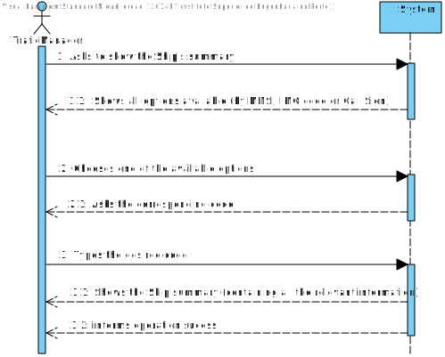
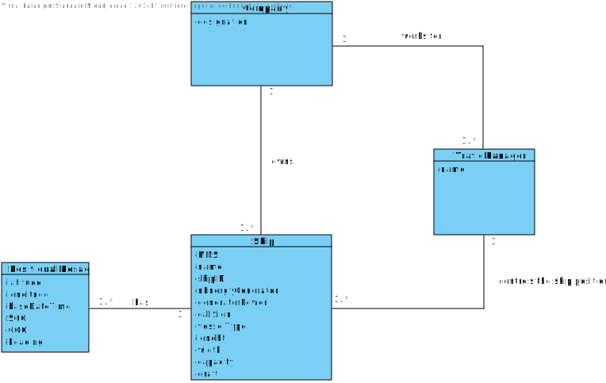
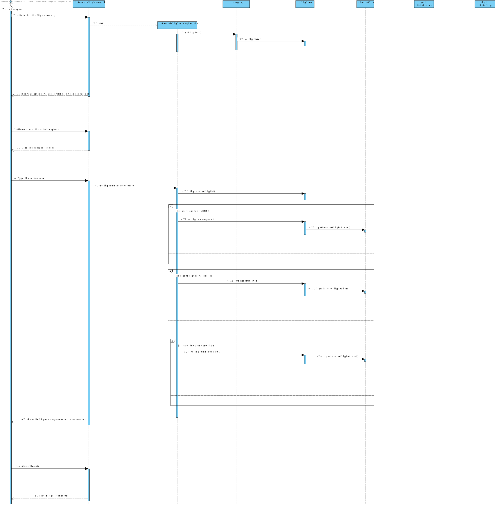
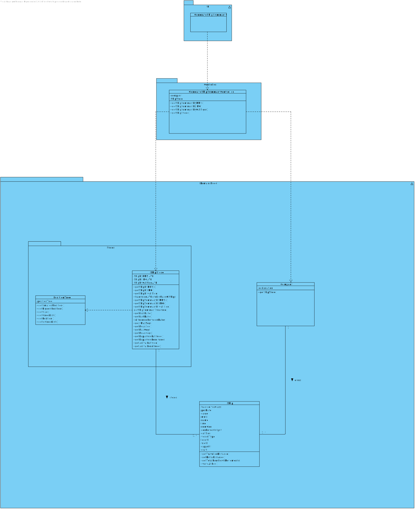

# US 101 - Make Summary of Ship's movements

## 1. Requirements Engineering

## 1.1. User Story Description

As a traffic manager I wish to make a Summary of a ship's movements.

## 1.2. Acceptance Criteria

* **AC1:** For a given ship return in an appropriate structure one of its codes
  (MMSI, IMO or Call Sign), Vessel Name, Start Base Date Time, End
  Base Date Time, Total Movement Time, Total Number of Movements,
  Max SOG, Mean SOG, Max COG, Mean COG, Departure Latitude,
  Departure Longitude, Arrival Latitude, Arrival Longitude, Travelled
  Distance (incremental sum of the distance between each positioning
  message) and Delta Distance (linear distance between the coordinates of
  the first and last move)7.

## 1.3. System Sequence Diagram (SSD)

## 2. OO Analysis

### Relevant Domain Model Excerpt

## 3. Design - User Story Realization

### 3.1. Sequence Diagram (SD)

### 3.2. Class Diagram (CD)

#4. Tests
**Test 1:** Checks if the expected ShipSummary by MMSI is equals to the actual

     @Test
    void getShipSummaryByMMSI1Position() {

        //Arrange
        shipgeral.getPosDate().addPosition(posgeral);
        shipstore.addShip(shipgeral);
        String expected = "MMSI : 111111111\n" +
                "Vessel name: A\n" +
                "Start Base date Time: 2020-12-31T23:16\n" +
                "End base date time : 2020-12-31T23:16\n" +
                "Total movement time: 0 minutes\n" +
                "Total number of movements : 1\n" +
                "Max SOG : 0.0\n" +
                "Mean SOG : 0.0\n" +
                "Max COG : 1.0\n" +
                "Mean COG : 1.0\n" +
                "Departure Latitude : 0.0\n" +
                "Departure Longitude : 0.0\n" +
                "Arrival Latitude : 0.0\n" +
                "Arrival Longitude : 0.0\n" +
                "Travelled Distance : 0.0\n" +
                "Delta Distance : 0.0";
        //Act
        String actual = shipstore.getShipSummaryByMMSI(shipgeral.getMmsi());
        //Assert
        assertEquals(expected, actual);

    }

**Test 2:** Checks if the MMSI is invalid.

    @Test
    void getShipSummaryByMMSIInvalid() {

        //Arrange
        shipstore.addShip(shipgeral);
        String expected = "MMSI : 111111111\n" +
                "Vessel name: A\n" +
                "Start Base date Time: null\n" +
                "End base date time : null\n" +
                "Total movement time: 0 minutes\n" +
                "Total number of movements : 0\n" +
                "Max SOG : 0.0\n" +
                "Mean SOG : 0.0\n" +
                "Max COG : 0.0\n" +
                "Mean COG : 0.0\n" +
                "Departure Latitude : 0.0\n" +
                "Departure Longitude : 0.0\n" +
                "Arrival Latitude : 0.0\n" +
                "Arrival Longitude : 0.0\n" +
                "Travelled Distance : 0.0\n" +
                "Delta Distance : 0.0";
        //Act
        String actual = shipstore.getShipSummaryByMMSI(shipgeral.getMmsi());
        //Assert
        assertEquals(expected, actual);

    }

**Test 3:** Checks if a null MMSI exists

     @Test
    void getShipSummaryByMMSINull() {

        //Arrange
        shipstore.addShip(shipgeral);
        shipstore.addShip(shipgeral5);
        String expected = "MMSI : 999999999\n" +
                "Vessel name: A\n" +
                "Start Base date Time: null\n" +
                "End base date time : null\n" +
                "Total movement time: 0 minutes\n" +
                "Total number of movements : 0\n" +
                "Max SOG : 0.0\n" +
                "Mean SOG : 0.0\n" +
                "Max COG : 0.0\n" +
                "Mean COG : 0.0\n" +
                "Departure Latitude : 0.0\n" +
                "Departure Longitude : 0.0\n" +
                "Arrival Latitude : 0.0\n" +
                "Arrival Longitude : 0.0\n" +
                "Travelled Distance : 0.0\n" +
                "Delta Distance : 0.0";
        //Act
        String actual = shipstore.getShipSummaryByMMSI(999999999);
        //Assert
        assertEquals(expected, actual);

    }

**Test 4:** Checks if the ship summary by IMO is generated

    @Test
    void getShipSummaryByIMO1Position() {

        //Arrange
        shipgeral.getPosDate().addPosition(posgeral);
        shipstore.addShip(shipgeral);
        String expected = "IMO : IMO1111111\n" +
                "Vessel name: A\n" +
                "Start Base date Time: 2020-12-31T23:16\n" +
                "End base date time : 2020-12-31T23:16\n" +
                "Total movement time: 0 minutes\n" +
                "Total number of movements : 1\n" +
                "Max SOG : 0.0\n" +
                "Mean SOG : 0.0\n" +
                "Max COG : 1.0\n" +
                "Mean COG : 1.0\n" +
                "Departure Latitude : 0.0\n" +
                "Departure Longitude : 0.0\n" +
                "Arrival Latitude : 0.0\n" +
                "Arrival Longitude : 0.0\n" +
                "Travelled Distance : 0.0\n" +
                "Delta Distance : 0.0";
        //Act
        String actual = shipstore.getShipSummaryByIMO(shipgeral.getImo());
        //Assert
        assertEquals(expected, actual);

    }

**Test 5: Checks if a IMO is invalid**

        @Test
        void getShipSummaryByIMOInvalid() {

        //Arrange
        shipstore.addShip(shipgeral);
        String expected = "MMSI : 111111111\n" +
                "Vessel name: A\n" +
                "Start Base date Time: null\n" +
                "End base date time : null\n" +
                "Total movement time: 0 minutes\n" +
                "Total number of movements : 0\n" +
                "Max SOG : 0.0\n" +
                "Mean SOG : 0.0\n" +
                "Max COG : 0.0\n" +
                "Mean COG : 0.0\n" +
                "Departure Latitude : 0.0\n" +
                "Departure Longitude : 0.0\n" +
                "Arrival Latitude : 0.0\n" +
                "Arrival Longitude : 0.0\n" +
                "Travelled Distance : 0.0\n" +
                "Delta Distance : 0.0";
        //Act
        String actual = shipstore.getShipSummaryByMMSI(shipgeral.getMmsi());
        //Assert
        assertEquals(expected, actual);

    }

**Test 6: Checks if a IMO is null**

    @Test
    void getShipSummaryByIMONull() {

        //Arrange
        shipstore.addShip(shipgeral4);
        String expected = "IMO : IMO9999999\n" +
                "Vessel name: A\n" +
                "Start Base date Time: null\n" +
                "End base date time : null\n" +
                "Total movement time: 0 minutes\n" +
                "Total number of movements : 0\n" +
                "Max SOG : 0.0\n" +
                "Mean SOG : 0.0\n" +
                "Max COG : 0.0\n" +
                "Mean COG : 0.0\n" +
                "Departure Latitude : 0.0\n" +
                "Departure Longitude : 0.0\n" +
                "Arrival Latitude : 0.0\n" +
                "Arrival Longitude : 0.0\n" +
                "Travelled Distance : 0.0\n" +
                "Delta Distance : 0.0";
        //Act
        String actual = shipstore.getShipSummaryByIMO("IMO9999999");
        //Assert
        assertEquals(expected, actual);

    }

**Test 7: Gets a ship sumarry by its call sign.**

    @Test
    void getShipSummaryByCallSign() {

        //Arrange
        shipgeral.getPosDate().addPosition(posgeral);
        shipstore.addShip(shipgeral);
        String expected = "Call Sign : A\n" +
                "Vessel name: A\n" +
                "Start Base date Time: 2020-12-31T23:16\n" +
                "End base date time : 2020-12-31T23:16\n" +
                "Total movement time: 0 minutes\n" +
                "Total number of movements : 1\n" +
                "Max SOG : 0.0\n" +
                "Mean SOG : 0.0\n" +
                "Max COG : 1.0\n" +
                "Mean COG : 1.0\n" +
                "Departure Latitude : 0.0\n" +
                "Departure Longitude : 0.0\n" +
                "Arrival Latitude : 0.0\n" +
                "Arrival Longitude : 0.0\n" +
                "Travelled Distance : 0.0\n" +
                "Delta Distance : 0.0";
        //Act
        String actual = shipstore.getShipSummaryByCallSign(shipgeral.getCallSign());
        //Assert
        assertEquals(expected, actual);

    }

# 5. Construction (Implementation)

##GenerateShipSummaryController

    public class ShipSummaryController {

    private final Company company;
    private final ShipStore shipStore;

    public ShipSummaryController() {
        this.company = App.getInstance().getCompany();
        this.shipStore = company.getShipStore();
    }

    public String getShipSummaryByMMSI(int mmsi) throws IllegalArgumentException, NullPointerException {
        return shipStore.getShipSummaryByMMSI(mmsi);
    }

    public String getShipSummaryByIMO(String imo) throws IllegalArgumentException , NullPointerException {
        return shipStore.getShipSummaryByIMO(imo);
    }

    public String getShipSummaryByCallSign(String callSign) throws IllegalArgumentException , NullPointerException {
        return shipStore.getShipSummaryByCallSign(callSign);
    }

    public ShipStore getShipStore() {
        return shipStore;
    }
    }

##ShipStore
    public class ShipStore {

    public AVL<ShipByMmsi> shipByMmsiAVL;
    public AVL<ShipByIMO> shipByIMOAVL;
    public AVL<ShipByCallSign> shipByCallSignAVL;
    public AVL<PairOfShips> pairsOfShipsSearchTree = new AVL<>();

    public ShipStore() {
        this.shipByMmsiAVL = new AVL<>();
        this.shipByIMOAVL = new AVL<>();
        this.shipByCallSignAVL = new AVL<>();
    }
  
      public LocalDateTime getLastDate(Ship s) {
        try {
            return s.getPosDate().getBiggestPosition().getDate();
        } catch (IndexOutOfBoundsException | NullPointerException e) {
            return null;
        }
    }

    public long differenceBetweenDates(LocalDateTime first, LocalDateTime second) {
        try {
            Date firstDate = java.util.Date.from(first.atZone(ZoneId.systemDefault()).toInstant());
            Date secondDate = java.util.Date.from(second.atZone(ZoneId.systemDefault()).toInstant());
            long diffInMillies = Math.abs(firstDate.getTime() - secondDate.getTime());
            return (TimeUnit.MINUTES.convert(diffInMillies, TimeUnit.MILLISECONDS));
        } catch (NullPointerException e) {
            return 0;
        }
    }

    public double getMaxSOG(Ship s) {
        double maxSog = 0;

        for (Position ps1 : s.getPosDate().getOrderList()) {
            if (ps1.getSog() > maxSog) {
                maxSog = ps1.getSog();
            }
        }
        return maxSog;
    }

    public double getMeanSOG(Ship s) {
        try {
            double meanSOG = 0;
            int count = 0;

            for (Position ps1 : s.getPosDate().getOrderList()) {
                meanSOG += ps1.getSog();
                count++;
            }

            if (count == 0) {
                return 0;
            }
            return (meanSOG / count);

        } catch (ArithmeticException | NullPointerException e) {
            return 0;
        }
    }

    public double getMaxCOG(Ship s) {
        double maxCog = 0;

        for (Position ps1 : s.getPosDate().getOrderList()) {
            if (ps1.getCog() > maxCog) {
                maxCog = ps1.getCog();
            }
        }
        return maxCog;
    }

    public double getMeanCOG(Ship s) {
        try {
            double meanCOG = 0;
            int count = 0;

            for (Position ps1 : s.getPosDate().getOrderList()) {
                meanCOG += ps1.getCog();
                count++;
            }

            if (count == 0) {
                return 0;
            }
            return (meanCOG / count);

        } catch (ArithmeticException | NullPointerException e) {
            return 0;
        }
    }

    public AVL<ShipByMmsi> getShipByMMSIBinarySearchTree() {
        return shipByMmsiAVL;
    }

    public double getDepartureLatitude(Ship s) {
        try {
            return (s.getSmallPosition().getLatitude());
        } catch (IndexOutOfBoundsException | NullPointerException e) {
            return 0;
        }
    }

    public double getDepartureLongitude(Ship s) {
        try {
            return (s.getSmallPosition().getLongitude());
        } catch (IndexOutOfBoundsException | NullPointerException e) {
            return 0;
        }
    }

    public double getArrivalLatitude(Ship s) {
        try {
            return (s.getBiggestPosition().getLatitude());
        } catch (IndexOutOfBoundsException | NullPointerException e) {
            return 0;
        }
    }

    public double getArrivalLongitude(Ship s) {
        try {
            return (s.getBiggestPosition().getLongitude());
        } catch (IndexOutOfBoundsException | NullPointerException e) {
            return 0;
        }
    }

    public String getShipSummaryByIMO(String imo) {
        String returnString = null;
        StringBuilder sb = new StringBuilder();

        Ship s = getShipByIMO(imo);

        if (s != null) {

            sb
                    .append("IMO : " + s.getImo() + "\n")
                    .append(getShipSummaryStructure(s));

            returnString = sb.toString();

        }
        if (returnString == null || returnString.isEmpty()) {
            throw new IllegalArgumentException("Invalid Ship, please enter another one");
        } else {
            return returnString;
        }
    }

    public String getShipSummaryByCallSign(String callSign) {

        String returnString = null;
        StringBuilder sb = new StringBuilder();

        Ship s = getShipByCallSign(callSign);

        if (s != null) {

            sb
                    .append("Call Sign : " + s.getCallSign() + "\n")
                    .append(getShipSummaryStructure(s));

            returnString = sb.toString();

        }

        if (returnString == null || returnString.isEmpty()) {
            throw new IllegalArgumentException("Invalid Ship, please enter another one");
        } else {
            return returnString;
        }
    }

    public String getShipSummaryStructure(Ship s) {
        StringBuilder sb = new StringBuilder();
        sb
                .append("Vessel name: " + s.getVesselType() + "\n")
                .append("Start Base date Time: " + getFirstDate(s) + "\n")
                .append("End base date time : " + getLastDate(s) + "\n")
                .append("Total movement time: " + differenceBetweenDates(getFirstDate(s), getLastDate(s)) + " minutes" + "\n")
                .append("Total number of movements : " + s.getTotalNumberOfMovements() + "\n")
                .append("Max SOG : " + getMaxSOG(s) + "\n")
                .append("Mean SOG : " + getMeanSOG(s) + "\n")
                .append("Max COG : " + getMaxCOG(s) + "\n")
                .append("Mean COG : " + getMeanCOG(s) + "\n")
                .append("Departure Latitude : " + getDepartureLatitude(s) + "\n")
                .append("Departure Longitude : " + getDepartureLongitude(s) + "\n")
                .append("Arrival Latitude : " + getArrivalLatitude(s) + "\n")
                .append("Arrival Longitude : " + getArrivalLongitude(s) + "\n")
                .append("Travelled Distance : " + s.getShipsTravelledDistance() + "\n")
                .append("Delta Distance : " + s.getDeltaDistance());

        return sb.toString();
    }

    public LocalDateTime getFirstDate(Ship s) {
        try {
            return s.getPosDate().getSmallestPosition().getDate();
        } catch (IndexOutOfBoundsException | NullPointerException e) {
            return null;
        }
    }

    public String getShipSummaryByMMSI(int mmsi) {

        String returnString = null;
        StringBuilder sb = new StringBuilder();

        Ship s = getShipByMmsi(mmsi);

        if (s != null) {

            sb
                    .append("MMSI : " + s.getMmsi() + "\n")
                    .append(getShipSummaryStructure(s));

            returnString = sb.toString();

        }
        if (returnString == null || returnString.isEmpty()) {
            throw new IllegalArgumentException("Invalid Ship, please enter another one");
        } else {
            return returnString;
        }
    }

  