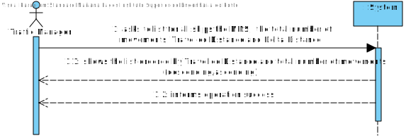
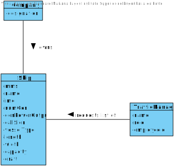
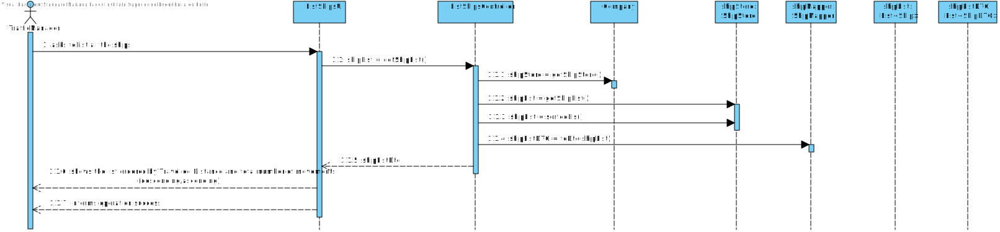
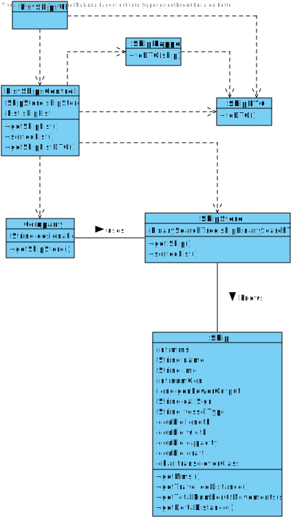

# US 105 - List All the Ships
## 1. Requirements Engineering

## 1.1. User Story Description

As a traffic manager I wish to list for all ships the MMSI, the total number of
movements, Travelled Distance and Delta Distance


## 1.2. Acceptance Criteria

* **AC1:** ordered by Travelled Distance and total number of movements
  (descending/ascending).

## 1.3. System Sequence Diagram (SSD)



## 2. OO Analysis

### Relevant Domain Model Excerpt



## 3. Design - User Story Realization

### 3.1. Sequence Diagram (SD)



### 3.2. Class Diagram (CD)



#4. Tests

**Test 1: Tests a sorted list of ships**
    
    @Test
    void sortedListTDDiffNumMovDiffMutant() {
        //Arrange
        shipgeral.getPosDate().addPosition(posgeral);
        shipgeral.getPosDate().addPosition(posgeral2);
        shipgeral2.getPosDate().addPosition(posgeral2);
        shipgeral2.getPosDate().addPosition(posgeral3);
        shipgeral2.getPosDate().addPosition(posgeral4);
        shipstore.addShip(shipgeral);
        shipstore.addShip(shipgeral2);

        //Act
        String expected = "[Ship{cargo='null', MMSI=111111111, name='name', IMO='IMO1111111', numGen=0, genPowerOutput=0, callSign='A', vesselType='A', length=1.0, width=1.0, capacity=0.0, draft=1.0}, Ship{cargo='null', MMSI=222222222, name='name', IMO='IMO2222222', numGen=0, genPowerOutput=0, callSign='A', vesselType='A', length=1.0, width=1.0, capacity=0.0, draft=1.0}]";
        String actual = shipstore.sortedList().toString();

        if (!actual.toString().equals("[Ship{cargo='null', MMSI=111111111, name='name', IMO='IMO1111111', numGen=0, genPowerOutput=0, callSign='A', vesselType='A', length=1.0, width=1.0, capacity=0.0, draft=1.0}, Ship{cargo='null', MMSI=222222222, name='name', IMO='IMO2222222', numGen=0, genPowerOutput=0, callSign='A', vesselType='A', length=1.0, width=1.0, capacity=0.0, draft=1.0}]"))
            fail();

        //Assert
        assertEquals(expected, actual);
    }

**Test 2: Tests a sorted list of ships if they have equal number of movements**
   
    @Test
    void sortedListTDEqualNumMovEqual() {
        //Arrange
        shipgeral.getPosDate().addPosition(posgeral);
        shipgeral.getPosDate().addPosition(posgeral2);
        shipgeral2.getPosDate().addPosition(posgeral);
        shipgeral2.getPosDate().addPosition(posgeral2);
        shipstore.addShip(shipgeral);
        shipstore.addShip(shipgeral2);

        //Act
        String expected = "[Ship{cargo='null', MMSI=111111111, name='name', IMO='IMO1111111', numGen=0, genPowerOutput=0, callSign='A', vesselType='A', length=1.0, width=1.0, capacity=0.0, draft=1.0}, Ship{cargo='null', MMSI=222222222, name='name', IMO='IMO2222222', numGen=0, genPowerOutput=0, callSign='A', vesselType='A', length=1.0, width=1.0, capacity=0.0, draft=1.0}]";
        String actual = shipstore.sortedList().toString();

        //Assert
        assertEquals(expected, actual);
    }

**Test 3: Tests a sorted list of ships if they have different number of movements**

    @Test
    void sortedListTDDiffNumMovEqual() {
        //Arrange
        shipgeral.getPosDate().addPosition(posgeral);
        shipgeral.getPosDate().addPosition(posgeral2);
        shipgeral2.getPosDate().addPosition(posgeral3);
        shipgeral2.getPosDate().addPosition(posgeral4);
        shipstore.addShip(shipgeral);
        shipstore.addShip(shipgeral2);

        //Act
        String expected = "[Ship{cargo='null', MMSI=111111111, name='name', IMO='IMO1111111', numGen=0, genPowerOutput=0, callSign='A', vesselType='A', length=1.0, width=1.0, capacity=0.0, draft=1.0}, Ship{cargo='null', MMSI=222222222, name='name', IMO='IMO2222222', numGen=0, genPowerOutput=0, callSign='A', vesselType='A', length=1.0, width=1.0, capacity=0.0, draft=1.0}]";
        String actual = shipstore.sortedList().toString();

        //Assert
        assertEquals(expected, actual);
    }

# 5. Construction (Implementation)

##Class ListShipsController

    public class ListShipsController {

    Company company;
    ShipStore shipStore;
    List<Ship> shipList;
    ShipMapper shipMapper;

    public ListShipsController() {
        this.company = App.getInstance().getCompany();
        this.shipStore = company.getShipStore();
    }

    public ShipStore getShipStore() {
        return shipStore;
    }

    public List<Ship> getShipList() {
        shipList = new ArrayList<>();
        shipList = shipStore.transformAVLintoListMMSI();
        return shipList;
    }

    public List<Ship> sortedList() {
        if (shipStore.sortedList().isEmpty()) {
            throw new IllegalArgumentException();
        }
        return shipStore.sortedList();
    }

    public List<ShipDTO> getShipListDTO() {
        try {
            this.shipMapper = new ShipMapper();
            List<Ship> sShips = sortedList();
            return shipMapper.toDTO(sShips);
        } catch (Exception e) {
            return Collections.emptyList();
        }
    }
    }

##Class ShipDTO

    public class ShipDTO {

    private final int mmsi;
    private final int totalNumberOfMovements;
    private final double travelledDistance;
    private final double deltaDistance;

    public ShipDTO(int mmsi, int totalNumberOfMovements, double travelledDistance, double deltaDistance) {
        this.mmsi = mmsi;
        this.totalNumberOfMovements = totalNumberOfMovements;
        this.travelledDistance = travelledDistance;
        this.deltaDistance = deltaDistance;
    }

    /**
     * Returns the textual description of the ship info in the format: MMSI, total number of movements, travelled distance, delta distance.
     *
     * @return the Ship's characteristics
     */
    @Override
    public String toString() {
        return "MMSI: " + this.mmsi + "; Total number of movements: " + this.totalNumberOfMovements + "; Travelled Distance: " + this.travelledDistance + "; Delta Distance: " + this.deltaDistance + "\n";
    }
  }

##Class ShipMapper
    public class ShipMapper {

    /**
     * Converts the ship info to DTO.
     *
     * @param ship the ship
     * @return the ship info in DTO
     */
    private ShipDTO toDTO(Ship ship) {
        return new ShipDTO(ship.getMmsi(), ship.getTotalNumberOfMovements(), ship.getTravelledDistance(), ship.getDeltaDistance());
    }

    /**
     * Converts the ship list to DTO.
     *
     * @param sList the ship list
     * @return the ship list in DTO
     */
    public List<ShipDTO> toDTO(List<Ship> sList) {
        List<ShipDTO> shipDTOS = new ArrayList<>();
        for (Ship ship : sList) {
            shipDTOS.add(this.toDTO(ship));
        }
        return shipDTOS;
    }
  }

## Class ShipStore

    public class ShipStore {

    public AVL<ShipByMmsi> shipByMmsiAVL;
    public AVL<ShipByIMO> shipByIMOAVL;
    public AVL<ShipByCallSign> shipByCallSignAVL;
    public AVL<PairOfShips> pairsOfShipsSearchTree = new AVL<>();


    public ShipStore() {
        this.shipByMmsiAVL = new AVL<>();
        this.shipByIMOAVL = new AVL<>();
        this.shipByCallSignAVL = new AVL<>();
    }


    public List<Ship> sortedList() {
        List<Ship> shipList = transformAVLintoListMMSI();
        Comparator<Ship> comparator1 = (o1, o2) -> {

            double x1 = o1.getShipsTravelledDistance();
            double x2 = o2.getShipsTravelledDistance();

            double z1 = o1.getPosDateSize();
            double z2 = o2.getPosDateSize();

            double result1 = x2 - x1;
            double result2 = z2 - z1;

            if (result1 > 0) {
                return 1;
            } else if (result1 < 0) {
                return -1;
            } else {
                if (result2 > 0) {
                    return -1;
                } else if (result2 < 0) {
                    return 1;
                } else {
                    return 0;
                }
            }
        };
        shipList.sort(comparator1);

        return shipList;
    }
    }
  